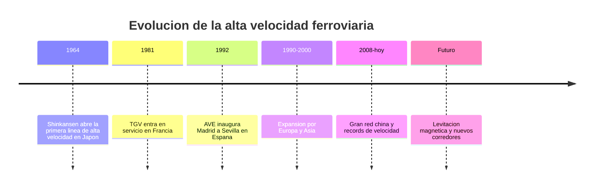

# 📜 Historia del tren de alta velocidad

[🏠 Inicio](../../../README.md) · [🚄 Curso: Tren de alta velocidad](../README.md) · 📜 Historia

## Origen

El tren de alta velocidad nace en Japon en 1964 con el Shinkansen, la primera
linea disenada desde cero para circular a mas de 200 km/h con via dedicada y sin
cruces a nivel. La idea era mover a muchos pasajeros entre grandes ciudades mas
rapido que el automovil y compitiendo con el avion en distancias medias. Francia
siguio con el TGV en 1981 y Espana con el AVE en 1992, consolidando el modelo en
Europa. Chile aun no tiene alta velocidad comercial; los proyectos locales se
tratan como por confirmar.

## Linea de tiempo

| Periodo | Hito | Importancia |
| --- | --- | --- |
| 1964 | Shinkansen Tokaido en Japon | Primera linea de alta velocidad del mundo. |
| 1981 | TGV en Francia | Lleva la alta velocidad a Europa. |
| 1992 | AVE Madrid a Sevilla en Espana | Alta velocidad en la peninsula iberica. |
| 1990-2000 | Expansion por Europa y Asia | Redes en Alemania, Italia, Corea. |
| 2008-presente | Gran red china | La mayor red de alta velocidad del mundo. |
| Futuro | Maglev y nuevos corredores | Levitacion magnetica y records de velocidad. |

## Evolucion tecnologica

- **Traccion**: de la locomotora en cabeza a la traccion distribuida en varios coches.
- **Aerodinamica**: narices cada vez mas largas para reducir resistencia y ruido.
- **Via**: lineas dedicadas con curvas amplias, peralte y sin pasos a nivel.
- **Senalizacion**: paso de senales laterales a senalizacion en cabina ETCS/ERTMS.
- **Frenado**: freno regenerativo, dinamico, neumatico y de corrientes de Foucault.
- **Materiales**: aluminio y compuestos ligeros para bajar masa y consumo.

## Tipos representativos

| Tipo | Origen | Caracteristica destacada |
| --- | --- | --- |
| Shinkansen | Japon | Traccion distribuida, alta frecuencia de servicio. |
| TGV | Francia | Traccion concentrada con coches remolcados. |
| AVE | Espana | Trocha internacional sobre red de trocha iberica. |
| ICE | Alemania | Alta velocidad integrada a la red europea. |
| CRH / CR | China | Mayor red mundial y grandes volumenes. |
| Maglev | Varios | Levitacion magnetica, sin contacto rueda-riel. |

## Impacto social y economico

La alta velocidad transformo los viajes de media distancia, restando cuota al
avion y al automovil entre ciudades separadas por algunos cientos de kilometros.
Impulso el desarrollo regional al acercar ciudades, aunque exige gran inversion
en infraestructura dedicada. Es un simbolo de modernizacion del transporte
publico en varios paises.

## Fuentes

- Registrar aqui las fuentes publicas consultadas.
- Enlazar cada fuente tambien en [`manuales/fuentes.md`](../../../manuales/fuentes.md).

---

[🎓 Portada del curso](../README.md) · [➡️ Siguiente: Caracteristicas](../operacion/caracteristicas-tren-alta-velocidad.md)
