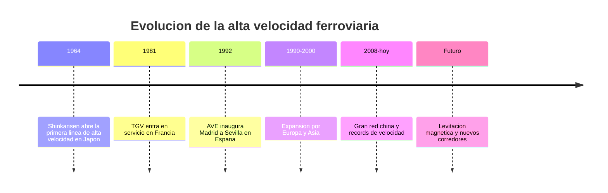

<!-- clase-meta
tipo_documento: clase
clase: 1
codigo: TRENALTAVELO-01
curso: tren-alta-velocidad
titulo: "Historia del tren de alta velocidad"
modalidad: "teórica dialogada"
duracion_minutos: 45
nivel: introductorio
prerrequisito: ninguno
competencia: "contexto_historico"
resultados_aprendizaje:
  - "Explicar origen, evolución tecnológica, variantes representativas e impacto con vocabulario propio de Tren de alta velocidad."
  - "Aplicar esos conceptos a una decisión segura o a un escenario de simulación de Tren de alta velocidad."
evidencia: "Línea de tiempo comentada con cuatro hitos o más."
criterio_aprobacion: "Los hitos están ordenados, son pertinentes y dos relaciones de causa y efecto quedan justificadas."
fuentes: manuales/fuentes.md
ultima_revision: 2026-09-10
-->

# 📜 Historia del tren de alta velocidad

[🏠 Inicio](../../../README.md) · [🚄 Curso: Tren de alta velocidad](../README.md) · 📜 Historia

```mermaid
timeline
    title Evolucion de la alta velocidad ferroviaria
    1964 : Shinkansen abre la primera linea de alta velocidad en Japon
    1981 : TGV entra en servicio en Francia
    1992 : AVE inaugura Madrid a Sevilla en Espana
    1990-2000 : Expansion por Europa y Asia
    2008-hoy : Gran red china y records de velocidad
    Futuro : Levitacion magnetica y nuevos corredores
```

## Origen

El tren de alta velocidad nace en Japón en 1964 con el Shinkansen, la primera
línea disenada desde cero para circular a más de 200 km/h con vía dedicada y sin
cruces a nivel. La idea era mover a muchos pasajeros entre grandes ciudades más
rápido que el automóvil y compitiendo con el avión en distancias medias. Francia
siguió con el TGV en 1981 y España con el AVE en 1992, consolidando el modelo en
Europa. Chile aún no tiene alta velocidad comercial; los proyectos locales se
tratan como por confirmar.

## Línea de tiempo

| Periodo | Hito | Importancia |
| --- | --- | --- |
| 1964 | Shinkansen Tokaido en Japón | Primera línea de alta velocidad del mundo. |
| 1981 | TGV en Francia | Lleva la alta velocidad a Europa. |
| 1992 | AVE Madrid a Sevilla en España | Alta velocidad en la península ibérica. |
| 1990-2000 | Expansión por Europa y Asia | Redes en Alemania, Italia, Corea. |
| 2008-presente | Gran red china | La mayor red de alta velocidad del mundo. |
| Futuro | Maglev y nuevos corredores | Levitación magnética y records de velocidad. |

## Evolución tecnológica

- **Tracción**: de la locomotora en cabeza a la tracción distribuida en varios coches.
- **Aerodinámica**: narices cada vez más largas para reducir resistencia y ruido.
- **Vía**: líneas dedicadas con curvas amplias, peralte y sin pasos a nivel.
- **Señalización**: paso de señales laterales a señalización en cabina ETCS/ERTMS.
- **Frenado**: freno regenerativo, dinámico, neumático y de corrientes de Foucault.
- **Materiales**: aluminio y compuestos ligeros para bajar masa y consumo.

## Tipos representativos

| Tipo | Origen | Característica destacada |
| --- | --- | --- |
| Shinkansen | Japón | Tracción distribuida, alta frecuencia de servicio. |
| TGV | Francia | Tracción concentrada con coches remolcados. |
| AVE | España | Trocha internacional sobre red de trocha ibérica. |
| ICE | Alemania | Alta velocidad integrada a la red europea. |
| CRH / CR | China | Mayor red mundial y grandes volumenes. |
| Maglev | Varios | Levitación magnética, sin contacto rueda-riel. |

## Impacto social y económico

La alta velocidad transformó los viajes de media distancia, restando cuota al
avión y al automóvil entre ciudades separadas por algunos cientos de kilómetros.
Impulso el desarrollo regional al acercar ciudades, aunque exige gran inversión
en infraestructura dedicada. Es un símbolo de modernización del transporte
público en varios países.

## 🧭 Guía de estudio aplicada

### Pregunta guía

¿Cómo ayuda **Origen, Línea de tiempo, Evolución tecnológica y Tipos representativos** a **explicar cómo la evolución hizo posibles alternativas como tracción distribuida frente a cabezas tractoras**?

### Explicación razonada

La evolución de Tren de alta velocidad se comprende mejor como una sucesión de respuestas a problemas, no como una lista de fechas. Los cambios en catenaria, electrónica de potencia, motores distribuidos y rueda-carril alteraron qué podía hacer la máquina, quién podía usarla y qué riesgos debían controlarse. El contraste «tracción distribuida frente a cabezas tractoras» permite observar qué decisiones de diseño permanecieron y cuáles cambiaron con la tecnología y el propósito.

Esta clase se conecta con el resto del curso mediante **estabilidad dinámica y crecimiento de la energía con el cuadrado de la velocidad**. El hilo de
seguridad consiste en reconocer a tiempo **perder margen por interpretar tarde una restricción a velocidad elevada** y poder justificar la decisión
**cumplir la curva de frenado con anticipación y sin correcciones bruscas**; en clases posteriores cambiará el ángulo de análisis, no esa relación causal.
La lectura funcional común sigue **catenaria → electrónica de potencia → motores distribuidos → rueda-carril**, de modo que cada concepto pueda
ubicarse dentro del funcionamiento completo y no quede como un dato aislado.

**Apoyo documental:** [Railroad Operating Practices](https://railroads.fra.dot.gov/railroad-safety/divisions/operating-practices/operating-practices-0) aporta operación, señalización y competencias ferroviarias;
[Human Factors: Tasks and Demands](https://railroads.fra.dot.gov/human-factors/elearning-attention/tasks-demands) se usa para factores humanos y carga de trabajo. Estas fuentes
se contrastan con el alcance de la clase y no sustituyen un manual de equipo concreto.

### Caso resuelto: de la observación a la decisión

1. **Situar:** ordena los hitos que explican cómo se llegó a **tracción distribuida frente a cabezas tractoras** y describe la necesidad que impulsó cada cambio.
2. **Relacionar:** explica qué se modificó en **catenaria**, **electrónica de potencia**, **motores distribuidos** o **rueda-carril**; una fecha sin mecanismo no basta.
3. **Interpretar:** vincula el cambio con una capacidad nueva y también con el riesgo **perder margen por interpretar tarde una restricción a velocidad elevada**.
4. **Transferir:** usa la evolución para justificar por qué hoy conviene **cumplir la curva de frenado con anticipación y sin correcciones bruscas**.

### Comprueba tu comprensión

1. ¿Qué necesidad histórica impulsó un cambio en **catenaria** o **electrónica de potencia**?
2. ¿Qué hito modificó la relación entre capacidad y **perder margen por interpretar tarde una restricción a velocidad elevada**?
3. ¿Por qué **tracción distribuida frente a cabezas tractoras** no puede explicarse como una simple diferencia estética?

Orientación para revisar tus respuestas

- La primera respuesta debe relacionar el eslabón elegido con un efecto posterior, no solo nombrarlo.
- La segunda debe proponer una señal medible u observable y explicar qué tendencia sería preocupante.
- La tercera debe cambiar al menos una variable de capacidad, mando, entorno o margen de seguridad.

## 🎓 Cierre de clase

- **Actividad:** Construye una línea de tiempo de Tren de alta velocidad y explica cómo dos cambios históricos transformaron su función o su puesto de mando.
- **Evidencia:** Línea de tiempo comentada con cuatro hitos o más.
- **Criterio de aprobación:** Los hitos están ordenados, son pertinentes y dos relaciones de causa y efecto quedan justificadas.
- **Transferencia:** explica qué cambiaría al pasar a otra variante de esta máquina.

### Fuentes de esta clase

- [US-FRA-OPS](https://railroads.fra.dot.gov/railroad-safety/divisions/operating-practices/operating-practices-0): Railroad Operating Practices, Federal Railroad Administration. Uso: operación, señalización y competencias ferroviarias.
- [US-FRA-HF](https://railroads.fra.dot.gov/human-factors/elearning-attention/tasks-demands): Human Factors: Tasks and Demands, Federal Railroad Administration. Uso: factores humanos y carga de trabajo.
- [NASA-FLIGHT](https://www1.grc.nasa.gov/beginners-guide-to-aeronautics/): Beginner's Guide to Aeronautics, NASA. Uso: contraste con física y vuelo reales.

> Las fuentes sostienen el marco conceptual y normativo; esta clase no reemplaza el manual
> del fabricante, la formación certificada ni la habilitación exigida para operar equipos reales.

---

[🎓 Portada del curso](../README.md) · [➡️ Siguiente: Características](../operacion/caracteristicas-tren-alta-velocidad.md)
