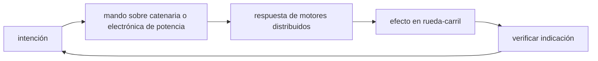

<!-- clase-meta
tipo_documento: clase
clase: 5
codigo: TRENALTAVELO-05
curso: tren-alta-velocidad
titulo: "Mandos e instrumentos del tren de alta velocidad"
modalidad: "taller de simulación"
duracion_minutos: 60
nivel: introductorio
prerrequisito: TRENALTAVELO-04
competencia: "lectura_y_mando"
resultados_aprendizaje:
  - "Explicar controles, instrumentos, entradas y estados del sistema con vocabulario propio de Tren de alta velocidad."
  - "Aplicar esos conceptos a una decisión segura o a un escenario de simulación de Tren de alta velocidad."
evidencia: "Mapa de mandos y resolución de dos estados del tablero."
criterio_aprobacion: "Reconoce los controles críticos y responde a los estados sin introducir acciones inseguras."
fuentes: manuales/fuentes.md
ultima_revision: 2026-09-10
-->

# 🎛️ Mandos e instrumentos del tren de alta velocidad

[🏠 Inicio](../../../README.md) · [🚄 Curso: Tren de alta velocidad](../README.md) · 🎛️ Mandos

## Vista general

El puesto de mando de un tren de alta velocidad es la cabina del maquinista, en
cabeza del tren. A diferencia de un vehículo de carretera, no hay volante: la
ruta la fija la vía. El maquinista controla sobre todo la **tracción y el freno**
mediante un manipulador, vigila la **pantalla de señalización en cabina** (DMI de
ETCS) y confirma su atención con el dispositivo de hombre muerto o vigilante.

## Mapa de controles

| Zona | Control | Tipo | Función | Prioridad | Comentarios |
| --- | --- | --- | --- | --- | --- |
| Pupitre central | Manipulador de tracción/freno | Palanca | Regular tracción y frenado | Alta | Controla la marcha sin volante. |
| Pupitre | Freno de emergencia | Palanca / botón | Detención máxima | Alta | Aplica todos los frenos disponibles. |
| Piso o pupitre | Hombre muerto / vigilante | Pedal o botón | Confirmar atención del maquinista | Alta | Si no se confirma, frena solo. |
| Pupitre | Pantógrafo | Botón | Subir o bajar el pantógrafo | Alta | Necesario para tomar corriente. |
| Pupitre | Puertas | Botón | Abrir y cerrar puertas en estación | Media | Enclavamiento con la marcha. |
| Pupitre | Bocina / silbato | Botón | Advertir | Media | Uso de seguridad en la vía. |
| Pupitre | Radio de tren | Consola | Comunicar con control | Alta | Contacto con el puesto de control. |
| Pupitre | Limpiaparabrisas y luces | Botones | Visibilidad | Media | Frontales y de gabarito. |

## Instrumentos principales

| Instrumento | Mide o muestra | Unidad | Importancia | Notas |
| --- | --- | --- | --- | --- |
| Velocímetro | Velocidad real | km/h | Alta | Central para respetar límites. |
| DMI de ETCS | Velocidad objetivo y límites | km/h | Alta | Pantalla de señalización en cabina. |
| Tensión de línea | Estado de la catenaria | kV | Alta | Avisa si falta tensión. |
| Esfuerzo de tracción/freno | Fuerza aplicada | porcentaje | Media | Muestra cuanto se pide al tren. |
| Presión de freno | Estado del freno neumático | bar | Alta | Clave para la frenada final. |
| Testigos | Estado de sistemas | luz | Alta | Puertas, pantógrafo, freno, alarmas. |

## Entradas de simulación

| Acción | Teclado | Controlador | Pantalla táctil | Comentarios |
| --- | --- | --- | --- | --- |
| Aplicar tracción | Flecha arriba | Gatillo derecho | Zona tracción | Progresivo, no on/off. |
| Aplicar freno | Flecha abajo | Gatillo izquierdo | Zona freno | Modula la fuerza de frenado. |
| Freno de emergencia | Barra espaciadora | Botón dedicado | Botón rojo | Aplica todos los frenos. |
| Confirmar vigilante | Tecla V | Botón lateral | Botón vigilante | Evita el frenado automático. |
| Subir pantógrafo | Tecla P | Cruceta arriba | Botón pantógrafo | Necesario antes de traccionar. |
| Abrir/cerrar puertas | Tecla O | Botón inferior | Botón puertas | Solo detenido en estación. |
| Bocina | Tecla B | Botón superior | Botón bocina | Advertencia en la vía. |

## Estados del sistema

| Estado | Descripción | Indicadores | Acciones disponibles |
| --- | --- | --- | --- |
| Apagado | Tren sin energía | Pupitre off | Subir pantógrafo, encender. |
| Preparado | Con tensión, detenido | Tensión de línea presente | Confirmar vigilante, aplicar tracción. |
| En movimiento | Circulando | Velocímetro y DMI activos | Traccionar, frenar, respetar objetivo. |
| Emergencia | Riesgo o falla | Testigos de alerta | Freno de emergencia, contactar control. |

## Observaciones ergonomicas

- El velocímetro y el DMI deben verse siempre y sin ambiguedad.
- El manipulador de tracción/freno debe distinguir con claridad ambas zonas.
- El dispositivo de hombre muerto no debe ser molesto pero si constante.
- El freno de emergencia debe ser accesible y reconocible al instante.
- La interfaz de simulación debería aplicar el frenado automático si no se
  confirma el vigilante o si se supera la velocidad objetivo del DMI.

## 🧭 Guía de estudio aplicada

### Pregunta guía

¿Cómo ayuda **Vista general, Mapa de controles, Instrumentos principales y Entradas de simulación** a **interpretar mandos e indicaciones durante reducción de velocidad previa a una zona de viento lateral**?

### Explicación razonada

Un mando no se aprende memorizando su nombre, sino recorriendo el ciclo intención → acción → indicación → verificación. En Tren de alta velocidad, el operador actúa sobre catenaria o electrónica de potencia, observa la respuesta en motores distribuidos y confirma el efecto en rueda-carril. Una indicación inesperada exige detener la secuencia mental, identificar el modo activo y evitar una segunda orden que agrave el estado.

Esta clase se conecta con el resto del curso mediante **estabilidad dinámica y crecimiento de la energía con el cuadrado de la velocidad**. El hilo de
seguridad consiste en reconocer a tiempo **perder margen por interpretar tarde una restricción a velocidad elevada** y poder justificar la decisión
**cumplir la curva de frenado con anticipación y sin correcciones bruscas**; en clases posteriores cambiará el ángulo de análisis, no esa relación causal.
La lectura funcional común sigue **catenaria → electrónica de potencia → motores distribuidos → rueda-carril**, de modo que cada concepto pueda
ubicarse dentro del funcionamiento completo y no quede como un dato aislado.

**Apoyo documental:** [Railroad Operating Practices](https://railroads.fra.dot.gov/railroad-safety/divisions/operating-practices/operating-practices-0) aporta operación, señalización y competencias ferroviarias;
[Human Factors: Tasks and Demands](https://railroads.fra.dot.gov/human-factors/elearning-attention/tasks-demands) se usa para factores humanos y carga de trabajo. Estas fuentes
se contrastan con el alcance de la clase y no sustituyen un manual de equipo concreto.

### Caso resuelto: de la observación a la decisión

1. **Intención:** formula qué cambio se necesita durante **reducción de velocidad previa a una zona de viento lateral**.
2. **Mando:** identifica el control que actúa sobre **catenaria** o **electrónica de potencia** y el modo que debe estar activo.
3. **Lectura:** localiza la indicación que confirma la respuesta de **motores distribuidos** y el efecto en **rueda-carril**.
4. **Verificación:** si la lectura no coincide, no acumules órdenes; estabiliza e investiga el estado.

### Comprueba tu comprensión

1. ¿Qué mando inicia la respuesta y qué instrumento confirma que el modo correcto está activo?
2. ¿Qué indicación temprana advertiría **perder margen por interpretar tarde una restricción a velocidad elevada**?
3. ¿Qué secuencia usarías si la respuesta de **rueda-carril** no coincide con la orden?

Orientación para revisar tus respuestas

- La primera respuesta debe relacionar el eslabón elegido con un efecto posterior, no solo nombrarlo.
- La segunda debe proponer una señal medible u observable y explicar qué tendencia sería preocupante.
- La tercera debe cambiar al menos una variable de capacidad, mando, entorno o margen de seguridad.

## 🎓 Cierre de clase

- **Actividad:** Recorre el puesto de mando simulado de Tren de alta velocidad: localiza los controles de controles, instrumentos, entradas y estados del sistema y asocia cada indicación con una decisión.
- **Evidencia:** Mapa de mandos y resolución de dos estados del tablero.
- **Criterio de aprobación:** Reconoce los controles críticos y responde a los estados sin introducir acciones inseguras.
- **Transferencia:** explica qué cambiaría al pasar a otra variante de esta máquina.

### Fuentes de esta clase

- [US-FRA-OPS](https://railroads.fra.dot.gov/railroad-safety/divisions/operating-practices/operating-practices-0): Railroad Operating Practices, Federal Railroad Administration. Uso: operación, señalización y competencias ferroviarias.
- [US-FRA-HF](https://railroads.fra.dot.gov/human-factors/elearning-attention/tasks-demands): Human Factors: Tasks and Demands, Federal Railroad Administration. Uso: factores humanos y carga de trabajo.
- [NASA-FLIGHT](https://www1.grc.nasa.gov/beginners-guide-to-aeronautics/): Beginner's Guide to Aeronautics, NASA. Uso: contraste con física y vuelo reales.

> Las fuentes sostienen el marco conceptual y normativo; esta clase no reemplaza el manual
> del fabricante, la formación certificada ni la habilitación exigida para operar equipos reales.

---

[⬅️ Anterior: Sistemas mecánicos](../operacion/sistemas-mecanicos-tren-alta-velocidad.md) · [➡️ Siguiente: Principios y operación](../operacion/principios-tren-alta-velocidad.md)
