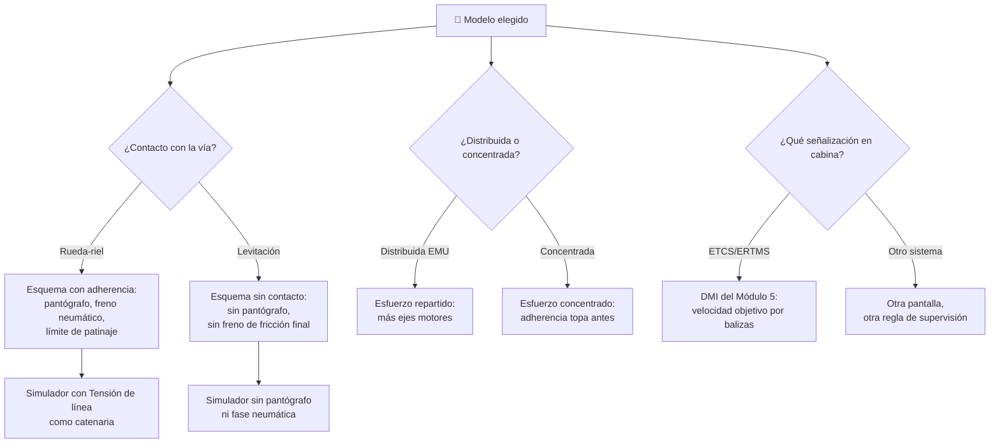

# 🧩 Modelos y variantes del tren de alta velocidad

[🏠 Inicio](../../../README.md) · [🚄 Curso: Tren de alta velocidad](../README.md) · 🧩 Modelos

El [Módulo 2](../operacion/caracteristicas-tren-alta-velocidad.md) ya dijo qué
configuraciones existen y cómo se distingue cada una. Este módulo responde a otra
cosa: **no todos se manejan igual**, y esa diferencia no es de matiz. Cambia qué
mandos tiene la máquina y, por tanto, qué debe modelar el simulador.

> 🎯 **La idea que sostiene el módulo.** "Un tren de alta velocidad" no es una
> sola máquina desde el punto de vista del mando. Un maglev no tiene pantógrafo
> ni contacto rueda-riel: no es que los tenga distintos, es que **no existen**. Y
> el DMI que el maquinista mira no es una pantalla universal, sino la de un
> sistema de señalización concreto. Un simulador que presente un solo esquema de
> control está representando un tren concreto aunque diga representarlos todos.

---

## 🧭 Por qué el modelo decide el simulador

El [Módulo 5](../mandos/manual-mandos-tren-alta-velocidad.md) describe un puesto
de mando con manipulador de tracción/freno, botón de pantógrafo y un **DMI de
ETCS** como pantalla de señalización en cabina. El
[Módulo 9](../simulacion/diseno-simulador-tren-alta-velocidad.md) expone una
variable `Tensión de línea` que limita la tracción disponible y una `Velocidad
objetivo` que "la marca el DMI en cabina". Ambos describen un tren **rueda-riel,
alimentado por catenaria y supervisado por ETCS**.

En un maglev no hay pantógrafo que subir ni adherencia rueda-riel que limite el
esfuerzo: el contacto físico, que es de donde salen esas dos restricciones, no
existe. Y en un tren equipado con otro sistema de señalización en cabina, la
pantalla que el maquinista mira no es el DMI de ETCS: muestra otra información y
supervisa con otra lógica. Si el simulador se construye sobre el esquema
ETCS + catenaria + rueda-riel y luego se le "añade" un maglev, el resultado es un
maglev con pantógrafo, que no existe.

Conviene además un matiz que el curso ya marca: **Chile todavía no tiene alta
velocidad comercial**. No hay un modelo "de casa" que sirva de referencia por
defecto, y varios valores locales (tensión de línea, ancho de vía) quedan por
confirmar. La elección del modelo base es, aquí, una decisión de diseño
explícita, no algo que el entorno resuelva solo.

---

## 🗂️ Qué cambia en el manejo

| Modelo | Qué cambia al conducirlo |
| --- | --- |
| Tracción distribuida (EMU) | La referencia del curso: motores repartidos en varios coches, más ejes motores y mejor adherencia. El esfuerzo se reparte y patina menos al acelerar. |
| Tracción concentrada | La potencia va en la locomotora en cabeza (y a veces en cola) y remolca coches sin motor. Menos ejes motores para el mismo tren: el límite de adherencia aparece antes al traccionar. |
| Rueda-riel | El contacto acero contra acero tiene poca fricción: la adherencia es el techo real de lo que se puede pedir, al acelerar y al frenar. |
| Levitación magnética | Sin contacto físico con la vía: desaparece el límite de adherencia y, con él, buena parte de la intuición de la frenada por fricción. Vía propia exclusiva, sin compatibilidad con la red convencional. |
| Señalización ETCS/ERTMS | La referencia del curso: el maquinista conduce mirando la velocidad objetivo del DMI, no señales laterales. |
| Otro sistema de señalización en cabina | La pantalla y la lógica de supervisión son otras. Lo que el maquinista lee y el momento en que el sistema interviene cambian; el detalle concreto queda por confirmar. |

---

## 🎛️ Qué cambia en el mando

| Modelo | Qué mando aparece o desaparece | Consecuencia |
| --- | --- | --- |
| Tracción distribuida (EMU) | Ninguno: el mapa de controles del Módulo 5 aplica tal cual. | Es el caso base del curso. |
| Tracción concentrada | Ninguno: mismos controles. | Cambian los rangos útiles del manipulador, no los mandos. |
| Rueda-riel | Ninguno: el manipulador de freno reparte entre regenerativo, dinámico, neumático y de Foucault. | El freno neumático completa siempre la detención final. |
| Levitación magnética | **Desaparece** el botón de pantógrafo: sin contacto físico no hay brazo que roce la catenaria. **Desaparece** el freno neumático de zapatas sobre rueda, y con él la fase final de frenada por fricción. | Se cae una entrada completa del Módulo 5 (tecla P) y se vacía una parte del manipulador de freno. La fuente de energía y el frenado propios de esta variante quedan por confirmar. |
| Señalización ETCS/ERTMS | Ninguno: el DMI del Módulo 5 es exactamente esta pantalla. | Es el caso base. |
| Otro sistema de señalización en cabina | El DMI **se sustituye** por otra pantalla; el instrumento no desaparece, cambia de contenido y de lógica. | El vigilante y el freno de emergencia siguen, pero la regla que dispara el frenado automático deja de ser la del Módulo 5. |

---

## 🎮 Qué cambia en el simulador

Contrastado con las variables del
[Módulo 9](../simulacion/diseno-simulador-tren-alta-velocidad.md):

| Modelo | Variables que cambian | Esquema de control |
| --- | --- | --- |
| Tracción distribuida (EMU) | Ninguna: es el caso base. | El del Módulo 5. |
| Tracción concentrada | `Esfuerzo de tracción` topa antes por adherencia con menos ejes motores. `Masa del tren` deja de repartirse de forma uniforme y se concentra en cabeza. | El mismo, con menos margen antes de patinar. |
| Rueda-riel | Ninguna: es el caso base. | El del Módulo 5. |
| Levitación magnética | `Tensión de línea` **deja de tener el sentido** de catenaria captada por pantógrafo. `Esfuerzo de freno` pierde el reparto que incluye el freno neumático sobre rueda. `Resistencia aerodinámica` gana peso relativo al desaparecer la resistencia de rodadura. | Sin entrada de pantógrafo; frenada sin fase final de fricción. |
| Señalización ETCS/ERTMS | Ninguna: es el caso base. | El del Módulo 5. |
| Otro sistema de señalización en cabina | `Velocidad objetivo` **cambia de origen**: deja de venir de las balizas y el equipo embarcado ETCS. El paso 6 del ciclo básico (supervisar y frenar solo si se excede) responde a otra regla. | El mismo, con otra pantalla y otro criterio de intervención. |
| Sin red de alta velocidad local | `Tensión de línea` y el ancho de vía carecen de valor de referencia chileno: quedan por confirmar. | El mismo, con parámetros declarados como pendientes. |

---

## 🗺️ Del modelo al esquema de control

---

## ⚠️ Qué modelos no comparten simulador

Dos familias no se resuelven con un ajuste de parámetros, porque su esquema de
control es otro:

- **El maglev** frente al resto rueda-riel: falta una entrada completa (el
  pantógrafo), se vacía una parte del manipulador de freno y `Tensión de línea`
  pierde su significado de catenaria. Es un modo de control distinto, no una
  dificultad distinta.
- **Un tren con señalización en cabina que no sea ETCS** frente al del curso: el
  instrumento que gobierna toda la conducción muestra otra cosa y supervisa con
  otra regla. Cambiar el DMI no es cambiar un indicador: cambia el bucle entero
  entre lo que el maquinista lee y cuándo el tren frena solo.

El resto de modelos sí caben en un mismo simulador ajustando rangos, tal como
plantean los [niveles de realismo](../../../docs/03-niveles-de-realismo.md): en
el nivel 1 la tracción distribuida y la concentrada se comportan casi igual, y
las diferencias emergen a medida que el nivel sube y la adherencia, la tensión de
línea y la supervisión ETCS entran en el modelo.

> ⚖️ **El principio detrás de todo esto.** Cuánto pesa la carga y dónde va no cambia
> solo los números: cambia qué puede hacer el operador. La física común a todas las
> máquinas del catálogo —sostener, girar, equilibrar y la masa que cambia en
> marcha— está en [⚖️ carga y manejo](../../../docs/09-carga-y-manejo.md).

---

[⬅️ Anterior: Características](../operacion/caracteristicas-tren-alta-velocidad.md) · [➡️ Siguiente: Sistemas mecánicos](../operacion/sistemas-mecanicos-tren-alta-velocidad.md)
