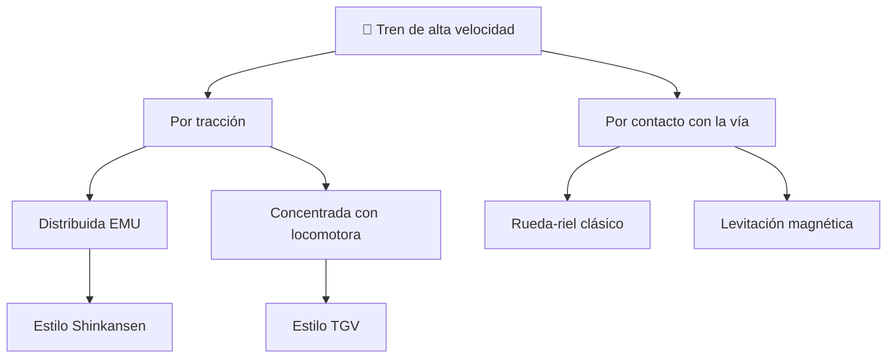

# 📋 Características funcionales del tren de alta velocidad

[🏠 Inicio](../../../README.md) · [🚄 Curso: Tren de alta velocidad](../README.md) · 📋 Características

Que es un tren de alta velocidad, que configuraciones existen y para que sirve
cada una. Este módulo da el contexto antes de abrir la mecánica (Módulo 4).

---

## 🧭 Definición

Un tren de alta velocidad es un tren disenado para circular por encima de unos
250 km/h sobre una vía dedicada, sin cruces a nivel y con curvas amplias. A esa
velocidad la resistencia del aire domina, por lo que la aerodinámica y una vía
especial son tan importantes como la potencia. Guía sobre rieles, de modo que no
tiene dirección libre: su ruta está fijada por la vía.

---

## 🧬 Características clave

| Característica | Descripción |
| --- | --- |
| Velocidad de servicio | Por encima de 250 km/h en vía dedicada. |
| Vía dedicada | Sin pasos a nivel, con curvas amplias y peralte. |
| Aerodinámica | Nariz alargada; la resistencia del aire domina a alta velocidad. |
| Tracción distribuida | Motores repartidos en varios coches (EMU) en muchos diseños. |
| Energía cinética enorme | Gran masa por gran velocidad; distancias de frenado de kilómetros. |
| Señalización en cabina | ETCS/ERTMS; no hay señales laterales legibles a esa velocidad. |
| Alimentación eléctrica | Pantógrafo único sobre catenaria de alta tensión. |

---

## 🗂️ Tipos de configuración

| Tipo | Como se distingue | Rasgo destacado |
| --- | --- | --- |
| Tracción distribuida (EMU) | Motores en varios coches | Mejor adherencia y aceleración repartida. |
| Tracción concentrada | Locomotora en cabeza (y cola) | Coches remolcados sin motor. |
| Rueda-riel | Contacto clásico rueda de pestaña | Compatible con red convencional. |
| Levitación magnética | Sin contacto físico | Muy alta velocidad, vía propia exclusiva. |
| Ancho internacional | Trocha estandar | Referencia común; valor para Chile por confirmar. |

---

## 🎯 Para qué se usa

- Unir grandes ciudades separadas por distancias medias de forma rápida.
- Competir con el avión en trayectos de algunos cientos de kilómetros.
- Descongestionar corredores de transporte muy demandados.
- Ofrecer transporte público masivo con alta frecuencia y puntualidad.
- Reducir el uso del automóvil entre ciudades conectadas.

---

[⬅️ Anterior: Historia](../historia/historia-tren-alta-velocidad.md) · [➡️ Siguiente: Modelos y variantes](../modelos/modelos-tren-alta-velocidad.md)
