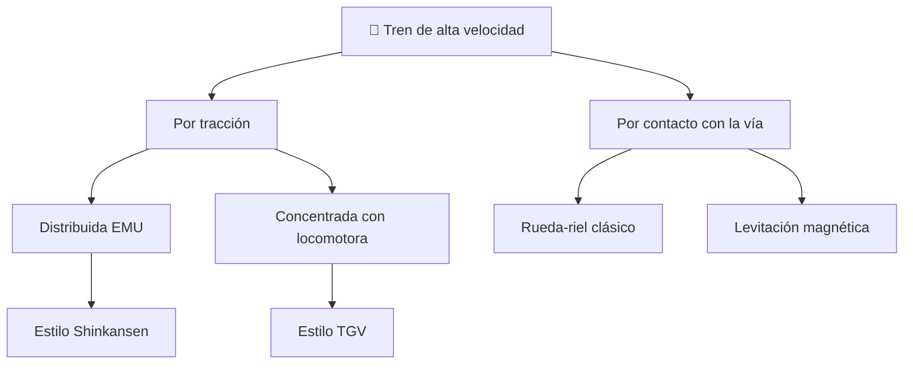

<!-- clase-meta
tipo_documento: clase
clase: 2
codigo: TRENALTAVELO-02
curso: tren-alta-velocidad
titulo: "Características funcionales del tren de alta velocidad"
modalidad: "teórica aplicada"
duracion_minutos: 45
nivel: introductorio
prerrequisito: TRENALTAVELO-01
competencia: "identificacion_funcional"
resultados_aprendizaje:
  - "Explicar definición, rasgos funcionales, tipos y usos con vocabulario propio de Tren de alta velocidad."
  - "Aplicar esos conceptos a una decisión segura o a un escenario de simulación de Tren de alta velocidad."
evidencia: "Matriz comparativa y decisión justificada."
criterio_aprobacion: "La elección considera función, límites, mando y efecto en la simulación; no se apoya solo en preferencias."
fuentes: manuales/fuentes.md
ultima_revision: 2026-09-10
-->

# 📋 Características funcionales del tren de alta velocidad

[🏠 Inicio](../../../README.md) · [🚄 Curso: Tren de alta velocidad](../README.md) · 📋 Características

Que es un tren de alta velocidad, que configuraciones existen y para que sirve
cada una. Esta clase da el contexto antes de abrir la mecánica (Clase 4).

---

## 🧭 Definición

Un tren de alta velocidad es un tren disenado para circular por encima de unos
250 km/h sobre una vía dedicada, sin cruces a nivel y con curvas amplias. A esa
velocidad la resistencia del aire domina, por lo que la aerodinámica y una vía
especial son tan importantes como la potencia. Guía sobre rieles, de modo que no
tiene dirección libre: su ruta está fijada por la vía.

---

## 🧬 Características clave

| Característica | Descripción |
| --- | --- |
| Velocidad de servicio | Por encima de 250 km/h en vía dedicada. |
| Vía dedicada | Sin pasos a nivel, con curvas amplias y peralte. |
| Aerodinámica | Nariz alargada; la resistencia del aire domina a alta velocidad. |
| Tracción distribuida | Motores repartidos en varios coches (EMU) en muchos diseños. |
| Energía cinética enorme | Gran masa por gran velocidad; distancias de frenado de kilómetros. |
| Señalización en cabina | ETCS/ERTMS; no hay señales laterales legibles a esa velocidad. |
| Alimentación eléctrica | Pantógrafo único sobre catenaria de alta tensión. |

---

## 🗂️ Tipos de configuración

```mermaid
flowchart TD
    Tren[🚄 Tren de alta velocidad] --> Traccion[Por tracción]
    Tren --> Contacto[Por contacto con la vía]
    Traccion --> Distribuida[Distribuida EMU]
    Traccion --> Concentrada[Concentrada con locomotora]
    Contacto --> Rueda[Rueda-riel clásico]
    Contacto --> Maglev[Levitación magnética]
    Distribuida --> Shinkansen[Estilo Shinkansen]
    Concentrada --> TGV[Estilo TGV]
```

| Tipo | Como se distingue | Rasgo destacado |
| --- | --- | --- |
| Tracción distribuida (EMU) | Motores en varios coches | Mejor adherencia y aceleración repartida. |
| Tracción concentrada | Locomotora en cabeza (y cola) | Coches remolcados sin motor. |
| Rueda-riel | Contacto clásico rueda de pestaña | Compatible con red convencional. |
| Levitación magnética | Sin contacto físico | Muy alta velocidad, vía propia exclusiva. |
| Ancho internacional | Trocha estandar | Referencia común; valor para Chile por confirmar. |

---

## 🎯 Para qué se usa

- Unir grandes ciudades separadas por distancias medias de forma rápida.
- Competir con el avión en trayectos de algunos cientos de kilómetros.
- Descongestionar corredores de transporte muy demandados.
- Ofrecer transporte público masivo con alta frecuencia y puntualidad.
- Reducir el uso del automóvil entre ciudades conectadas.

## 🧭 Guía de estudio aplicada

### Pregunta guía

¿Cómo ayuda **Definición, Características clave, Tipos de configuración y Para qué se usa** a **elegir una configuración adecuada para reducción de velocidad previa a una zona de viento lateral**?

### Explicación razonada

Una característica solo es útil cuando permite anticipar comportamiento. En Tren de alta velocidad, la relación entre catenaria, electrónica de potencia, motores distribuidos y rueda-carril determina capacidad, respuesta y límites. Por eso «tracción distribuida frente a cabezas tractoras» no se compara por apariencia: se compara por misión, entorno, carga de trabajo y exposición al riesgo «perder margen por interpretar tarde una restricción a velocidad elevada».

Esta clase se conecta con el resto del curso mediante **estabilidad dinámica y crecimiento de la energía con el cuadrado de la velocidad**. El hilo de
seguridad consiste en reconocer a tiempo **perder margen por interpretar tarde una restricción a velocidad elevada** y poder justificar la decisión
**cumplir la curva de frenado con anticipación y sin correcciones bruscas**; en clases posteriores cambiará el ángulo de análisis, no esa relación causal.
La lectura funcional común sigue **catenaria → electrónica de potencia → motores distribuidos → rueda-carril**, de modo que cada concepto pueda
ubicarse dentro del funcionamiento completo y no quede como un dato aislado.

**Apoyo documental:** [Railroad Operating Practices](https://railroads.fra.dot.gov/railroad-safety/divisions/operating-practices/operating-practices-0) aporta operación, señalización y competencias ferroviarias;
[Human Factors: Tasks and Demands](https://railroads.fra.dot.gov/human-factors/elearning-attention/tasks-demands) se usa para factores humanos y carga de trabajo. Estas fuentes
se contrastan con el alcance de la clase y no sustituyen un manual de equipo concreto.

### Caso resuelto: de la observación a la decisión

1. **Definir la necesidad:** convierte «reducción de velocidad previa a una zona de viento lateral» en requisitos de capacidad, entorno y respuesta.
2. **Comparar:** contrasta **tracción distribuida frente a cabezas tractoras** usando esos requisitos y la cadena **catenaria → electrónica de potencia → motores distribuidos → rueda-carril**.
3. **Descartar:** elimina la alternativa que deja menos margen frente a **perder margen por interpretar tarde una restricción a velocidad elevada**.
4. **Elegir:** declara la variante escogida, la evidencia usada y una limitación que todavía debe respetarse.

### Comprueba tu comprensión

1. ¿Qué característica de **rueda-carril** condiciona primero el caso «reducción de velocidad previa a una zona de viento lateral»?
2. ¿Qué requisito descartaría una de las alternativas **tracción distribuida frente a cabezas tractoras**?
3. ¿Qué límite debe declararse junto con la variante elegida?

Orientación para revisar tus respuestas

- La primera respuesta debe relacionar el eslabón elegido con un efecto posterior, no solo nombrarlo.
- La segunda debe proponer una señal medible u observable y explicar qué tendencia sería preocupante.
- La tercera debe cambiar al menos una variable de capacidad, mando, entorno o margen de seguridad.

## 🎓 Cierre de clase

- **Actividad:** Compara variantes de Tren de alta velocidad mediante los ejes «definición, rasgos funcionales, tipos y usos» y elige una para un caso de uso razonado.
- **Evidencia:** Matriz comparativa y decisión justificada.
- **Criterio de aprobación:** La elección considera función, límites, mando y efecto en la simulación; no se apoya solo en preferencias.
- **Transferencia:** explica qué cambiaría al pasar a otra variante de esta máquina.

### Fuentes de esta clase

- [US-FRA-OPS](https://railroads.fra.dot.gov/railroad-safety/divisions/operating-practices/operating-practices-0): Railroad Operating Practices, Federal Railroad Administration. Uso: operación, señalización y competencias ferroviarias.
- [US-FRA-HF](https://railroads.fra.dot.gov/human-factors/elearning-attention/tasks-demands): Human Factors: Tasks and Demands, Federal Railroad Administration. Uso: factores humanos y carga de trabajo.
- [NASA-FLIGHT](https://www1.grc.nasa.gov/beginners-guide-to-aeronautics/): Beginner's Guide to Aeronautics, NASA. Uso: contraste con física y vuelo reales.

> Las fuentes sostienen el marco conceptual y normativo; esta clase no reemplaza el manual
> del fabricante, la formación certificada ni la habilitación exigida para operar equipos reales.

---

[⬅️ Anterior: Historia](../historia/historia-tren-alta-velocidad.md) · [➡️ Siguiente: Modelos y variantes](../modelos/modelos-tren-alta-velocidad.md)
