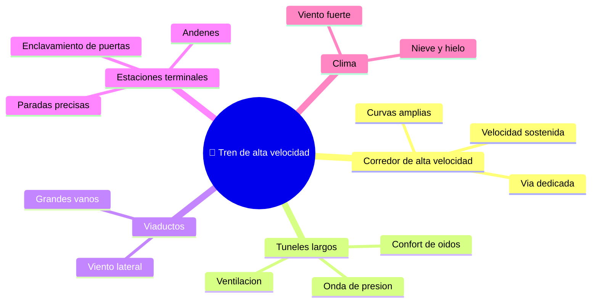

# 🌍 Entornos de trabajo del tren de alta velocidad

[🏠 Inicio](../../../README.md) · [🚄 Curso: Tren de alta velocidad](../README.md) · 🌍 Entornos

Dónde opera un tren de alta velocidad y cómo cambia la conducción según el
entorno. Cada entorno implica reglas, riesgos y ajustes distintos, y en
simulación se traduce en escenarios diferentes.

---

## 🗺️ Entornos principales

| Entorno | Características | Riesgos típicos | Ajuste de conducción |
| --- | --- | --- | --- |
| Corredor de alta velocidad | Vía dedicada, curvas amplias. | Objetos en la vía, fallas de catenaria. | Velocidad sostenida, respetar el DMI. |
| Túneles largos | Cambios de presión, ruido. | Onda de presión, confort de oidos. | Velocidad y ventilación adecuadas. |
| Viaductos | Grandes vanos elevados. | Viento lateral, rachas. | Reducir velocidad con viento fuerte. |
| Estaciones terminales | Andenes y agujas. | Mala alineación, atrapamientos. | Frenado preciso, enclavamiento de puertas. |
| Clima adverso | Viento, nieve, hielo. | Menor adherencia, catenaria helada. | Límites reducidos por condiciones. |

---

## 🌦️ Factores del entorno

- **Clima**: el viento lateral en viaductos y la nieve o hielo en la catenaria
  obligan a reducir la velocidad.
- **Infraestructura**: túneles y viaductos imponen condiciones de presión y viento
  que cambian la marcha.
- **Tráfico ferroviario**: el control asigna la vía y las agujas; el tren no elige
  su ruta.
- **Cruce de trenes**: al cruzarse dos trenes a alta velocidad se genera una onda
  de presión que la aerodinámica debe absorber.

---

## 🎮 Traducción a simulación

Cada entorno es un escenario con su vía, clima y condiciones de infraestructura.
Ver cómo se modela en el
[Módulo 9: Diseño de simulación](../simulacion/diseno-simulador-tren-alta-velocidad.md).

---

[⬅️ Anterior: Principios y operación](principios-tren-alta-velocidad.md) · [➡️ Siguiente: Reglamentos](../reglamentos/reglamentos-tren-alta-velocidad.md)
