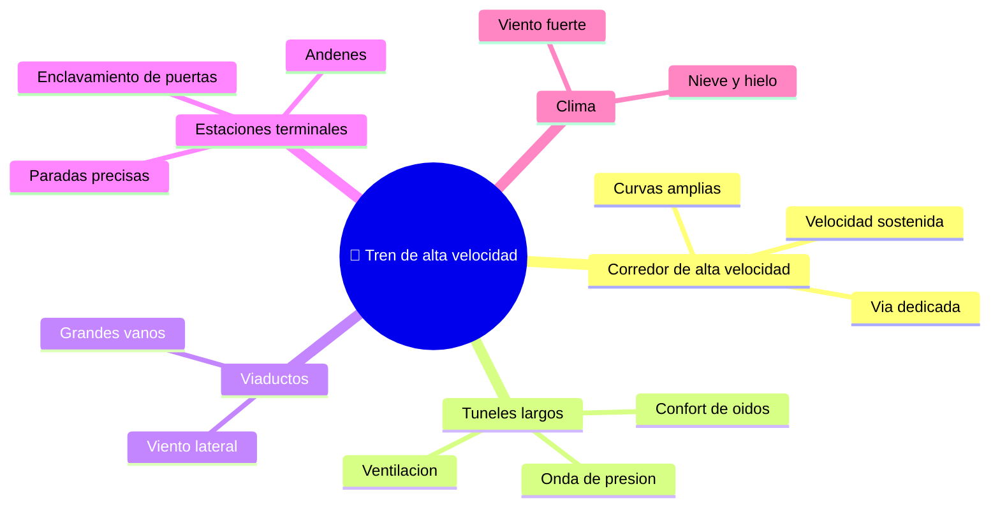

# 🌍 Entornos de trabajo del tren de alta velocidad

[🏠 Inicio](../../../README.md) · [🚄 Curso: Tren de alta velocidad](../README.md) · 🌍 Entornos

Donde opera un tren de alta velocidad y como cambia la conduccion segun el
entorno. Cada entorno implica reglas, riesgos y ajustes distintos, y en
simulacion se traduce en escenarios diferentes.

---

## 🗺️ Entornos principales

| Entorno | Caracteristicas | Riesgos tipicos | Ajuste de conduccion |
| --- | --- | --- | --- |
| Corredor de alta velocidad | Via dedicada, curvas amplias. | Objetos en la via, fallas de catenaria. | Velocidad sostenida, respetar el DMI. |
| Tuneles largos | Cambios de presion, ruido. | Onda de presion, confort de oidos. | Velocidad y ventilacion adecuadas. |
| Viaductos | Grandes vanos elevados. | Viento lateral, rachas. | Reducir velocidad con viento fuerte. |
| Estaciones terminales | Andenes y agujas. | Mala alineacion, atrapamientos. | Frenado preciso, enclavamiento de puertas. |
| Clima adverso | Viento, nieve, hielo. | Menor adherencia, catenaria helada. | Limites reducidos por condiciones. |

---

## 🌦️ Factores del entorno

- **Clima**: el viento lateral en viaductos y la nieve o hielo en la catenaria
  obligan a reducir la velocidad.
- **Infraestructura**: tuneles y viaductos imponen condiciones de presion y viento
  que cambian la marcha.
- **Trafico ferroviario**: el control asigna la via y las agujas; el tren no elige
  su ruta.
- **Cruce de trenes**: al cruzarse dos trenes a alta velocidad se genera una onda
  de presion que la aerodinamica debe absorber.

---

## 🎮 Traduccion a simulacion

Cada entorno es un escenario con su via, clima y condiciones de infraestructura.
Ver como se modela en el
[Modulo 8: Diseno de simulacion](../simulacion/diseno-simulador-tren-alta-velocidad.md).

---

[⬅️ Anterior: Principios y operacion](principios-tren-alta-velocidad.md) · [➡️ Siguiente: Reglamentos](../reglamentos/reglamentos-tren-alta-velocidad.md)
