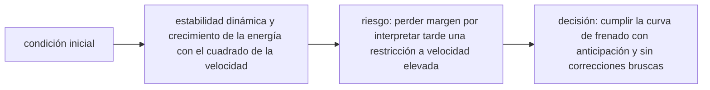

<!-- clase-meta
tipo_documento: clase
clase: 6
codigo: TRENALTAVELO-06
curso: tren-alta-velocidad
titulo: "Principios y operación del tren de alta velocidad"
modalidad: "resolución de problemas"
duracion_minutos: 90
nivel: introductorio
prerrequisito: TRENALTAVELO-05
competencia: "razonamiento_operacional"
resultados_aprendizaje:
  - "Explicar principios físicos, fases de operación, decisiones y errores frecuentes con vocabulario propio de Tren de alta velocidad."
  - "Aplicar esos conceptos a una decisión segura o a un escenario de simulación de Tren de alta velocidad."
evidencia: "Resolución argumentada de un escenario operacional."
criterio_aprobacion: "Aplica los principios correctos, anticipa consecuencias y respeta los límites del curso."
fuentes: manuales/fuentes.md
ultima_revision: 2026-09-10
-->

# 🧪 Principios y operación del tren de alta velocidad

[🏠 Inicio](../../../README.md) · [🚄 Curso: Tren de alta velocidad](../README.md) · 🧪 Principios

Documento general y educativo. No sustituye la formación certificada de un
maquinista ni los manuales del fabricante y del administrador de la
infraestructura. Describe cómo se opera un tren de alta velocidad en simulación y
que principios físicos conviene representar.

## Principios de funcionamiento

- **Propulsión**: los motores eléctricos, alimentados desde la catenaria, entregan
  esfuerzo de tracción a los ejes. El manipulador regula esa entrega.
- **Energía cinética enorme**: la gran masa a gran velocidad acumula muchísima
  energía; frenar exige combinar varios sistemas y mucho espacio.
- **Frenado de distancias de kilómetros**: no se detiene en metros; la frenada se
  planifica con mucha anticipación respecto a la señal objetivo.
- **Dominio de la resistencia aerodinámica**: por encima de 250 km/h la resistencia
  del aire es la principal fuerza que se opone al avance.
- **Estabilidad a alta velocidad**: bogies, suspensión y vía dedicada evitan la
  oscilación y mantienen el tren centrado sobre el riel.
- **Ruta fija**: el tren no elige dirección; sigue la vía y las agujas que le
  asigna el control de tráfico.

## Fases de operación

| Fase | Que ocurre | Puntos clave |
| --- | --- | --- |
| Inspección previa | Revisión básica | Pantógrafo, frenos, puertas, señalización en cabina. |
| Toma de tensión | Subir pantógrafo | Confirmar tensión de línea antes de traccionar. |
| Puesta en marcha | Iniciar movimiento | Confirmar vigilante y aplicar tracción progresiva. |
| Circulación | Marcha a alta velocidad | Respetar la velocidad objetivo del DMI, anticipar. |
| Frenado planificado | Preparar la parada | Iniciar el frenado con mucha anticipación. |
| Parada en estación | Detener con precisión | Alinear puertas al andén, abrir con enclavamiento. |
| Cierre | Dejar seguro | Bajar pantógrafo, freno aplicado, sistemas off. |

## Frenado anticipado: idea general

1. Conocer la **velocidad objetivo** que marca el DMI mucho antes del punto.
2. Iniciar el frenado con **kilómetros** de anticipación, no metros.
3. Usar primero el **freno regenerativo y dinámico**, que no desgastan.
4. Completar con el **freno neumático** para la detención final.
5. Detener con precisión para alinear las puertas con el andén.

## Errores comunes que la simulación puede enseñar a evitar

- Frenar tarde, sin respetar la enorme distancia de frenado.
- Ignorar la velocidad objetivo del DMI y provocar el frenado automático.
- No confirmar el dispositivo de hombre muerto o vigilante.
- Subestimar la resistencia aerodinámica y el consumo a alta velocidad.
- Abrir puertas sin el enclavamiento o con el tren mal alineado al andén.

## Relación con los niveles de realismo

- **Nivel 1 (educativo)**: traccionar, frenar a tiempo y respetar la señal objetivo.
- **Nivel 2 (simplificado)**: agregar energía cinética, resistencia aerodinámica
  y distancia de frenado realista.
- **Nivel 3 (técnico)**: sumar gestión de varios frenos, tensión de línea, vigilante
  y supervisión ETCS.

Ver [`docs/03-niveles-de-realismo.md`](../../../docs/03-niveles-de-realismo.md) para el detalle de cada nivel.

## 🧭 Guía de estudio aplicada

### Pregunta guía

¿Cómo ayuda **Principios de funcionamiento, Fases de operación, Frenado anticipado: idea general y Errores comunes que la simulación puede enseñar a evitar** a **resolver reducción de velocidad previa a una zona de viento lateral sin agotar el margen operacional**?

### Explicación razonada

El principio rector puede resumirse así: estabilidad dinámica y crecimiento de la energía con el cuadrado de la velocidad. Esto explica por qué una misma orden produce resultados distintos cuando cambian velocidad, carga, configuración o entorno. Operar bien consiste en leer la tendencia antes de agotar el margen y tomar esta decisión: cumplir la curva de frenado con anticipación y sin correcciones bruscas.

Esta clase se conecta con el resto del curso mediante **estabilidad dinámica y crecimiento de la energía con el cuadrado de la velocidad**. El hilo de
seguridad consiste en reconocer a tiempo **perder margen por interpretar tarde una restricción a velocidad elevada** y poder justificar la decisión
**cumplir la curva de frenado con anticipación y sin correcciones bruscas**; en clases posteriores cambiará el ángulo de análisis, no esa relación causal.
La lectura funcional común sigue **catenaria → electrónica de potencia → motores distribuidos → rueda-carril**, de modo que cada concepto pueda
ubicarse dentro del funcionamiento completo y no quede como un dato aislado.

**Apoyo documental:** [Railroad Operating Practices](https://railroads.fra.dot.gov/railroad-safety/divisions/operating-practices/operating-practices-0) aporta operación, señalización y competencias ferroviarias;
[Human Factors: Tasks and Demands](https://railroads.fra.dot.gov/human-factors/elearning-attention/tasks-demands) se usa para factores humanos y carga de trabajo. Estas fuentes
se contrastan con el alcance de la clase y no sustituyen un manual de equipo concreto.

### Caso resuelto: de la observación a la decisión

1. **Datos:** reconoce condiciones, configuración y margen disponibles en **reducción de velocidad previa a una zona de viento lateral**.
2. **Modelo:** aplica **estabilidad dinámica y crecimiento de la energía con el cuadrado de la velocidad** para predecir una tendencia antes de actuar.
3. **Riesgo:** explica mediante qué cadena de causas podría ocurrir **perder margen por interpretar tarde una restricción a velocidad elevada**.
4. **Decisión:** ejecuta mentalmente **cumplir la curva de frenado con anticipación y sin correcciones bruscas** y define qué observación confirmaría que funcionó.

### Comprueba tu comprensión

1. ¿Qué variable del principio «estabilidad dinámica y crecimiento de la energía con el cuadrado de la velocidad» cambia primero en el caso?
2. ¿Cómo se propaga ese cambio hasta **rueda-carril**?
3. ¿Qué evidencia confirmaría que **cumplir la curva de frenado con anticipación y sin correcciones bruscas** conservó margen operacional?

Orientación para revisar tus respuestas

- La primera respuesta debe relacionar el eslabón elegido con un efecto posterior, no solo nombrarlo.
- La segunda debe proponer una señal medible u observable y explicar qué tendencia sería preocupante.
- La tercera debe cambiar al menos una variable de capacidad, mando, entorno o margen de seguridad.

## 🎓 Cierre de clase

- **Actividad:** Resuelve un escenario de Tren de alta velocidad explicando, paso a paso, cómo intervienen principios físicos, fases de operación, decisiones y errores frecuentes.
- **Evidencia:** Resolución argumentada de un escenario operacional.
- **Criterio de aprobación:** Aplica los principios correctos, anticipa consecuencias y respeta los límites del curso.
- **Transferencia:** explica qué cambiaría al pasar a otra variante de esta máquina.

### Fuentes de esta clase

- [US-FRA-OPS](https://railroads.fra.dot.gov/railroad-safety/divisions/operating-practices/operating-practices-0): Railroad Operating Practices, Federal Railroad Administration. Uso: operación, señalización y competencias ferroviarias.
- [US-FRA-HF](https://railroads.fra.dot.gov/human-factors/elearning-attention/tasks-demands): Human Factors: Tasks and Demands, Federal Railroad Administration. Uso: factores humanos y carga de trabajo.
- [NASA-FLIGHT](https://www1.grc.nasa.gov/beginners-guide-to-aeronautics/): Beginner's Guide to Aeronautics, NASA. Uso: contraste con física y vuelo reales.

> Las fuentes sostienen el marco conceptual y normativo; esta clase no reemplaza el manual
> del fabricante, la formación certificada ni la habilitación exigida para operar equipos reales.

---

[⬅️ Anterior: Mandos](../mandos/manual-mandos-tren-alta-velocidad.md) · [➡️ Siguiente: Entornos de trabajo](entornos-tren-alta-velocidad.md)
