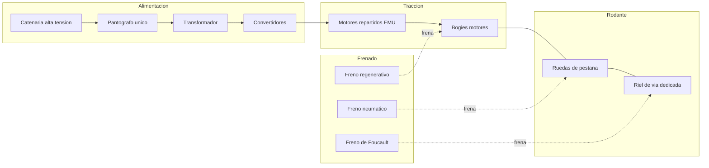
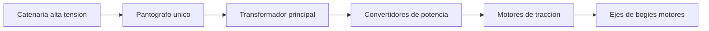
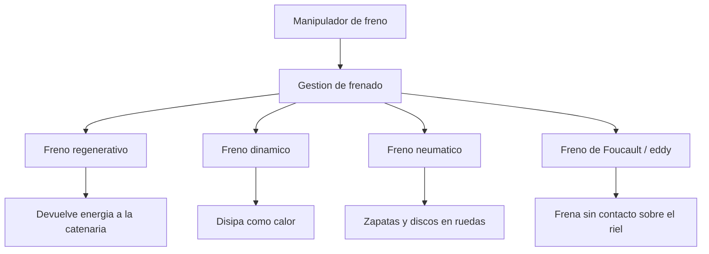
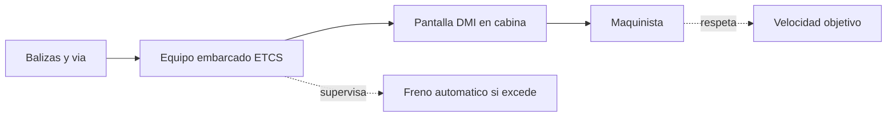

# 🔧 Sistemas mecanicos del tren de alta velocidad

[🏠 Inicio](../../../README.md) · [🚄 Curso: Tren de alta velocidad](../README.md) · 🔧 Sistemas mecanicos

Este modulo abre el tren de alta velocidad por dentro. Explica cada sistema, como
funciona y como se conecta con los demas, con foco en la traccion electrica de
alta potencia, el frenado de gran masa, la aerodinamica y la via dedicada. Es la
base tecnica para entender los mandos (Modulo 4) y la fisica (Modulo 5).

---

## 1. ⚡ Traccion electrica de alta potencia

El tren no lleva combustible a bordo: toma energia electrica de la **catenaria de
alta tension** mediante un **pantografo unico** en contacto con el cable. A alta
velocidad se usa un solo pantografo activo para reducir el arco electrico y el
ruido aerodinamico.

| Componente | Funcion |
| --- | --- |
| Catenaria | Cable aereo que lleva la alta tension a lo largo de la via. |
| Pantografo | Brazo articulado que roza la catenaria y capta la corriente. |
| Transformador | Adapta la tension de linea a la del tren. |
| Convertidores | Regulan la energia entregada a los motores. |
| Motores de traccion | Convierten la electricidad en giro de los ejes. |

- **Traccion distribuida (EMU)**: los motores se reparten en varios coches. Esto
  mejora la adherencia (mas ejes motores) y reparte el esfuerzo.
- **Traccion concentrada**: la potencia se concentra en una locomotora en cabeza
  (y a veces en cola) que remolca coches sin motor.
- **Tension exacta de linea para Chile**: por confirmar, al no existir red de
  alta velocidad comercial.

---

## 2. 🛞 Bogies y ruedas de pestana

El **bogie** es el carro con ejes, ruedas y suspension sobre el que se apoya cada
coche. Las **ruedas de pestana** guian el tren sobre el riel: la pestana interior
impide que la rueda se salga y el perfil conico ayuda a centrar el eje.

| Elemento | Funcion |
| --- | --- |
| Bogie | Estructura con ejes y suspension bajo cada coche. |
| Rueda de pestana | Rueda con reborde que se mantiene sobre el riel. |
| Perfil conico | Centra el eje y ayuda a tomar curvas. |
| Suspension primaria | Une eje y bogie, filtra irregularidades del riel. |
| Suspension secundaria | Une bogie y coche, da confort al pasajero. |

- **Adherencia rueda-riel**: el contacto acero contra acero tiene poca friccion,
  por eso repartir motores (EMU) ayuda a no patinar al acelerar.
- **Estabilidad**: a alta velocidad los bogies deben evitar la oscilacion
  llamada movimiento de lazo, con amortiguadores especiales.

---

## 3. 🛑 Frenado de gran masa a alta velocidad

Detener un tren de alta velocidad exige combinar varios frenos, porque la energia
cinetica es enorme y la distancia de frenado se mide en kilometros. El freno solo
de friccion no basta ni disiparia el calor con seguridad.

| Tipo de freno | Como funciona | Nota |
| --- | --- | --- |
| Regenerativo | El motor actua como generador y devuelve energia a la linea. | Ahorra energia y frena sin desgaste. |
| Dinamico | El motor genera electricidad que se disipa como calor. | Util cuando la linea no admite regeneracion. |
| Neumatico | Aire comprimido aprieta zapatas o discos en las ruedas. | Freno de friccion clasico, para baja velocidad y parada. |
| Foucault / eddy | Corrientes inducidas frenan sobre el riel sin contacto. | Sin desgaste; util a alta velocidad. |

- El **freno regenerativo** y el **dinamico** hacen la mayor parte del trabajo a
  alta velocidad; el **neumatico** completa la detencion final.
- El **freno de Foucault** (corrientes de Foucault o eddy) frena sin tocar la
  rueda, lo que reduce el desgaste en frenadas fuertes.

---

## 4. 🌬️ Aerodinamica

Por encima de 250 km/h la **resistencia del aire domina** sobre las demas fuerzas
de oposicion. Por eso la forma del tren importa tanto como su potencia.

| Aspecto aerodinamico | Efecto |
| --- | --- |
| Forma de nariz | Una nariz larga reduce la resistencia y la onda de presion. |
| Resistencia del aire | Crece con el cuadrado de la velocidad; domina a alta velocidad. |
| Ruido | El flujo de aire y el pantografo generan ruido que se busca reducir. |
| Tuneles | Al entrar a un tunel se crea una onda de presion y un estampido de salida. |
| Onda de presion | La nariz alargada suaviza el golpe de presion al cruzarse trenes o entrar a tuneles. |

- La resistencia aerodinamica obliga a carenar bajos, juntas entre coches y el
  propio pantografo.
- En **tuneles largos** la seccion del tunel y la forma del tren definen el
  confort de oidos de los pasajeros.

---

## 5. 🛤️ Via dedicada y ancho de via

La alta velocidad necesita una **linea de gran velocidad (LGV)** construida para
ese fin. No comparte los cruces ni las curvas cerradas de una red convencional.

| Elemento de via | Funcion |
| --- | --- |
| Radios de curva amplios | Permiten mantener alta velocidad sin fuerza lateral excesiva. |
| Peralte | La via se inclina en curva para compensar la fuerza centrifuga. |
| Sin pasos a nivel | Elimina cruces con carreteras, principal fuente de riesgo. |
| Via dedicada (LGV) | Trazado exclusivo para alta velocidad. |
| Ancho de via | Trocha internacional como referencia; valor exacto para Chile por confirmar. |

- Los **radios de curva amplios** y el **peralte** permiten tomar curvas sin que
  el pasajero sienta fuerza lateral molesta.
- El **ancho de via** de referencia es la trocha internacional; el valor exacto
  aplicable a Chile queda por confirmar.

---

## 6. 📡 Senalizacion en cabina ETCS/ERTMS

A alta velocidad el maquinista **no puede leer senales laterales**: pasan
demasiado rapido. La informacion de circulacion se muestra dentro de la cabina.

| Elemento | Funcion |
| --- | --- |
| ETCS | Sistema europeo de control del tren embarcado. |
| ERTMS | Marco que integra ETCS y comunicaciones. |
| DMI | Pantalla en cabina que muestra la velocidad objetivo. |
| Balizas | Puntos en la via que informan al tren su posicion y limites. |
| Supervision | Si el tren excede el limite, el sistema frena solo. |

La senalizacion embarcada supervisa la velocidad y aplica el freno de forma
automatica si el maquinista no respeta el limite, lo que es imprescindible a esa
velocidad.

---

## 🔁 Como se conecta todo

1. El **pantografo** capta la energia de la **catenaria** de alta tension.
2. El **transformador** y los **convertidores** la adaptan a los **motores**.
3. Los **motores repartidos** mueven los **bogies** y las **ruedas de pestana**.
4. La **via dedicada** con curvas amplias y peralte permite mantener la velocidad.
5. La **aerodinamica** reduce la resistencia del aire, que domina a alta velocidad.
6. El **frenado combinado** (regenerativo, dinamico, neumatico y de Foucault) detiene la gran masa.
7. La **senalizacion en cabina** ETCS/ERTMS informa y supervisa la velocidad objetivo.

Con esto entendido, el [Modulo 4: Mandos](../mandos/manual-mandos-tren-alta-velocidad.md)
muestra como el maquinista opera cada uno de estos sistemas.

---

[⬅️ Anterior: Caracteristicas](caracteristicas-tren-alta-velocidad.md) · [➡️ Siguiente: Mandos e instrumentos](../mandos/manual-mandos-tren-alta-velocidad.md)
