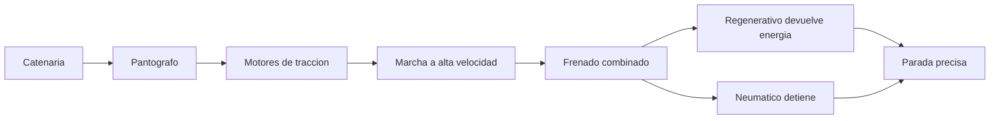

# 🧰 Recursos del tren de alta velocidad

[🏠 Inicio](../../../README.md) · [🚄 Curso: Tren de alta velocidad](../README.md) · 🧰 Recursos

Glosario especifico, enlaces y diagramas de apoyo del curso de tren de alta
velocidad. Amplia el
[glosario general](../../../docs/05-glosario-general.md).

---

## 📖 Glosario especifico

| Termino | Definicion |
| --- | --- |
| Alta velocidad | Circulacion ferroviaria por encima de unos 250 km/h en via dedicada. |
| Traccion distribuida | Motores repartidos en varios coches del tren (EMU). |
| Traccion concentrada | Potencia concentrada en una locomotora en cabeza. |
| Pantografo | Brazo articulado que capta corriente de la catenaria. |
| Catenaria | Cable aereo de alta tension que alimenta el tren. |
| Rueda de pestana | Rueda con reborde que se mantiene guiada sobre el riel. |
| Freno de Foucault | Freno por corrientes inducidas que actua sin contacto. |
| ETCS/ERTMS | Senalizacion embarcada que muestra la velocidad objetivo en cabina. |
| DMI | Pantalla de cabina que informa al maquinista los limites. |
| Peralte | Inclinacion de la via en curva para compensar la fuerza centrifuga. |

---

## 🗺️ Diagrama de flujo de energia y frenado

---

## 🔗 Enlaces y fuentes

- Marco legal: [⚖️ docs/07-marco-legal-chile.md](../../../docs/07-marco-legal-chile.md) (seccion 1.6 Ferroviario)
- Registro de fuentes: [📚 manuales/fuentes.md](../../../manuales/fuentes.md)
- Operador estatal historico (EFE): <https://www.efe.cl>

Registrar cada recurso nuevo con su origen y licencia, siguiendo
[`recursos/README.md`](../../../recursos/README.md).

---

[🎓 Portada del curso](../README.md) · [⬅️ Anterior: Diseno de simulacion](../simulacion/diseno-simulador-tren-alta-velocidad.md)
