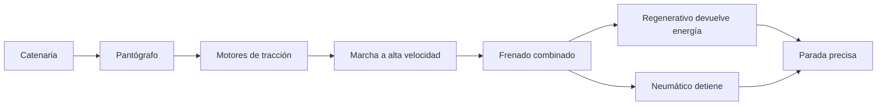

# 🧰 Recursos del tren de alta velocidad

[🏠 Inicio](../../../README.md) · [🚄 Curso: Tren de alta velocidad](../README.md) · 🧰 Recursos

Glosario específico, enlaces y diagramas de apoyo del curso de tren de alta
velocidad. Amplia el
[glosario general](../../../docs/05-glosario-general.md).

---

## 📖 Glosario específico

| Término | Definición |
| --- | --- |
| Alta velocidad | Circulación ferroviaria por encima de unos 250 km/h en vía dedicada. |
| Tracción distribuida | Motores repartidos en varios coches del tren (EMU). |
| Tracción concentrada | Potencia concentrada en una locomotora en cabeza. |
| Pantógrafo | Brazo articulado que capta corriente de la catenaria. |
| Catenaria | Cable aéreo de alta tensión que alimenta el tren. |
| Rueda de pestaña | Rueda con reborde que se mantiene guiada sobre el riel. |
| Freno de Foucault | Freno por corrientes inducidas que actua sin contacto. |
| ETCS/ERTMS | Señalización embarcada que muestra la velocidad objetivo en cabina. |
| DMI | Pantalla de cabina que informa al maquinista los límites. |
| Peralte | Inclinación de la vía en curva para compensar la fuerza centrífuga. |

---

## 🗺️ Diagrama de flujo de energía y frenado

```mermaid
flowchart LR
    Catenaria[Catenaria] --> Pantografo[Pantógrafo]
    Pantografo --> Motores[Motores de tracción]
    Motores --> Marcha[Marcha a alta velocidad]
    Marcha --> Frenado[Frenado combinado]
    Frenado --> Regen[Regenerativo devuelve energía]
    Frenado --> Neumatico[Neumático detiene]
    Regen --> Parada[Parada precisa]
    Neumatico --> Parada
```

---

## 🔗 Enlaces y fuentes

- Marco legal: [⚖️ docs/07-marco-legal-chile.md](../../../docs/07-marco-legal-chile.md) (sección 1.6 Ferroviario)
- Registro de fuentes: [📚 manuales/fuentes.md](../../../manuales/fuentes.md)
- Operador estatal histórico (EFE): <https://www.efe.cl>

Registrar cada recurso nuevo con su origen y licencia, siguiendo
[`recursos/README.md`](../../../recursos/README.md).

## 🎓 Cierre de clase

- **Actividad:** Selecciona términos de glosario, esquemas y trazabilidad de fuentes, explícalos en contexto de Tren de alta velocidad y verifica la procedencia de las fuentes utilizadas.
- **Evidencia:** Glosario aplicado y ficha breve de trazabilidad.
- **Criterio de aprobación:** Los términos permiten interpretar el curso y las fuentes se distinguen por autoridad, alcance y vigencia.
- **Transferencia:** explica qué cambiaría al pasar a otra variante de esta máquina.

### Fuentes de esta clase

- [US-FRA-OPS](https://railroads.fra.dot.gov/railroad-safety/divisions/operating-practices/operating-practices-0): Railroad Operating Practices, Federal Railroad Administration. Uso: operación, señalización y competencias ferroviarias.
- [US-FRA-HF](https://railroads.fra.dot.gov/human-factors/elearning-attention/tasks-demands): Human Factors: Tasks and Demands, Federal Railroad Administration. Uso: factores humanos y carga de trabajo.
- [NASA-FLIGHT](https://www1.grc.nasa.gov/beginners-guide-to-aeronautics/): Beginner's Guide to Aeronautics, NASA. Uso: contraste con física y vuelo reales.

> Las fuentes sostienen el marco conceptual y normativo; esta clase no reemplaza el manual
> del fabricante, la formación certificada ni la habilitación exigida para operar equipos reales.

---

[🎓 Portada del curso](../README.md) · [⬅️ Anterior: Diseño de simulación](../simulacion/diseno-simulador-tren-alta-velocidad.md) · [➡️ Siguiente: Ejercicios](../ejercicios/ejercicios-tren-alta-velocidad.md)
