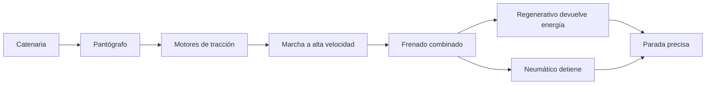

<!-- clase-meta
tipo_documento: clase
clase: 10
codigo: TRENALTAVELO-10
curso: tren-alta-velocidad
titulo: "Recursos del tren de alta velocidad"
modalidad: "taller documental"
duracion_minutos: 45
nivel: introductorio
prerrequisito: TRENALTAVELO-09
competencia: "alfabetizacion_tecnica"
resultados_aprendizaje:
  - "Explicar glosario, esquemas y trazabilidad de fuentes con vocabulario propio de Tren de alta velocidad."
  - "Aplicar esos conceptos a una decisión segura o a un escenario de simulación de Tren de alta velocidad."
evidencia: "Glosario aplicado y ficha breve de trazabilidad."
criterio_aprobacion: "Los términos permiten interpretar el curso y las fuentes se distinguen por autoridad, alcance y vigencia."
fuentes: manuales/fuentes.md
ultima_revision: 2026-09-10
-->

# 🧰 Recursos del tren de alta velocidad

[🏠 Inicio](../../../README.md) · [🚄 Curso: Tren de alta velocidad](../README.md) · 🧰 Recursos

Glosario específico, enlaces y diagramas de apoyo del curso de tren de alta
velocidad. Amplia el
[glosario general](../../../docs/05-glosario-general.md).

---

## 📖 Glosario específico

| Término | Definición |
| --- | --- |
| Alta velocidad | Circulación ferroviaria por encima de unos 250 km/h en vía dedicada. |
| Tracción distribuida | Motores repartidos en varios coches del tren (EMU). |
| Tracción concentrada | Potencia concentrada en una locomotora en cabeza. |
| Pantógrafo | Brazo articulado que capta corriente de la catenaria. |
| Catenaria | Cable aéreo de alta tensión que alimenta el tren. |
| Rueda de pestaña | Rueda con reborde que se mantiene guiada sobre el riel. |
| Freno de Foucault | Freno por corrientes inducidas que actua sin contacto. |
| ETCS/ERTMS | Señalización embarcada que muestra la velocidad objetivo en cabina. |
| DMI | Pantalla de cabina que informa al maquinista los límites. |
| Peralte | Inclinación de la vía en curva para compensar la fuerza centrífuga. |

---

## 🗺️ Diagrama de flujo de energía y frenado

```mermaid
flowchart LR
    Catenaria[Catenaria] --> Pantografo[Pantógrafo]
    Pantografo --> Motores[Motores de tracción]
    Motores --> Marcha[Marcha a alta velocidad]
    Marcha --> Frenado[Frenado combinado]
    Frenado --> Regen[Regenerativo devuelve energía]
    Frenado --> Neumatico[Neumático detiene]
    Regen --> Parada[Parada precisa]
    Neumatico --> Parada
```

---

## 🔗 Enlaces y fuentes

- Marco legal: [⚖️ docs/07-marco-legal-chile.md](../../../docs/07-marco-legal-chile.md) (sección 1.6 Ferroviario)
- Registro de fuentes: [📚 manuales/fuentes.md](../../../manuales/fuentes.md)
- Operador estatal histórico (EFE): <https://www.efe.cl>

Registrar cada recurso nuevo con su origen y licencia, siguiendo
[`recursos/README.md`](../../../recursos/README.md).

## 🧭 Guía de estudio aplicada

### Pregunta guía

¿Cómo ayuda **Glosario específico, Diagrama de flujo de energía y frenado, Enlaces y fuentes y Guía de estudio aplicada** a **explicar con fuentes los términos catenaria, electrónica de potencia, motores distribuidos y rueda-carril**?

### Explicación razonada

El vocabulario técnico organiza relaciones: catenaria, electrónica de potencia, motores distribuidos y rueda-carril nombran partes distintas de una misma cadena funcional. Una fuente se usa para sostener una afirmación concreta —principio, límite, procedimiento o contexto— y debe distinguirse del manual particular de un fabricante o de una regla narrativa.

Esta clase se conecta con el resto del curso mediante **estabilidad dinámica y crecimiento de la energía con el cuadrado de la velocidad**. El hilo de
seguridad consiste en reconocer a tiempo **perder margen por interpretar tarde una restricción a velocidad elevada** y poder justificar la decisión
**cumplir la curva de frenado con anticipación y sin correcciones bruscas**; en clases posteriores cambiará el ángulo de análisis, no esa relación causal.
La lectura funcional común sigue **catenaria → electrónica de potencia → motores distribuidos → rueda-carril**, de modo que cada concepto pueda
ubicarse dentro del funcionamiento completo y no quede como un dato aislado.

**Apoyo documental:** [Railroad Operating Practices](https://railroads.fra.dot.gov/railroad-safety/divisions/operating-practices/operating-practices-0) aporta operación, señalización y competencias ferroviarias;
[Human Factors: Tasks and Demands](https://railroads.fra.dot.gov/human-factors/elearning-attention/tasks-demands) se usa para factores humanos y carga de trabajo. Estas fuentes
se contrastan con el alcance de la clase y no sustituyen un manual de equipo concreto.

### Caso resuelto: de la observación a la decisión

1. **Definir en contexto:** explica **catenaria**, **electrónica de potencia**, **motores distribuidos** y **rueda-carril** por su función y relación.
2. **Respaldar:** enlaza cada afirmación importante con una fuente identificable y declara su alcance.
3. **Contrastar:** separa principios generales, requisitos locales, manual de fabricante y —si aplica— canon ficticio.
4. **Reformular:** convierte una definición copiada en una explicación propia con un ejemplo de **Tren de alta velocidad**.

### Comprueba tu comprensión

1. Explica la diferencia funcional entre **electrónica de potencia** y **motores distribuidos** sin copiar una definición.
2. ¿Qué fuente respalda el principio «estabilidad dinámica y crecimiento de la energía con el cuadrado de la velocidad» y cuál es su alcance?
3. ¿Qué dato exigiría un manual de fabricante en vez de una fuente general?

Orientación para revisar tus respuestas

- La primera respuesta debe relacionar el eslabón elegido con un efecto posterior, no solo nombrarlo.
- La segunda debe proponer una señal medible u observable y explicar qué tendencia sería preocupante.
- La tercera debe cambiar al menos una variable de capacidad, mando, entorno o margen de seguridad.

## 🎓 Cierre de clase

- **Actividad:** Selecciona términos de glosario, esquemas y trazabilidad de fuentes, explícalos en contexto de Tren de alta velocidad y verifica la procedencia de las fuentes utilizadas.
- **Evidencia:** Glosario aplicado y ficha breve de trazabilidad.
- **Criterio de aprobación:** Los términos permiten interpretar el curso y las fuentes se distinguen por autoridad, alcance y vigencia.
- **Transferencia:** explica qué cambiaría al pasar a otra variante de esta máquina.

### Fuentes de esta clase

- [US-FRA-OPS](https://railroads.fra.dot.gov/railroad-safety/divisions/operating-practices/operating-practices-0): Railroad Operating Practices, Federal Railroad Administration. Uso: operación, señalización y competencias ferroviarias.
- [US-FRA-HF](https://railroads.fra.dot.gov/human-factors/elearning-attention/tasks-demands): Human Factors: Tasks and Demands, Federal Railroad Administration. Uso: factores humanos y carga de trabajo.
- [NASA-FLIGHT](https://www1.grc.nasa.gov/beginners-guide-to-aeronautics/): Beginner's Guide to Aeronautics, NASA. Uso: contraste con física y vuelo reales.

> Las fuentes sostienen el marco conceptual y normativo; esta clase no reemplaza el manual
> del fabricante, la formación certificada ni la habilitación exigida para operar equipos reales.

---

[🎓 Portada del curso](../README.md) · [⬅️ Anterior: Diseño de simulación](../simulacion/diseno-simulador-tren-alta-velocidad.md) · [➡️ Siguiente: Ejercicios](../ejercicios/ejercicios-tren-alta-velocidad.md)
