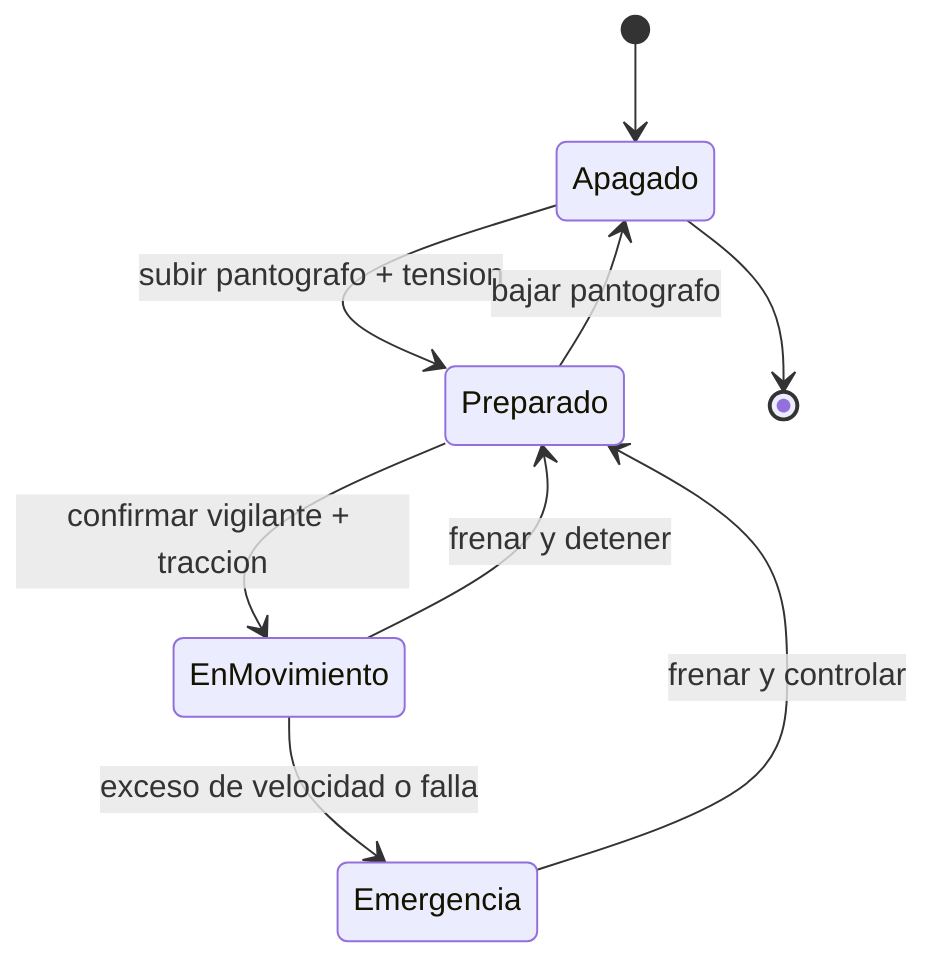

# 🎮 Diseño de simulación del tren de alta velocidad

[🏠 Inicio](../../../README.md) · [🚄 Curso: Tren de alta velocidad](../README.md) · 🎮 Simulación

## Objetivo de la simulación

Que el usuario aprenda a traccionar de forma progresiva, planificar el frenado
con la anticipación que exige la enorme distancia de frenado, respetar la
velocidad objetivo de la señalización en cabina y detener el tren con precisión
en la estación, de forma segura y realista.

## Nivel de realismo

- Nivel elegido: se ofrece del 1 al 3 (ver `docs/03-niveles-de-realismo.md`).
- Justificación: el tren de alta velocidad es un vehículo avanzado porque suma la
  energía cinética enorme, el dominio de la aerodinámica y la supervisión ETCS,
  por eso se ubica después de vehículos más simples.

## Variables principales

| Variable | Tipo | Rango | Afecta a | Comentarios |
| --- | --- | --- | --- | --- |
| Velocidad | numérica | 0-350 km/h | Movimiento y frenado | Central para todo. |
| Velocidad objetivo | numérica | 0-350 km/h | Supervisión ETCS | La marca el DMI en cabina. |
| Esfuerzo de tracción | numérica | 0-100% | Aceleración | Regulado por el manipulador. |
| Esfuerzo de freno | numérica | 0-100% | Deceleración | Combina varios frenos. |
| Tensión de línea | numérica | 0-100% | Tracción disponible | Depende de la catenaria. |
| Resistencia aerodinámica | numérica | crece con velocidad | Consumo y velocidad máxima | Domina a alta velocidad. |
| Masa del tren | numérica | fijo + pasaje | Energía cinética y frenado | Define la distancia de frenado. |

## Ciclo básico

1. Leer entrada del usuario (tracción, freno, vigilante, pantógrafo, puertas).
2. Actualizar estado de tracción, catenaria y frenos.
3. Calcular fuerzas: tracción, resistencia aerodinámica y frenado combinado.
4. Aplicar restricciones del entorno (vía, clima, túneles, viaductos).
5. Actualizar velocidad y posición sobre la vía.
6. Supervisar la velocidad objetivo ETCS y aplicar frenado automático si se excede.
7. Refrescar instrumentos y retroalimentación (DMI, sonido, testigos).

## Modos de juego futuros

- Tutorial guiado de mandos de cabina.
- Práctica libre en un corredor de alta velocidad cerrado.
- Misiones de puntualidad entre estaciones.
- Desafíos de frenado anticipado y parada precisa en el andén.
- Situaciones de clima adverso controladas (viento, nieve) sin contenido sensible.

## Elementos fuera de alcance

- Maniobras peligrosas presentadas como recomendables.
- Reproducción de conducción temeraria como objetivo del juego.
- Datos técnicos que permitan alterar sistemas reales de un tren.

## Pendientes

- [ ] Definir valores por defecto de cada variable por tipo de tren.
- [ ] Prototipar el ciclo básico en un motor simple.
- [ ] Ajustar el modelo de resistencia aerodinámica con la velocidad.
- [ ] Confirmar los datos ferroviarios locales marcados por confirmar.
- [ ] Agregar fuentes técnicas públicas a [`manuales/fuentes.md`](../../../manuales/fuentes.md).

---

[⬅️ Anterior: Reglamentos](../reglamentos/reglamentos-tren-alta-velocidad.md) · [➡️ Siguiente: Recursos](../recursos/recursos-tren-alta-velocidad.md)
