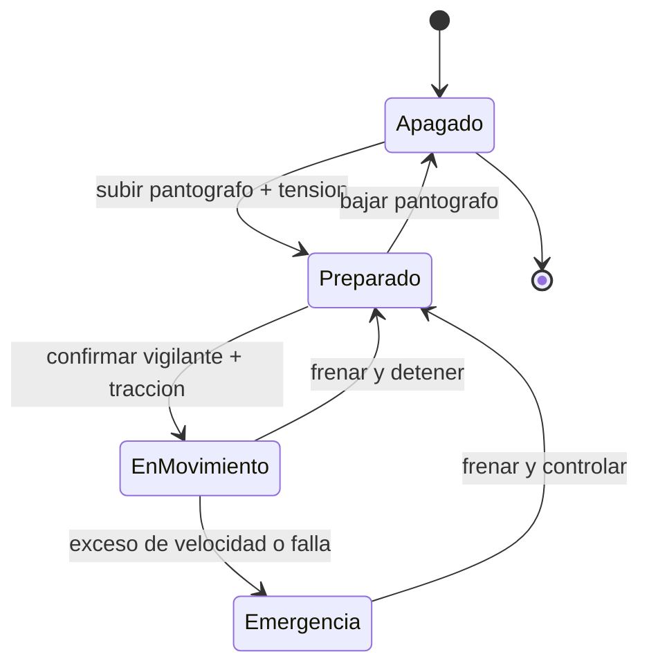

# 🎮 Diseno de simulacion del tren de alta velocidad

[🏠 Inicio](../../../README.md) · [🚄 Curso: Tren de alta velocidad](../README.md) · 🎮 Simulacion

## Objetivo de la simulacion

Que el usuario aprenda a traccionar de forma progresiva, planificar el frenado
con la anticipacion que exige la enorme distancia de frenado, respetar la
velocidad objetivo de la senalizacion en cabina y detener el tren con precision
en la estacion, de forma segura y realista.

## Nivel de realismo

- Nivel elegido: se ofrece del 1 al 3 (ver `docs/03-niveles-de-realismo.md`).
- Justificacion: el tren de alta velocidad es un vehiculo avanzado porque suma la
  energia cinetica enorme, el dominio de la aerodinamica y la supervision ETCS,
  por eso se ubica despues de vehiculos mas simples.

## Variables principales

| Variable | Tipo | Rango | Afecta a | Comentarios |
| --- | --- | --- | --- | --- |
| Velocidad | numerica | 0-350 km/h | Movimiento y frenado | Central para todo. |
| Velocidad objetivo | numerica | 0-350 km/h | Supervision ETCS | La marca el DMI en cabina. |
| Esfuerzo de traccion | numerica | 0-100% | Aceleracion | Regulado por el manipulador. |
| Esfuerzo de freno | numerica | 0-100% | Deceleracion | Combina varios frenos. |
| Tension de linea | numerica | 0-100% | Traccion disponible | Depende de la catenaria. |
| Resistencia aerodinamica | numerica | crece con velocidad | Consumo y velocidad maxima | Domina a alta velocidad. |
| Masa del tren | numerica | fijo + pasaje | Energia cinetica y frenado | Define la distancia de frenado. |

## Ciclo basico

1. Leer entrada del usuario (traccion, freno, vigilante, pantografo, puertas).
2. Actualizar estado de traccion, catenaria y frenos.
3. Calcular fuerzas: traccion, resistencia aerodinamica y frenado combinado.
4. Aplicar restricciones del entorno (via, clima, tuneles, viaductos).
5. Actualizar velocidad y posicion sobre la via.
6. Supervisar la velocidad objetivo ETCS y aplicar frenado automatico si se excede.
7. Refrescar instrumentos y retroalimentacion (DMI, sonido, testigos).

## Modos de juego futuros

- Tutorial guiado de mandos de cabina.
- Practica libre en un corredor de alta velocidad cerrado.
- Misiones de puntualidad entre estaciones.
- Desafios de frenado anticipado y parada precisa en el anden.
- Situaciones de clima adverso controladas (viento, nieve) sin contenido sensible.

## Elementos fuera de alcance

- Maniobras peligrosas presentadas como recomendables.
- Reproduccion de conduccion temeraria como objetivo del juego.
- Datos tecnicos que permitan alterar sistemas reales de un tren.

## Pendientes

- [ ] Definir valores por defecto de cada variable por tipo de tren.
- [ ] Prototipar el ciclo basico en un motor simple.
- [ ] Ajustar el modelo de resistencia aerodinamica con la velocidad.
- [ ] Confirmar los datos ferroviarios locales marcados por confirmar.
- [ ] Agregar fuentes tecnicas publicas a [`manuales/fuentes.md`](../../../manuales/fuentes.md).

---

[⬅️ Anterior: Reglamentos](../reglamentos/reglamentos-tren-alta-velocidad.md) · [➡️ Siguiente: Recursos](../recursos/recursos-tren-alta-velocidad.md)
