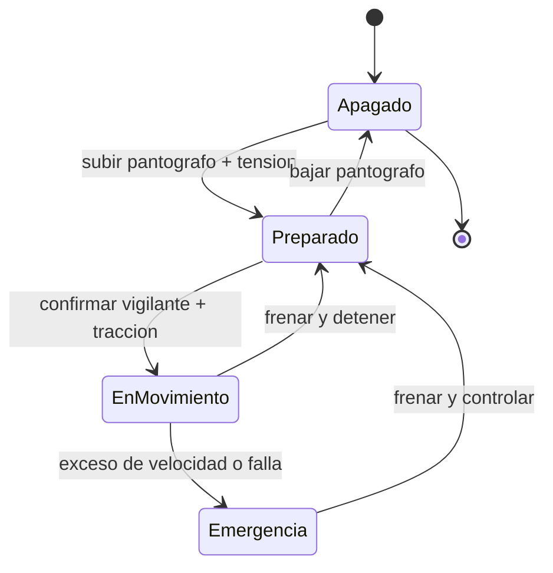
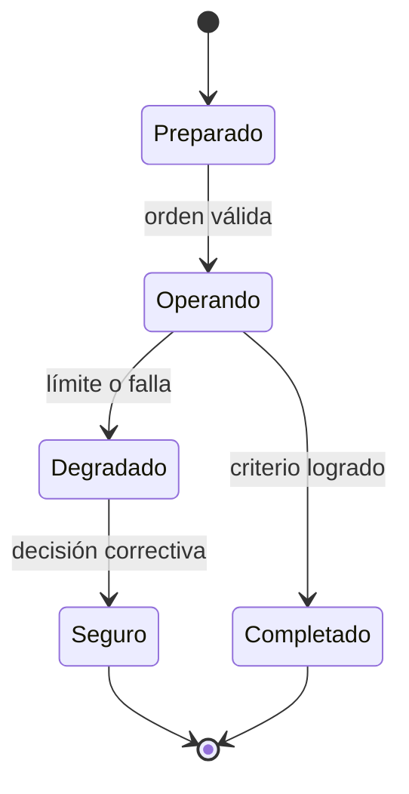

<!-- clase-meta
tipo_documento: clase
clase: 9
codigo: TRENALTAVELO-09
curso: tren-alta-velocidad
titulo: "Diseño de simulación del tren de alta velocidad"
modalidad: "laboratorio de diseño"
duracion_minutos: 90
nivel: introductorio
prerrequisito: TRENALTAVELO-08
competencia: "modelado_de_simulacion"
resultados_aprendizaje:
  - "Explicar objetivo, variables, estados, ciclo y escenarios de simulación con vocabulario propio de Tren de alta velocidad."
  - "Aplicar esos conceptos a una decisión segura o a un escenario de simulación de Tren de alta velocidad."
evidencia: "Ficha de escenario y diagrama de estados."
criterio_aprobacion: "El modelo es específico de la máquina, medible, seguro y trazable a clases anteriores."
fuentes: manuales/fuentes.md
ultima_revision: 2026-09-10
-->

# 🎮 Diseño de simulación del tren de alta velocidad

[🏠 Inicio](../../../README.md) · [🚄 Curso: Tren de alta velocidad](../README.md) · 🎮 Simulación

```mermaid
stateDiagram-v2
    [*] --> Apagado
    Apagado --> Preparado: subir pantografo + tension
    Preparado --> EnMovimiento: confirmar vigilante + traccion
    EnMovimiento --> Preparado: frenar y detener
    EnMovimiento --> Emergencia: exceso de velocidad o falla
    Emergencia --> Preparado: frenar y controlar
    Preparado --> Apagado: bajar pantografo
    Apagado --> [*]
```

## Objetivo de la simulación

Que el usuario aprenda a traccionar de forma progresiva, planificar el frenado
con la anticipación que exige la enorme distancia de frenado, respetar la
velocidad objetivo de la señalización en cabina y detener el tren con precisión
en la estación, de forma segura y realista.

## Nivel de realismo

- Nivel elegido: se ofrece del 1 al 3 (ver `docs/03-niveles-de-realismo.md`).
- Justificación: el tren de alta velocidad es un vehículo avanzado porque suma la
  energía cinética enorme, el dominio de la aerodinámica y la supervisión ETCS,
  por eso se ubica después de vehículos más simples.

## Variables principales

| Variable | Tipo | Rango | Afecta a | Comentarios |
| --- | --- | --- | --- | --- |
| Velocidad | numérica | 0-350 km/h | Movimiento y frenado | Central para todo. |
| Velocidad objetivo | numérica | 0-350 km/h | Supervisión ETCS | La marca el DMI en cabina. |
| Esfuerzo de tracción | numérica | 0-100% | Aceleración | Regulado por el manipulador. |
| Esfuerzo de freno | numérica | 0-100% | Deceleración | Combina varios frenos. |
| Tensión de línea | numérica | 0-100% | Tracción disponible | Depende de la catenaria. |
| Resistencia aerodinámica | numérica | crece con velocidad | Consumo y velocidad máxima | Domina a alta velocidad. |
| Masa del tren | numérica | fijo + pasaje | Energía cinética y frenado | Define la distancia de frenado. |

## Ciclo básico

1. Leer entrada del usuario (tracción, freno, vigilante, pantógrafo, puertas).
2. Actualizar estado de tracción, catenaria y frenos.
3. Calcular fuerzas: tracción, resistencia aerodinámica y frenado combinado.
4. Aplicar restricciones del entorno (vía, clima, túneles, viaductos).
5. Actualizar velocidad y posición sobre la vía.
6. Supervisar la velocidad objetivo ETCS y aplicar frenado automático si se excede.
7. Refrescar instrumentos y retroalimentación (DMI, sonido, testigos).

## Modos de juego futuros

- Tutorial guiado de mandos de cabina.
- Práctica libre en un corredor de alta velocidad cerrado.
- Misiones de puntualidad entre estaciones.
- Desafíos de frenado anticipado y parada precisa en el andén.
- Situaciones de clima adverso controladas (viento, nieve) sin contenido sensible.

## Elementos fuera de alcance

- Maniobras peligrosas presentadas como recomendables.
- Reproducción de conducción temeraria como objetivo del juego.
- Datos técnicos que permitan alterar sistemas reales de un tren.

## Pendientes

- [ ] Definir valores por defecto de cada variable por tipo de tren.
- [ ] Prototipar el ciclo básico en un motor simple.
- [ ] Ajustar el modelo de resistencia aerodinámica con la velocidad.
- [ ] Confirmar los datos ferroviarios locales marcados por confirmar.
- [ ] Agregar fuentes técnicas públicas a [`manuales/fuentes.md`](../../../manuales/fuentes.md).

## 🧭 Guía de estudio aplicada

### Pregunta guía

¿Cómo ayuda **Objetivo de la simulación, Nivel de realismo, Variables principales y Ciclo básico** a **modelar reducción de velocidad previa a una zona de viento lateral como estados, variables y decisiones observables**?

### Explicación razonada

Una simulación de Tren de alta velocidad es educativa si representa decisiones y consecuencias. Como mínimo debe modelar el estado de catenaria, la respuesta de electrónica de potencia, la transición en motores distribuidos y el resultado en rueda-carril. El escenario «reducción de velocidad previa a una zona de viento lateral» es valioso porque obliga a observar, formular una hipótesis, actuar y comprobar.

```mermaid
stateDiagram-v2
    [*] --> Preparado
    Preparado --> Operando: orden válida
    Operando --> Degradado: límite o falla
    Degradado --> Seguro: decisión correctiva
    Operando --> Completado: criterio logrado
    Seguro --> [*]
    Completado --> [*]
```

Esta clase se conecta con el resto del curso mediante **estabilidad dinámica y crecimiento de la energía con el cuadrado de la velocidad**. El hilo de
seguridad consiste en reconocer a tiempo **perder margen por interpretar tarde una restricción a velocidad elevada** y poder justificar la decisión
**cumplir la curva de frenado con anticipación y sin correcciones bruscas**; en clases posteriores cambiará el ángulo de análisis, no esa relación causal.
La lectura funcional común sigue **catenaria → electrónica de potencia → motores distribuidos → rueda-carril**, de modo que cada concepto pueda
ubicarse dentro del funcionamiento completo y no quede como un dato aislado.

**Apoyo documental:** [Railroad Operating Practices](https://railroads.fra.dot.gov/railroad-safety/divisions/operating-practices/operating-practices-0) aporta operación, señalización y competencias ferroviarias;
[Human Factors: Tasks and Demands](https://railroads.fra.dot.gov/human-factors/elearning-attention/tasks-demands) se usa para factores humanos y carga de trabajo. Estas fuentes
se contrastan con el alcance de la clase y no sustituyen un manual de equipo concreto.

### Caso resuelto: de la observación a la decisión

1. **Estado inicial:** representa reducción de velocidad previa a una zona de viento lateral con valores observables para **catenaria**, **electrónica de potencia**, **motores distribuidos** y **rueda-carril**.
2. **Decisión del estudiante:** ofrece una elección que cambie el estado, no una animación automática.
3. **Consecuencia:** modela la tendencia hacia **perder margen por interpretar tarde una restricción a velocidad elevada** y una señal previa que permita corregir.
4. **Cierre:** evalúa la explicación de la decisión, además de si el estudiante “ganó” el escenario.

### Comprueba tu comprensión

1. ¿Qué cuatro estados mínimos necesita el escenario «reducción de velocidad previa a una zona de viento lateral»?
2. ¿Qué variable anticipa **perder margen por interpretar tarde una restricción a velocidad elevada** antes de llegar al estado de falla?
3. ¿Cómo evaluarías la explicación del estudiante y no solo el resultado final?

Orientación para revisar tus respuestas

- La primera respuesta debe relacionar el eslabón elegido con un efecto posterior, no solo nombrarlo.
- La segunda debe proponer una señal medible u observable y explicar qué tendencia sería preocupante.
- La tercera debe cambiar al menos una variable de capacidad, mando, entorno o margen de seguridad.

## 🎓 Cierre de clase

- **Actividad:** Diseña un escenario educativo de Tren de alta velocidad basado en objetivo, variables, estados, ciclo y escenarios de simulación, con entradas, estados, variables y criterio de cierre.
- **Evidencia:** Ficha de escenario y diagrama de estados.
- **Criterio de aprobación:** El modelo es específico de la máquina, medible, seguro y trazable a clases anteriores.
- **Transferencia:** explica qué cambiaría al pasar a otra variante de esta máquina.

### Fuentes de esta clase

- [US-FRA-OPS](https://railroads.fra.dot.gov/railroad-safety/divisions/operating-practices/operating-practices-0): Railroad Operating Practices, Federal Railroad Administration. Uso: operación, señalización y competencias ferroviarias.
- [US-FRA-HF](https://railroads.fra.dot.gov/human-factors/elearning-attention/tasks-demands): Human Factors: Tasks and Demands, Federal Railroad Administration. Uso: factores humanos y carga de trabajo.
- [NASA-FLIGHT](https://www1.grc.nasa.gov/beginners-guide-to-aeronautics/): Beginner's Guide to Aeronautics, NASA. Uso: contraste con física y vuelo reales.

> Las fuentes sostienen el marco conceptual y normativo; esta clase no reemplaza el manual
> del fabricante, la formación certificada ni la habilitación exigida para operar equipos reales.

---

[⬅️ Anterior: Reglamentos](../reglamentos/reglamentos-tren-alta-velocidad.md) · [➡️ Siguiente: Recursos](../recursos/recursos-tren-alta-velocidad.md)
