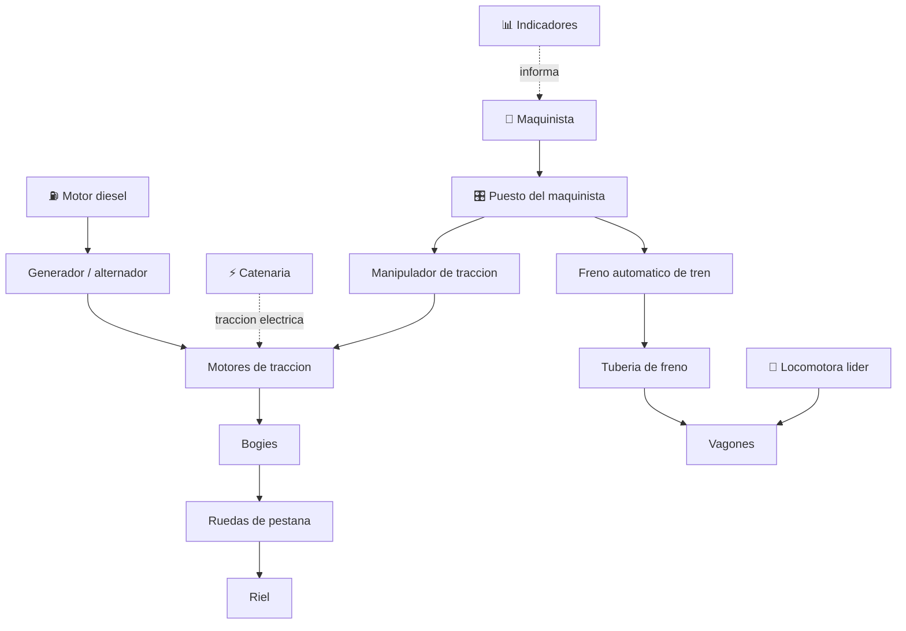

# 🚂 Curso: Tren de carga

[🏠 Inicio](../../README.md) · [🚙 Catalogo de vehiculos](../README.md) · [🎓 Guia de curso](../../docs/08-guia-de-estilo-y-curso.md)

> **Curso del tren de carga.** Documenta el ferrocarril de mercancias de
> principio a fin: historia, caracteristicas, mecanica en profundidad, mandos,
> principios de gran masa, entornos, marco ferroviario chileno y diseno de
> simulacion. Sigue el mismo molde que el curso de motos.

---

## 🎯 Objetivos de aprendizaje

Al terminar este curso deberias poder:

- Explicar como un tren de carga arranca, mantiene velocidad y frena gran masa.
- Identificar sus sistemas mecanicos y como se conectan.
- Reconocer los mandos del puesto del maquinista y su funcion.
- Comprender los principios de inercia, adherencia rueda-riel y frenado largo.
- Conocer el marco ferroviario chileno (EFE, MTT, habilitacion del maquinista).
- Traducir todo lo anterior en variables de un simulador educativo.

---

## 🗺️ Mapa del vehiculo

---

## 📚 Modulos del curso

| # | Modulo | Contenido | Enlace |
| :-: | --- | --- | --- |
| 1 | 📜 Historia | Del vapor al diesel-electrico y trenes de mercancias modernos. | [Abrir](historia/historia-tren-carga.md) |
| 2 | 📋 Caracteristicas | Que es, tipos de vagon y trenes unitarios o mixtos. | [Abrir](operacion/caracteristicas-tren-carga.md) |
| 3 | 🔧 Sistemas mecanicos | Traccion, bogies, adherencia, frenado, composicion y enganches. | [Abrir](operacion/sistemas-mecanicos-tren-carga.md) |
| 4 | 🎛️ Mandos e instrumentos | Puesto del maquinista, controles e indicadores. | [Abrir](mandos/manual-mandos-tren-carga.md) |
| 5 | 🧪 Principios y operacion | Inercia, adherencia y fuerzas longitudinales del tren. | [Abrir](operacion/principios-tren-carga.md) |
| 6 | 🌍 Entornos de trabajo | Corredores, patios, terminales intermodales y ramales. | [Abrir](operacion/entornos-tren-carga.md) |
| 7 | ⚖️ Reglamentos | Marco ferroviario chileno: EFE, MTT y habilitacion. | [Abrir](reglamentos/reglamentos-tren-carga.md) |
| 8 | 🎮 Diseno de simulacion | Variables, ciclo y modos de juego. | [Abrir](simulacion/diseno-simulador-tren-carga.md) |
| 9 | 🧰 Recursos | Glosario, enlaces y diagramas. | [Abrir](recursos/recursos-tren-carga.md) |

---

## 🧩 Requisitos previos

Se recomienda haber visto antes el curso de motos y el de camiones, porque el
tren de carga lleva al extremo la gestion de masa: gran inercia, adherencia
limitada y distancias de frenado muy largas. Marco legal comun en
[⚖️ docs/07-marco-legal-chile.md](../../docs/07-marco-legal-chile.md).

---

[➡️ Empezar por el Modulo 1: Historia](historia/historia-tren-carga.md)
