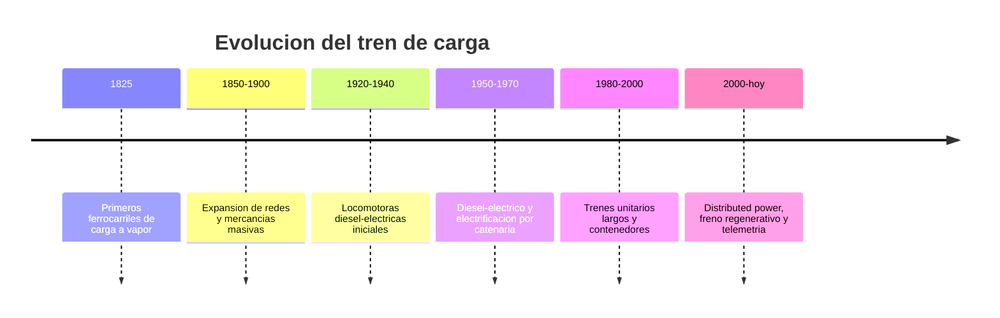

# 📜 Historia del tren de carga

[🏠 Inicio](../../../README.md) · [🚂 Curso: Tren de carga](../README.md) · 📜 Historia

## Origen

El tren de carga nace con el ferrocarril a vapor a comienzos del siglo XIX, cuando
la locomotora a vapor permitio arrastrar sobre rieles mucho mas peso que la
traccion animal. Mover gran tonelaje con baja resistencia rueda-riel fue la clave:
el ferrocarril se volvio la columna del transporte de materias primas.

## Linea de tiempo

| Periodo | Hito | Importancia |
| --- | --- | --- |
| 1825 | Primeros ferrocarriles de carga a vapor | Prueba del concepto de arrastre masivo. |
| 1850-1900 | Expansion de redes y mercancias masivas | El tren mueve carbon, mineral y grano. |
| 1920-1940 | Locomotoras diesel-electricas iniciales | Menos agua y carbon, mas autonomia. |
| 1950-1970 | Diesel-electrico y electrificacion | Traccion mas eficiente y potente. |
| 1980-2000 | Trenes unitarios largos y contenedores | Intermodalidad y economia de escala. |
| 2000-presente | Distributed power y freno regenerativo | Trenes mas largos y eficientes. |

## Evolucion tecnologica

- **Propulsion**: del vapor al diesel-electrico y a la traccion electrica por catenaria.
- **Materiales**: de estructuras remachadas a bogies y bastidores soldados.
- **Frenado**: del freno manual por vagon al freno neumatico automatico de todo el tren.
- **Composicion**: de trenes cortos a trenes unitarios largos con locomotoras remotas.
- **Enganches**: del enganche de husillo a tornillo al enganche automatico tipo cuchara.
- **Control**: de la operacion manual a la telemetria y el control de patinaje.

## Tipos representativos

| Tipo | Uso tipico | Caracteristica destacada |
| --- | --- | --- |
| Tren de mineral | Ramales mineros | Vagones tolva de gran tonelaje. |
| Tren intermodal | Corredores de carga | Plataformas para contenedores. |
| Tren cisterna | Liquidos y graneles | Vagones cisterna sellados. |
| Tren forestal | Ramales industriales | Plataformas para rollizos y madera. |
| Tren unitario | Un solo producto punto a punto | Composicion homogenea y larga. |
| Tren mixto | Varias mercancias | Vagones de distinto tipo en un mismo tren. |

## Impacto economico

El ferrocarril de carga permitio mover grandes volumenes a bajo costo por
tonelada-kilometro, sosteniendo la mineria, la industria y la exportacion. En
Chile, de forma general, el ferrocarril se ha ligado al transporte minero y
forestal y a la conexion con puertos; los operadores de carga actuales que usan
la red quedan por confirmar en sus nombres y participaciones.

## Fuentes

- Registrar aqui las fuentes publicas consultadas.
- Enlazar cada fuente tambien en [`manuales/fuentes.md`](../../../manuales/fuentes.md).

---

[🎓 Portada del curso](../README.md) · [➡️ Siguiente: Caracteristicas](../operacion/caracteristicas-tren-carga.md)
