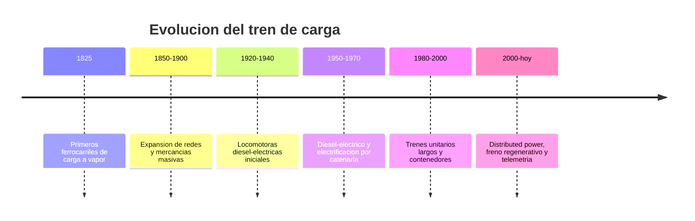

# 📜 Historia del tren de carga

[🏠 Inicio](../../../README.md) · [🚂 Curso: Tren de carga](../README.md) · 📜 Historia

## Origen

El tren de carga nace con el ferrocarril a vapor a comienzos del siglo XIX, cuando
la locomotora a vapor permitió arrastrar sobre rieles mucho más peso que la
tracción animal. Mover gran tonelaje con baja resistencia rueda-riel fue la clave:
el ferrocarril se volvió la columna del transporte de materias primas.

## Línea de tiempo

| Periodo | Hito | Importancia |
| --- | --- | --- |
| 1825 | Primeros ferrocarriles de carga a vapor | Prueba del concepto de arrastre masivo. |
| 1850-1900 | Expansión de redes y mercancías masivas | El tren mueve carbón, mineral y grano. |
| 1920-1940 | Locomotoras diesel-electricas iniciales | Menos agua y carbón, más autonomía. |
| 1950-1970 | Diesel-electrico y electrificación | Tracción más eficiente y potente. |
| 1980-2000 | Trenes unitarios largos y contenedores | Intermodalidad y economía de escala. |
| 2000-presente | Distributed power y freno regenerativo | Trenes más largos y eficientes. |

## Evolución tecnológica

- **Propulsión**: del vapor al diesel-electrico y a la tracción eléctrica por catenaria.
- **Materiales**: de estructuras remachadas a bogies y bastidores soldados.
- **Frenado**: del freno manual por vagón al freno neumático automático de todo el tren.
- **Composición**: de trenes cortos a trenes unitarios largos con locomotoras remotas.
- **Enganches**: del enganche de husillo a tornillo al enganche automático tipo cuchara.
- **Control**: de la operación manual a la telemetría y el control de patinaje.

## Tipos representativos

| Tipo | Uso típico | Característica destacada |
| --- | --- | --- |
| Tren de mineral | Ramales mineros | Vagones tolva de gran tonelaje. |
| Tren intermodal | Corredores de carga | Plataformas para contenedores. |
| Tren cisterna | Líquidos y graneles | Vagones cisterna sellados. |
| Tren forestal | Ramales industriales | Plataformas para rollizos y madera. |
| Tren unitario | Un solo producto punto a punto | Composición homogénea y larga. |
| Tren mixto | Varias mercancías | Vagones de distinto tipo en un mismo tren. |

## Impacto económico

El ferrocarril de carga permitió mover grandes volumenes a bajo costo por
tonelada-kilometro, sosteniendo la minería, la industria y la exportación. En
Chile, de forma general, el ferrocarril se ha ligado al transporte minero y
forestal y a la conexión con puertos; los operadores de carga actuales que usan
la red quedan por confirmar en sus nombres y participaciones.

## Fuentes

- Registrar aquí las fuentes públicas consultadas.
- Enlazar cada fuente también en [`manuales/fuentes.md`](../../../manuales/fuentes.md).

---

[🎓 Portada del curso](../README.md) · [➡️ Siguiente: Características](../operacion/caracteristicas-tren-carga.md)
