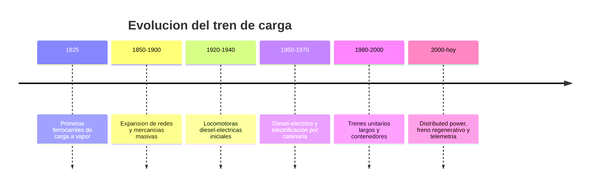

# 📜 Historia del tren de carga

[🏠 Inicio](../../../README.md) · [🚂 Curso: Tren de carga](../README.md) · 📜 Historia

```mermaid
timeline
    title Evolucion del tren de carga
    1825 : Primeros ferrocarriles de carga a vapor
    1850-1900 : Expansion de redes y mercancias masivas
    1920-1940 : Locomotoras diesel-electricas iniciales
    1950-1970 : Diesel-electrico y electrificacion por catenaria
    1980-2000 : Trenes unitarios largos y contenedores
    2000-hoy : Distributed power, freno regenerativo y telemetria
```

## Origen

El tren de carga nace con el ferrocarril a vapor a comienzos del siglo XIX, cuando
la locomotora a vapor permitió arrastrar sobre rieles mucho más peso que la
tracción animal. Mover gran tonelaje con baja resistencia rueda-riel fue la clave:
el ferrocarril se volvió la columna del transporte de materias primas.

## Línea de tiempo

| Periodo | Hito | Importancia |
| --- | --- | --- |
| 1825 | Primeros ferrocarriles de carga a vapor | Prueba del concepto de arrastre masivo. |
| 1850-1900 | Expansión de redes y mercancías masivas | El tren mueve carbón, mineral y grano. |
| 1920-1940 | Locomotoras diesel-eléctricas iniciales | Menos agua y carbón, más autonomía. |
| 1950-1970 | Diesel-eléctrico y electrificación | Tracción más eficiente y potente. |
| 1980-2000 | Trenes unitarios largos y contenedores | Intermodalidad y economía de escala. |
| 2000-presente | Distributed power y freno regenerativo | Trenes más largos y eficientes. |

## Evolución tecnológica

- **Propulsión**: del vapor al diesel-eléctrico y a la tracción eléctrica por catenaria.
- **Materiales**: de estructuras remachadas a bogies y bastidores soldados.
- **Frenado**: del freno manual por vagón al freno neumático automático de todo el tren.
- **Composición**: de trenes cortos a trenes unitarios largos con locomotoras remotas.
- **Enganches**: del enganche de husillo a tornillo al enganche automático tipo cuchara.
- **Control**: de la operación manual a la telemetría y el control de patinaje.

## Tipos representativos

| Tipo | Uso típico | Característica destacada |
| --- | --- | --- |
| Tren de mineral | Ramales mineros | Vagones tolva de gran tonelaje. |
| Tren intermodal | Corredores de carga | Plataformas para contenedores. |
| Tren cisterna | Líquidos y graneles | Vagones cisterna sellados. |
| Tren forestal | Ramales industriales | Plataformas para rollizos y madera. |
| Tren unitario | Un solo producto punto a punto | Composición homogénea y larga. |
| Tren mixto | Varias mercancías | Vagones de distinto tipo en un mismo tren. |

## Impacto económico

El ferrocarril de carga permitió mover grandes volumenes a bajo costo por
tonelada-kilómetro, sosteniendo la minería, la industria y la exportación. En
Chile, de forma general, el ferrocarril se ha ligado al transporte minero y
forestal y a la conexión con puertos; los operadores de carga actuales que usan
la red quedan por confirmar en sus nombres y participaciones.

## Fuentes

- Registrar aquí las fuentes públicas consultadas.
- Enlazar cada fuente también en [`manuales/fuentes.md`](../../../manuales/fuentes.md).

## 🎓 Cierre de clase

- **Actividad:** Construye una línea de tiempo de Tren de carga y explica cómo dos cambios históricos transformaron su función o su puesto de mando.
- **Evidencia:** Línea de tiempo comentada con cuatro hitos o más.
- **Criterio de aprobación:** Los hitos están ordenados, son pertinentes y dos relaciones de causa y efecto quedan justificadas.
- **Transferencia:** explica qué cambiaría al pasar a otra variante de esta máquina.

### Fuentes de esta clase

- [US-FRA-OPS](https://railroads.fra.dot.gov/railroad-safety/divisions/operating-practices/operating-practices-0): Railroad Operating Practices, Federal Railroad Administration. Uso: operación, señalización y competencias ferroviarias.
- [US-FRA-HF](https://railroads.fra.dot.gov/human-factors/elearning-attention/tasks-demands): Human Factors: Tasks and Demands, Federal Railroad Administration. Uso: factores humanos y carga de trabajo.

> Las fuentes sostienen el marco conceptual y normativo; esta clase no reemplaza el manual
> del fabricante, la formación certificada ni la habilitación exigida para operar equipos reales.

---

[🎓 Portada del curso](../README.md) · [➡️ Siguiente: Características](../operacion/caracteristicas-tren-carga.md)
