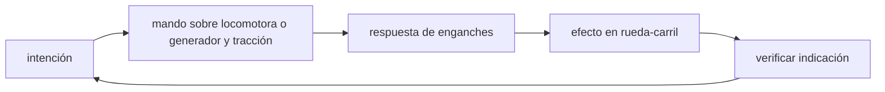

<!-- clase-meta
tipo_documento: clase
clase: 5
codigo: TRENCARGA-05
curso: tren-carga
titulo: "Mandos e instrumentos del tren de carga"
modalidad: "taller de simulación"
duracion_minutos: 60
nivel: introductorio
prerrequisito: TRENCARGA-04
competencia: "lectura_y_mando"
resultados_aprendizaje:
  - "Explicar controles, instrumentos, entradas y estados del sistema con vocabulario propio de Tren de carga."
  - "Aplicar esos conceptos a una decisión segura o a un escenario de simulación de Tren de carga."
evidencia: "Mapa de mandos y resolución de dos estados del tablero."
criterio_aprobacion: "Reconoce los controles críticos y responde a los estados sin introducir acciones inseguras."
fuentes: manuales/fuentes.md
ultima_revision: 2026-09-10
-->

# 🎛️ Mandos e instrumentos del tren de carga

[🏠 Inicio](../../../README.md) · [🚂 Curso: Tren de carga](../README.md) · 🎛️ Mandos

## Vista general

El puesto del maquinista va en la cabina de la locomotora lider. Desde ahí se
controla la tracción de todo el tren, incluidas las locomotoras remotas por
radio, y el frenado de toda la composición. A diferencia de un vehículo de
carretera, el maquinista no dirige la trayectoria (la vía es fija): gestiona
fuerza, freno y velocidad sobre una ruta senalizada.

## Mapa de controles

| Zona | Control | Tipo | Función | Prioridad | Comentarios |
| --- | --- | --- | --- | --- | --- |
| Puesto central | Manipulador de tracción | Palanca | Regular fuerza de los motores | Alta | Manda también a las locomotoras remotas. |
| Puesto central | Freno automático | Palanca | Frenar todo el tren por la tubería de aire | Alta | Actua en locomotora y vagones. |
| Puesto central | Freno independiente | Palanca | Frenar solo la locomotora | Alta | Útil en maniobras y ajustes finos. |
| Puesto central | Inversor | Palanca | Elegir sentido de marcha | Alta | Adelante, neutro o atrás. |
| Puesto central | Freno dinámico | Palanca o modo | Retener con los motores | Alta | Ahorra zapatas en descensos. |
| Pedal / botón | Hombre muerto / vigilante | Pedal o botón | Confirmar que el maquinista está atento | Alta | Si no se atiende, frena solo. |
| Consola | Control de patinaje / arenado | Botón | Lanzar arena y limitar patinaje | Media | Mejora la adherencia al arrancar. |
| Consola | Radio | Equipo | Comunicar y mandar remotas | Alta | Enlace con control y otras locomotoras. |
| Consola | Bocina y silbato | Botón | Advertir en pasos a nivel | Alta | Uso obligatorio de seguridad. |

## Instrumentos principales

| Instrumento | Mide o muestra | Unidad | Importancia | Notas |
| --- | --- | --- | --- | --- |
| Velocímetro | Velocidad del tren | km/h | Alta | Central para respetar límites de vía. |
| Manómetro de tubería de freno | Presión de la tubería de freno | bar | Alta | Vigila el frenado de todo el tren. |
| Amperímetro de tracción | Corriente en los motores | amperios | Alta | Indica el esfuerzo y el riesgo de patinaje. |
| Indicador de esfuerzo de tracción | Fuerza aplicada | referencia | Media | Ayuda a dosificar el arranque. |
| Testigos | Estado de sistemas | luz | Alta | Patinaje, hombre muerto, remotas, freno. |
| Odómetro | Distancia recorrida | km | Baja | Control de recorrido y punto kilométrico. |

## Entradas de simulación

| Acción | Teclado | Controlador | Pantalla táctil | Comentarios |
| --- | --- | --- | --- | --- |
| Aplicar tracción | Flecha arriba | Gatillo derecho | Palanca de tracción | Progresivo, cuidando el patinaje. |
| Freno automático | Tecla J | Gatillo izquierdo | Palanca de freno tren | Frena toda la composición. |
| Freno independiente | Tecla K | Botón inferior | Palanca de freno loco | Solo la locomotora. |
| Freno dinámico | Tecla D | Botón lateral | Modo dinámico | Retiene sin desgaste. |
| Invertir sentido | Tecla R | Cruceta arriba/abajo | Selector de sentido | Adelante, neutro o atrás. |
| Arenado | Tecla S | Botón frontal | Botón de arena | Sube la adherencia al arrancar. |
| Vigilante / hombre muerto | Barra espacio | Botón de confirmación | Botón de atención | Confirmar de forma periódica. |

## Estados del sistema

| Estado | Descripción | Indicadores | Acciones disponibles |
| --- | --- | --- | --- |
| Detenido | Tren parado con freno aplicado | Presión de tubería baja | Cargar aire, soltar freno, aplicar tracción. |
| Preparado | Aire cargado, listo para partir | Manómetro en rango | Aplicar tracción, arenar. |
| En marcha | Tren circulando | Velocímetro activo | Traccionar, frenar, usar dinámico. |
| Frenando | Reduciendo velocidad | Manómetro descendiendo | Modular freno, arenar, detener. |
| Emergencia | Riesgo o falla | Testigos de alerta | Freno de emergencia, avisar por radio. |

## Observaciones ergonomicas

- El velocímetro, el manómetro de tubería de freno y el amperímetro deben verse siempre.
- El manipulador de tracción y el freno automático conviven en el puesto central: la
  interfaz debe dejar claro que no se aplican fuerza y freno a la vez sin control.
- El hombre muerto o vigilante debe ser accesible y su alarma reconocible.
- La interfaz de simulación debería advertir el patinaje y sugerir arenado en los
  niveles de realismo más altos.

## 🧭 Guía de estudio aplicada

### Pregunta guía

¿Cómo ayuda **Vista general, Mapa de controles, Instrumentos principales y Entradas de simulación** a **interpretar mandos e indicaciones durante arranque de un tren largo en rampa con holguras entre enganches**?

### Explicación razonada

Un mando no se aprende memorizando su nombre, sino recorriendo el ciclo intención → acción → indicación → verificación. En Tren de carga, el operador actúa sobre locomotora o generador y tracción, observa la respuesta en enganches y confirma el efecto en rueda-carril. Una indicación inesperada exige detener la secuencia mental, identificar el modo activo y evitar una segunda orden que agrave el estado.

Esta clase se conecta con el resto del curso mediante **fuerzas longitudinales del tren y propagación del freno neumático**. El hilo de
seguridad consiste en reconocer a tiempo **rotura de enganche, patinaje o compresión excesiva del convoy** y poder justificar la decisión
**aplicar potencia y freno de modo gradual considerando la longitud completa**; en clases posteriores cambiará el ángulo de análisis, no esa relación causal.
La lectura funcional común sigue **locomotora → generador y tracción → enganches → rueda-carril**, de modo que cada concepto pueda
ubicarse dentro del funcionamiento completo y no quede como un dato aislado.

**Apoyo documental:** [Railroad Operating Practices](https://railroads.fra.dot.gov/railroad-safety/divisions/operating-practices/operating-practices-0) aporta operación, señalización y competencias ferroviarias;
[Human Factors: Tasks and Demands](https://railroads.fra.dot.gov/human-factors/elearning-attention/tasks-demands) se usa para factores humanos y carga de trabajo. Estas fuentes
se contrastan con el alcance de la clase y no sustituyen un manual de equipo concreto.

### Caso resuelto: de la observación a la decisión

1. **Intención:** formula qué cambio se necesita durante **arranque de un tren largo en rampa con holguras entre enganches**.
2. **Mando:** identifica el control que actúa sobre **locomotora** o **generador y tracción** y el modo que debe estar activo.
3. **Lectura:** localiza la indicación que confirma la respuesta de **enganches** y el efecto en **rueda-carril**.
4. **Verificación:** si la lectura no coincide, no acumules órdenes; estabiliza e investiga el estado.

### Comprueba tu comprensión

1. ¿Qué mando inicia la respuesta y qué instrumento confirma que el modo correcto está activo?
2. ¿Qué indicación temprana advertiría **rotura de enganche, patinaje o compresión excesiva del convoy**?
3. ¿Qué secuencia usarías si la respuesta de **rueda-carril** no coincide con la orden?

Orientación para revisar tus respuestas

- La primera respuesta debe relacionar el eslabón elegido con un efecto posterior, no solo nombrarlo.
- La segunda debe proponer una señal medible u observable y explicar qué tendencia sería preocupante.
- La tercera debe cambiar al menos una variable de capacidad, mando, entorno o margen de seguridad.

## 🎓 Cierre de clase

- **Actividad:** Recorre el puesto de mando simulado de Tren de carga: localiza los controles de controles, instrumentos, entradas y estados del sistema y asocia cada indicación con una decisión.
- **Evidencia:** Mapa de mandos y resolución de dos estados del tablero.
- **Criterio de aprobación:** Reconoce los controles críticos y responde a los estados sin introducir acciones inseguras.
- **Transferencia:** explica qué cambiaría al pasar a otra variante de esta máquina.

### Fuentes de esta clase

- [US-FRA-OPS](https://railroads.fra.dot.gov/railroad-safety/divisions/operating-practices/operating-practices-0): Railroad Operating Practices, Federal Railroad Administration. Uso: operación, señalización y competencias ferroviarias.
- [US-FRA-HF](https://railroads.fra.dot.gov/human-factors/elearning-attention/tasks-demands): Human Factors: Tasks and Demands, Federal Railroad Administration. Uso: factores humanos y carga de trabajo.

> Las fuentes sostienen el marco conceptual y normativo; esta clase no reemplaza el manual
> del fabricante, la formación certificada ni la habilitación exigida para operar equipos reales.

---

[⬅️ Anterior: Sistemas mecánicos](../operacion/sistemas-mecanicos-tren-carga.md) · [➡️ Siguiente: Principios y operación](../operacion/principios-tren-carga.md)
