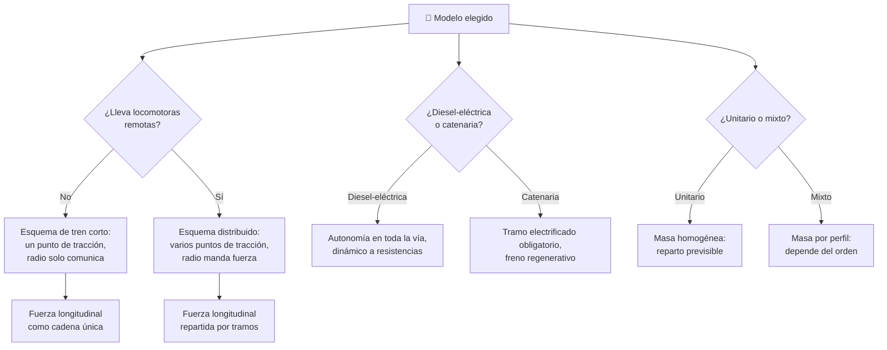

# 🧩 Modelos y variantes del tren de carga

[🏠 Inicio](../../../README.md) · [🚂 Curso: Tren de carga](../README.md) · 🧩 Modelos

El [Módulo 2](../operacion/caracteristicas-tren-carga.md) ya dijo qué tipos de
locomotora y de vagón existen y qué composiciones se arman con ellos. Este
módulo responde a otra cosa: **no todos los trenes se conducen igual**, y esa
diferencia no es de matiz. Cambia qué mandos tiene la cabina y, por tanto, qué
debe modelar el simulador.

> 🎯 **La idea que sostiene el módulo.** "Un tren de carga" no es una sola
> máquina desde el punto de vista del mando. En un tren corto, la radio sirve
> para hablar; en un tren largo con locomotoras distribuidas, la radio **es**
> parte del mando de tracción: el manipulador no aplica fuerza en un punto,
> sino en varios a la vez. Un simulador que presente un solo esquema de control
> está representando un tren concreto aunque diga representarlos todos.

---

## 🧭 Por qué el modelo decide el simulador

El [Módulo 5](../mandos/manual-mandos-tren-carga.md) describe un puesto con
manipulador de tracción, freno automático, freno independiente, freno dinámico,
inversor, arenado y radio. El [Módulo 9](../simulacion/diseno-simulador-tren-carga.md)
expone variables como `Esfuerzo de tracción`, `Fuerza longitudinal` y
`Adherencia rueda-riel`. Ambos describen, sin decirlo, un tren **diesel-eléctrico
con locomotoras remotas**.

Cambia la fuente de energía y el freno dinámico deja de disipar calor en
resistencias para devolver energía a la catenaria: el mando se parece, pero la
consecuencia energética es opuesta. Cambia la longitud del tren y la
`Fuerza longitudinal` deja de tener un punto de aplicación para tener varios,
repartidos a lo largo de la composición. Si el simulador se construye sobre el
esquema del tren corto y luego se le "añaden" locomotoras remotas, el resultado
es un tren largo cuyas fuerzas internas nacen todas del enganche delantero, que
es justamente lo que el *distributed power* existe para evitar.

---

## 🗂️ Qué cambia en el manejo

| Modelo | Qué cambia al conducirlo |
| --- | --- |
| Diesel-eléctrica | La referencia del curso: potencia a bordo, autonomía en cualquier vía, el motor diesel gira a régimen casi constante y la fuerza se dosifica con el control eléctrico. |
| Eléctrica por catenaria | Más potencia disponible desde el arranque, pero la máquina depende de la línea: fuera del tramo electrificado no hay tracción posible. |
| Tren corto (una locomotora líder) | Toda la fuerza entra por el enganche delantero. El tren se estira y se comprime como una sola cadena; el arranque progresivo lo resuelve casi todo. |
| Tren largo con locomotoras distribuidas | El esfuerzo entra en varios puntos. Hay que pensar el tren por tramos: uno puede estar en tensión mientras otro sigue comprimido. |
| Tren unitario | Masa homogénea de punta a punta: el tren responde de forma previsible y las fuerzas se reparten de manera pareja. |
| Tren mixto | Vagones de distinto tipo y peso: el comportamiento cambia según dónde quedó lo pesado en el orden de la composición. |
| Maniobras en patio | Velocidades bajas, tren en armado y longitud cambiante: la máquina se mueve más de lo que arrastra. |

---

## 🎛️ Qué cambia en el mando

| Modelo | Qué mando aparece o desaparece | Consecuencia |
| --- | --- | --- |
| Diesel-eléctrica | Ninguno: el mapa de controles del Módulo 5 aplica tal cual. | Es el caso base del curso. |
| Eléctrica por catenaria | **Desaparece** el motor diesel como sistema a bordo y **aparece** el pantógrafo como condición de la tracción. El freno dinámico pasa a ser regenerativo. | El mismo gesto de freno dinámico devuelve energía a la catenaria en vez de disiparla; sin línea, el manipulador de tracción no manda nada. |
| Tren corto (una locomotora líder) | **Desaparece** el mando de las remotas: la radio queda solo como enlace con el control. | El manipulador de tracción aplica fuerza en un único punto del tren. |
| Tren largo con locomotoras distribuidas | La radio **se convierte** en parte del mando de tracción: replica el manipulador en las locomotoras remotas. | Un mando de comunicación pasa a ser un mando de fuerza; hay testigos de estado de remotas que vigilar. |
| Tren unitario | Ninguno: cambian los rangos, no los controles. | El arenado y el freno se dosifican igual en toda la composición. |
| Tren mixto | Ninguno, pero el freno automático **deja de actuar de forma pareja** sobre vagones de masa muy distinta. | El mismo movimiento de palanca da un resultado desigual a lo largo del tren. |
| Maniobras en patio | El **freno independiente** pasa de ajuste fino a mando principal; el **inversor** se usa constantemente. | El freno automático de tren deja de ser el recurso habitual. |

---

## 🎮 Qué cambia en el simulador

Contrastado con las variables del
[Módulo 9](../simulacion/diseno-simulador-tren-carga.md):

| Modelo | Variables que cambian | Esquema de control |
| --- | --- | --- |
| Diesel-eléctrica | Ninguna: es el caso base. | El del Módulo 5. |
| Eléctrica por catenaria | `Esfuerzo de tracción` pasa a depender de la línea disponible además de la `Adherencia rueda-riel`. La energía del freno dinámico deja de disiparse y se devuelve. | El mismo, con el pantógrafo y el tramo electrificado como condición previa. |
| Tren corto (una locomotora líder) | `Fuerza longitudinal` **se simplifica**: un solo origen de tracción, tensión y compresión encadenadas desde el frente. | Sin entrada de mando a remotas. |
| Tren largo con locomotoras distribuidas | `Fuerza longitudinal` **deja de ser un valor** y pasa a ser una distribución por tramos. `Masa total` se reparte entre varios puntos de tracción. | Manipulador que actúa en varios puntos vía radio; testigos de remotas. |
| Tren unitario | `Masa total` es homogénea por vagón: el reparto se calcula una vez. | El mismo. |
| Tren mixto | `Masa total` **deja de ser uniforme** y se vuelve un perfil según el orden de vagones; `Fuerza longitudinal` depende de ese orden. | El mismo. |
| Maniobras en patio | `Velocidad` reduce mucho su rango útil. `Masa total` **deja de ser fija** y cambia durante la partida al enganchar y desenganchar. | Freno independiente como mando primario; inversor de uso continuo. |
| Cualquiera con riel húmedo | `Adherencia rueda-riel` baja y el arenado gana peso en el cálculo. | El mismo, con más advertencia de patinaje. |

---

## 🗺️ Del modelo al esquema de control

---

## ⚠️ Qué modelos no comparten simulador

Tres familias no se resuelven con un ajuste de parámetros, porque su esquema de
control es otro:

- **El tren largo con locomotoras distribuidas** frente al tren corto: la radio
  deja de ser un enlace y pasa a ser un mando de fuerza, y `Fuerza longitudinal`
  deja de ser una cadena para volverse un reparto por tramos. Es un modo de
  control distinto, no una dificultad distinta.
- **La eléctrica por catenaria** frente a la diesel-eléctrica: la tracción queda
  condicionada por la infraestructura de la vía, no solo por la adherencia, y el
  freno dinámico cambia de destino energético. El mando se ve igual y hace otra
  cosa.
- **Las maniobras en patio** frente a la marcha en corredor: `Masa total` tiene
  que ser una variable viva durante la partida, no una constante que se fija al
  empezar, y el freno independiente desplaza al automático como mando principal.

El tren unitario y el tren mixto sí caben en un mismo simulador ajustando el
perfil de masa, tal como plantean los
[niveles de realismo](../../../docs/03-niveles-de-realismo.md): en el nivel 1
casi todos se comportan igual, y las diferencias emergen a medida que el nivel
sube. Los propios [Módulos 6](../operacion/principios-tren-carga.md) y
[9](../simulacion/diseno-simulador-tren-carga.md) sitúan las fuerzas
longitudinales y el *distributed power* en el nivel 3, que es exactamente donde
estos modelos dejan de ser el mismo tren.

> ⚖️ **El principio detrás de todo esto.** Cuánto pesa la carga y dónde va no cambia
> solo los números: cambia qué puede hacer el operador. La física común a todas las
> máquinas del catálogo —sostener, girar, equilibrar y la masa que cambia en
> marcha— está en [⚖️ carga y manejo](../../../docs/09-carga-y-manejo.md).

---

[⬅️ Anterior: Características](../operacion/caracteristicas-tren-carga.md) · [➡️ Siguiente: Sistemas mecánicos](../operacion/sistemas-mecanicos-tren-carga.md)
