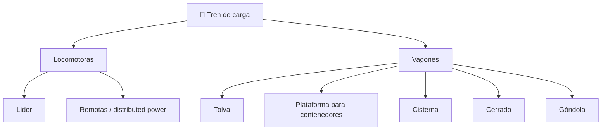

# 📋 Características funcionales del tren de carga

[🏠 Inicio](../../../README.md) · [🚂 Curso: Tren de carga](../README.md) · 📋 Características

Que es un tren de carga, que tipos de vagón existen y para que sirve cada
composición. Este módulo da el contexto antes de abrir la mecánica (Módulo 4).

---

## 🧭 Definición

Un tren de carga es una composición formada por una o varias locomotoras que
arrastran un conjunto de vagones para mover gran tonelaje de mercancías sobre una
vía de ferrocarril. La adherencia rueda-riel es baja, por lo que el tren depende
de gran fuerza de tracción para arrancar y de largas distancias para frenar.

---

## 🧬 Características clave

| Característica | Descripción |
| --- | --- |
| Gran masa | Miles de toneladas entre locomotoras y vagones cargados. |
| Ruta fija | Circula solo sobre la vía; no elige trayectoria libre. |
| Adherencia limitada | El contacto acero-acero da poco agarre; se usa arenado. |
| Frenado largo | La distancia de detención es muy superior a la de un camión. |
| Composición modular | Se agregan o quitan vagones según la carga. |
| Fuerzas longitudinales | Aparecen estirones y compresiones entre vagones. |

---

## 🗂️ Tipos de vagón y composición

| Tipo de vagón | Uso típico | Rasgo destacado |
| --- | --- | --- |
| Tolva | Mineral, grano, árido | Descarga por el fondo. |
| Plataforma | Contenedores intermodales | Base plana para carga apilada. |
| Cisterna | Líquidos y graneles | Cuerpo sellado y válvulas. |
| Cerrado | Carga que teme la intemperie | Caja techada y con puertas. |
| Góndola | Carga a granel abierta | Caja abierta sin techo. |

- **Tren unitario**: todos los vagones llevan el mismo producto punto a punto.
- **Tren mixto**: combina vagones de distinto tipo y varias mercancías.

---

## 🎯 Para qué se usa

- Transporte masivo de mineral, grano y áridos.
- Movimiento intermodal de contenedores entre puerto y terminal.
- Transporte de líquidos y graneles en cisterna.
- Carga forestal e industrial en ramales.
- Corredores de larga distancia con gran tonelaje.

---

[⬅️ Anterior: Historia](../historia/historia-tren-carga.md) · [➡️ Siguiente: Modelos y variantes](../modelos/modelos-tren-carga.md)
