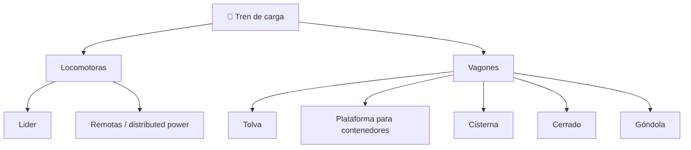

<!-- clase-meta
tipo_documento: clase
clase: 2
codigo: TRENCARGA-02
curso: tren-carga
titulo: "Características funcionales del tren de carga"
modalidad: "teórica aplicada"
duracion_minutos: 45
nivel: introductorio
prerrequisito: TRENCARGA-01
competencia: "identificacion_funcional"
resultados_aprendizaje:
  - "Explicar definición, rasgos funcionales, tipos y usos con vocabulario propio de Tren de carga."
  - "Aplicar esos conceptos a una decisión segura o a un escenario de simulación de Tren de carga."
evidencia: "Matriz comparativa y decisión justificada."
criterio_aprobacion: "La elección considera función, límites, mando y efecto en la simulación; no se apoya solo en preferencias."
fuentes: manuales/fuentes.md
ultima_revision: 2026-09-10
-->

# 📋 Características funcionales del tren de carga

[🏠 Inicio](../../../README.md) · [🚂 Curso: Tren de carga](../README.md) · 📋 Características

Que es un tren de carga, que tipos de vagón existen y para que sirve cada
composición. Esta clase da el contexto antes de abrir la mecánica (Clase 4).

---

## 🧭 Definición

Un tren de carga es una composición formada por una o varias locomotoras que
arrastran un conjunto de vagones para mover gran tonelaje de mercancías sobre una
vía de ferrocarril. La adherencia rueda-riel es baja, por lo que el tren depende
de gran fuerza de tracción para arrancar y de largas distancias para frenar.

---

## 🧬 Características clave

| Característica | Descripción |
| --- | --- |
| Gran masa | Miles de toneladas entre locomotoras y vagones cargados. |
| Ruta fija | Circula solo sobre la vía; no elige trayectoria libre. |
| Adherencia limitada | El contacto acero-acero da poco agarre; se usa arenado. |
| Frenado largo | La distancia de detención es muy superior a la de un camión. |
| Composición modular | Se agregan o quitan vagones según la carga. |
| Fuerzas longitudinales | Aparecen estirones y compresiones entre vagones. |

---

## 🗂️ Tipos de vagón y composición

```mermaid
flowchart TD
    Tren[🚂 Tren de carga] --> Locomotoras[Locomotoras]
    Tren --> Vagones[Vagones]
    Locomotoras --> Lider[Lider]
    Locomotoras --> Remotas[Remotas / distributed power]
    Vagones --> Tolva[Tolva]
    Vagones --> Plataforma[Plataforma para contenedores]
    Vagones --> Cisterna[Cisterna]
    Vagones --> Cerrado[Cerrado]
    Vagones --> Gondola[Góndola]
```

| Tipo de vagón | Uso típico | Rasgo destacado |
| --- | --- | --- |
| Tolva | Mineral, grano, árido | Descarga por el fondo. |
| Plataforma | Contenedores intermodales | Base plana para carga apilada. |
| Cisterna | Líquidos y graneles | Cuerpo sellado y válvulas. |
| Cerrado | Carga que teme la intemperie | Caja techada y con puertas. |
| Góndola | Carga a granel abierta | Caja abierta sin techo. |

- **Tren unitario**: todos los vagones llevan el mismo producto punto a punto.
- **Tren mixto**: combina vagones de distinto tipo y varias mercancías.

---

## 🎯 Para qué se usa

- Transporte masivo de mineral, grano y áridos.
- Movimiento intermodal de contenedores entre puerto y terminal.
- Transporte de líquidos y graneles en cisterna.
- Carga forestal e industrial en ramales.
- Corredores de larga distancia con gran tonelaje.

## 🧭 Guía de estudio aplicada

### Pregunta guía

¿Cómo ayuda **Definición, Características clave, Tipos de vagón y composición y Para qué se usa** a **elegir una configuración adecuada para arranque de un tren largo en rampa con holguras entre enganches**?

### Explicación razonada

Una característica solo es útil cuando permite anticipar comportamiento. En Tren de carga, la relación entre locomotora, generador y tracción, enganches y rueda-carril determina capacidad, respuesta y límites. Por eso «carga unitaria frente a carga mixta» no se compara por apariencia: se compara por misión, entorno, carga de trabajo y exposición al riesgo «rotura de enganche, patinaje o compresión excesiva del convoy».

Esta clase se conecta con el resto del curso mediante **fuerzas longitudinales del tren y propagación del freno neumático**. El hilo de
seguridad consiste en reconocer a tiempo **rotura de enganche, patinaje o compresión excesiva del convoy** y poder justificar la decisión
**aplicar potencia y freno de modo gradual considerando la longitud completa**; en clases posteriores cambiará el ángulo de análisis, no esa relación causal.
La lectura funcional común sigue **locomotora → generador y tracción → enganches → rueda-carril**, de modo que cada concepto pueda
ubicarse dentro del funcionamiento completo y no quede como un dato aislado.

**Apoyo documental:** [Railroad Operating Practices](https://railroads.fra.dot.gov/railroad-safety/divisions/operating-practices/operating-practices-0) aporta operación, señalización y competencias ferroviarias;
[Human Factors: Tasks and Demands](https://railroads.fra.dot.gov/human-factors/elearning-attention/tasks-demands) se usa para factores humanos y carga de trabajo. Estas fuentes
se contrastan con el alcance de la clase y no sustituyen un manual de equipo concreto.

### Caso resuelto: de la observación a la decisión

1. **Definir la necesidad:** convierte «arranque de un tren largo en rampa con holguras entre enganches» en requisitos de capacidad, entorno y respuesta.
2. **Comparar:** contrasta **carga unitaria frente a carga mixta** usando esos requisitos y la cadena **locomotora → generador y tracción → enganches → rueda-carril**.
3. **Descartar:** elimina la alternativa que deja menos margen frente a **rotura de enganche, patinaje o compresión excesiva del convoy**.
4. **Elegir:** declara la variante escogida, la evidencia usada y una limitación que todavía debe respetarse.

### Comprueba tu comprensión

1. ¿Qué característica de **rueda-carril** condiciona primero el caso «arranque de un tren largo en rampa con holguras entre enganches»?
2. ¿Qué requisito descartaría una de las alternativas **carga unitaria frente a carga mixta**?
3. ¿Qué límite debe declararse junto con la variante elegida?

Orientación para revisar tus respuestas

- La primera respuesta debe relacionar el eslabón elegido con un efecto posterior, no solo nombrarlo.
- La segunda debe proponer una señal medible u observable y explicar qué tendencia sería preocupante.
- La tercera debe cambiar al menos una variable de capacidad, mando, entorno o margen de seguridad.

## 🎓 Cierre de clase

- **Actividad:** Compara variantes de Tren de carga mediante los ejes «definición, rasgos funcionales, tipos y usos» y elige una para un caso de uso razonado.
- **Evidencia:** Matriz comparativa y decisión justificada.
- **Criterio de aprobación:** La elección considera función, límites, mando y efecto en la simulación; no se apoya solo en preferencias.
- **Transferencia:** explica qué cambiaría al pasar a otra variante de esta máquina.

### Fuentes de esta clase

- [US-FRA-OPS](https://railroads.fra.dot.gov/railroad-safety/divisions/operating-practices/operating-practices-0): Railroad Operating Practices, Federal Railroad Administration. Uso: operación, señalización y competencias ferroviarias.
- [US-FRA-HF](https://railroads.fra.dot.gov/human-factors/elearning-attention/tasks-demands): Human Factors: Tasks and Demands, Federal Railroad Administration. Uso: factores humanos y carga de trabajo.

> Las fuentes sostienen el marco conceptual y normativo; esta clase no reemplaza el manual
> del fabricante, la formación certificada ni la habilitación exigida para operar equipos reales.

---

[⬅️ Anterior: Historia](../historia/historia-tren-carga.md) · [➡️ Siguiente: Modelos y variantes](../modelos/modelos-tren-carga.md)
