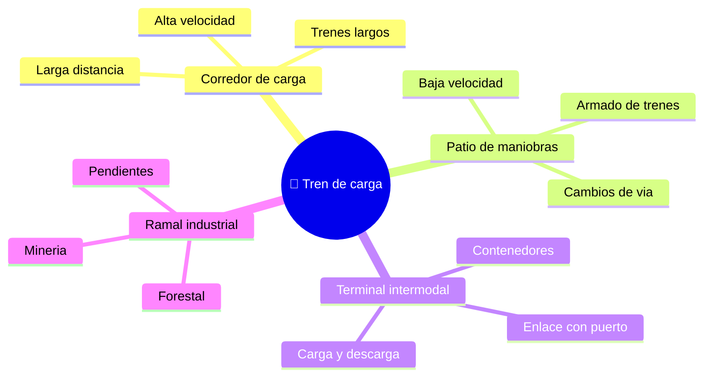

# 🌍 Entornos de trabajo del tren de carga

[🏠 Inicio](../../../README.md) · [🚂 Curso: Tren de carga](../README.md) · 🌍 Entornos

Donde opera un tren de carga y como cambia la operacion segun el entorno. Cada
entorno implica reglas, riesgos y ajustes distintos, y en simulacion se traduce en
escenarios diferentes.

---

## 🗺️ Entornos principales

| Entorno | Caracteristicas | Riesgos tipicos | Ajuste de operacion |
| --- | --- | --- | --- |
| Corredor de carga | Larga distancia, trenes largos. | Fatiga, pasos a nivel. | Anticipacion, velocidad de crucero estable. |
| Patio de maniobras | Armado y clasificacion de vagones. | Enganches, personal en via. | Baja velocidad, freno independiente. |
| Terminal intermodal | Carga y descarga de contenedores. | Maniobras junto a gruas. | Coordinacion y paradas precisas. |
| Ramal minero / industrial | Pendientes y gran tonelaje. | Descenso cargado, adherencia. | Freno dinamico, arenado, control de masa. |
| Pendientes prolongadas | Subidas y bajadas largas. | Recalentamiento del freno, embalamiento. | Freno dinamico primero, gran anticipacion. |

---

## 🌦️ Factores del entorno

- **Clima**: lluvia, hielo u hojas en el riel reducen la adherencia rueda-riel.
- **Superficie de via**: estado del riel y de la trocha afecta el guiado y la velocidad.
- **Pendiente**: la carga empuja en bajada y frena en subida; cambia la gestion de masa.
- **Pasos a nivel**: cruces con caminos que exigen bocina y maxima atencion.

---

## 🎮 Traduccion a simulacion

Cada entorno es un escenario con su via, pendiente, clima y trafico ferroviario.
Ver como se modela en el [Modulo 8: Diseno de simulacion](../simulacion/diseno-simulador-tren-carga.md).

---

[⬅️ Anterior: Principios y operacion](principios-tren-carga.md) · [➡️ Siguiente: Reglamentos](../reglamentos/reglamentos-tren-carga.md)
