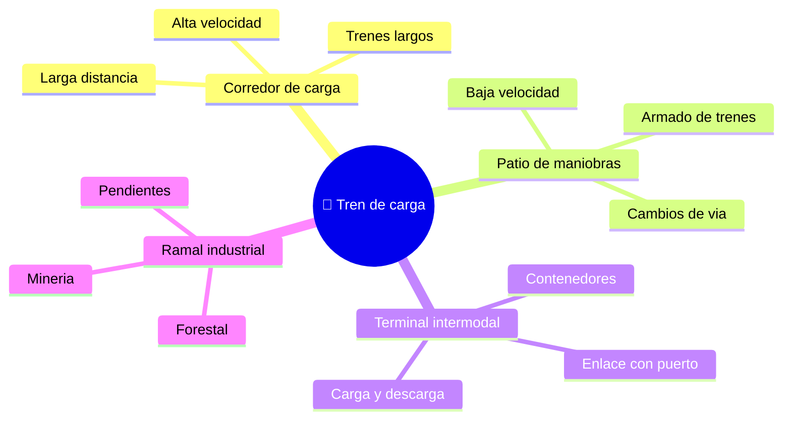

# 🌍 Entornos de trabajo del tren de carga

[🏠 Inicio](../../../README.md) · [🚂 Curso: Tren de carga](../README.md) · 🌍 Entornos

Dónde opera un tren de carga y cómo cambia la operación según el entorno. Cada
entorno implica reglas, riesgos y ajustes distintos, y en simulación se traduce en
escenarios diferentes.

---

## 🗺️ Entornos principales

| Entorno | Características | Riesgos típicos | Ajuste de operación |
| --- | --- | --- | --- |
| Corredor de carga | Larga distancia, trenes largos. | Fatiga, pasos a nivel. | Anticipación, velocidad de crucero estable. |
| Patio de maniobras | Armado y clasificación de vagones. | Enganches, personal en vía. | Baja velocidad, freno independiente. |
| Terminal intermodal | Carga y descarga de contenedores. | Maniobras junto a grúas. | Coordinación y paradas precisas. |
| Ramal minero / industrial | Pendientes y gran tonelaje. | Descenso cargado, adherencia. | Freno dinámico, arenado, control de masa. |
| Pendientes prolongadas | Subidas y bajadas largas. | Recalentamiento del freno, embalamiento. | Freno dinámico primero, gran anticipación. |

---

## 🌦️ Factores del entorno

- **Clima**: lluvia, hielo u hojas en el riel reducen la adherencia rueda-riel.
- **Superficie de vía**: estado del riel y de la trocha afecta el guiado y la velocidad.
- **Pendiente**: la carga empuja en bajada y frena en subida; cambia la gestión de masa.
- **Pasos a nivel**: cruces con caminos que exigen bocina y máxima atención.

---

## 🎮 Traducción a simulación

Cada entorno es un escenario con su vía, pendiente, clima y tráfico ferroviario.
Ver cómo se modela en el [Módulo 8: Diseño de simulación](../simulacion/diseno-simulador-tren-carga.md).

---

[⬅️ Anterior: Principios y operación](principios-tren-carga.md) · [➡️ Siguiente: Reglamentos](../reglamentos/reglamentos-tren-carga.md)
