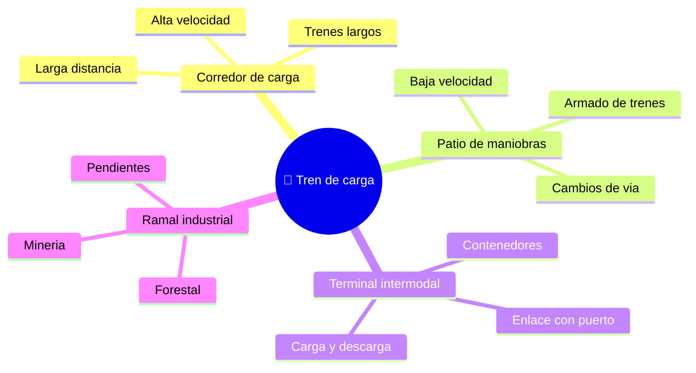

<!-- clase-meta
tipo_documento: clase
clase: 7
codigo: TRENCARGA-07
curso: tren-carga
titulo: "Entornos de trabajo del tren de carga"
modalidad: "análisis de escenarios"
duracion_minutos: 60
nivel: introductorio
prerrequisito: TRENCARGA-06
competencia: "adaptacion_al_entorno"
resultados_aprendizaje:
  - "Explicar entornos, factores ambientales, riesgos y respuesta de simulación con vocabulario propio de Tren de carga."
  - "Aplicar esos conceptos a una decisión segura o a un escenario de simulación de Tren de carga."
evidencia: "Matriz entorno–cambio–riesgo–respuesta."
criterio_aprobacion: "Cada respuesta se adapta al entorno y distingue riesgos que no son intercambiables entre escenarios."
fuentes: manuales/fuentes.md
ultima_revision: 2026-09-10
-->

# 🌍 Entornos de trabajo del tren de carga

[🏠 Inicio](../../../README.md) · [🚂 Curso: Tren de carga](../README.md) · 🌍 Entornos

Dónde opera un tren de carga y cómo cambia la operación según el entorno. Cada
entorno implica reglas, riesgos y ajustes distintos, y en simulación se traduce en
escenarios diferentes.

---

## 🗺️ Entornos principales

```mermaid
mindmap
  root((🚂 Tren de carga))
    Corredor de carga
      Larga distancia
      Alta velocidad
      Trenes largos
    Patio de maniobras
      Armado de trenes
      Baja velocidad
      Cambios de via
    Terminal intermodal
      Contenedores
      Carga y descarga
      Enlace con puerto
    Ramal industrial
      Mineria
      Forestal
      Pendientes
```

| Entorno | Características | Riesgos típicos | Ajuste de operación |
| --- | --- | --- | --- |
| Corredor de carga | Larga distancia, trenes largos. | Fatiga, pasos a nivel. | Anticipación, velocidad de crucero estable. |
| Patio de maniobras | Armado y clasificación de vagones. | Enganches, personal en vía. | Baja velocidad, freno independiente. |
| Terminal intermodal | Carga y descarga de contenedores. | Maniobras junto a grúas. | Coordinación y paradas precisas. |
| Ramal minero / industrial | Pendientes y gran tonelaje. | Descenso cargado, adherencia. | Freno dinámico, arenado, control de masa. |
| Pendientes prolongadas | Subidas y bajadas largas. | Recalentamiento del freno, embalamiento. | Freno dinámico primero, gran anticipación. |

---

## 🌦️ Factores del entorno

- **Clima**: lluvia, hielo u hojas en el riel reducen la adherencia rueda-riel.
- **Superficie de vía**: estado del riel y de la trocha afecta el guiado y la velocidad.
- **Pendiente**: la carga empuja en bajada y frena en subida; cambia la gestión de masa.
- **Pasos a nivel**: cruces con caminos que exigen bocina y máxima atención.

---

## 🎮 Traducción a simulación

Cada entorno es un escenario con su vía, pendiente, clima y tráfico ferroviario.
Ver cómo se modela en el [Clase 9: Diseño de simulación](../simulacion/diseno-simulador-tren-carga.md).

## 🧭 Guía de estudio aplicada

### Pregunta guía

¿Cómo ayuda **Entornos principales, Factores del entorno, Traducción a simulación y Guía de estudio aplicada** a **adaptar arranque de un tren largo en rampa con holguras entre enganches a tres condiciones ambientales distintas**?

### Explicación razonada

El entorno no es decoración: modifica las fuerzas, la percepción y el tiempo disponible. En el caso «arranque de un tren largo en rampa con holguras entre enganches», cambia el comportamiento de rueda-carril y aumenta la probabilidad de rotura de enganche, patinaje o compresión excesiva del convoy. La respuesta correcta empieza por reconocer qué variable cambió y después adaptar límites, ruta o misión.

Esta clase se conecta con el resto del curso mediante **fuerzas longitudinales del tren y propagación del freno neumático**. El hilo de
seguridad consiste en reconocer a tiempo **rotura de enganche, patinaje o compresión excesiva del convoy** y poder justificar la decisión
**aplicar potencia y freno de modo gradual considerando la longitud completa**; en clases posteriores cambiará el ángulo de análisis, no esa relación causal.
La lectura funcional común sigue **locomotora → generador y tracción → enganches → rueda-carril**, de modo que cada concepto pueda
ubicarse dentro del funcionamiento completo y no quede como un dato aislado.

**Apoyo documental:** [Railroad Operating Practices](https://railroads.fra.dot.gov/railroad-safety/divisions/operating-practices/operating-practices-0) aporta operación, señalización y competencias ferroviarias;
[Human Factors: Tasks and Demands](https://railroads.fra.dot.gov/human-factors/elearning-attention/tasks-demands) se usa para factores humanos y carga de trabajo. Estas fuentes
se contrastan con el alcance de la clase y no sustituyen un manual de equipo concreto.

### Caso resuelto: de la observación a la decisión

1. **Escenario base:** conserva la misión «arranque de un tren largo en rampa con holguras entre enganches» para poder comparar.
2. **Cambiar una condición:** modifica sucesivamente superficie o medio, visibilidad y perturbación externa.
3. **Recalcular margen:** explica cómo cada cambio afecta **rueda-carril** y acerca o aleja **rotura de enganche, patinaje o compresión excesiva del convoy**.
4. **Adaptar:** cambia límite, ruta, configuración o incluso cancela; no mantengas la misma respuesta por hábito.

### Comprueba tu comprensión

1. ¿Cómo cambiaría **rueda-carril** si empeora la perturbación externa?
2. ¿Qué condición ambiental acerca más el escenario a **rotura de enganche, patinaje o compresión excesiva del convoy**?
3. ¿Cuándo adaptarías la maniobra y cuándo la cancelarías?

Orientación para revisar tus respuestas

- La primera respuesta debe relacionar el eslabón elegido con un efecto posterior, no solo nombrarlo.
- La segunda debe proponer una señal medible u observable y explicar qué tendencia sería preocupante.
- La tercera debe cambiar al menos una variable de capacidad, mando, entorno o margen de seguridad.

## 🎓 Cierre de clase

- **Actividad:** Contrasta tres entornos de Tren de carga a partir de entornos, factores ambientales, riesgos y respuesta de simulación y determina cómo cambian variables, percepción, riesgos y respuesta.
- **Evidencia:** Matriz entorno–cambio–riesgo–respuesta.
- **Criterio de aprobación:** Cada respuesta se adapta al entorno y distingue riesgos que no son intercambiables entre escenarios.
- **Transferencia:** explica qué cambiaría al pasar a otra variante de esta máquina.

### Fuentes de esta clase

- [US-FRA-OPS](https://railroads.fra.dot.gov/railroad-safety/divisions/operating-practices/operating-practices-0): Railroad Operating Practices, Federal Railroad Administration. Uso: operación, señalización y competencias ferroviarias.
- [US-FRA-HF](https://railroads.fra.dot.gov/human-factors/elearning-attention/tasks-demands): Human Factors: Tasks and Demands, Federal Railroad Administration. Uso: factores humanos y carga de trabajo.

> Las fuentes sostienen el marco conceptual y normativo; esta clase no reemplaza el manual
> del fabricante, la formación certificada ni la habilitación exigida para operar equipos reales.

---

[⬅️ Anterior: Principios y operación](principios-tren-carga.md) · [➡️ Siguiente: Reglamentos](../reglamentos/reglamentos-tren-carga.md)
