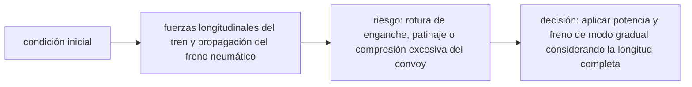

<!-- clase-meta
tipo_documento: clase
clase: 6
codigo: TRENCARGA-06
curso: tren-carga
titulo: "Principios y operación del tren de carga"
modalidad: "resolución de problemas"
duracion_minutos: 90
nivel: introductorio
prerrequisito: TRENCARGA-05
competencia: "razonamiento_operacional"
resultados_aprendizaje:
  - "Explicar principios físicos, fases de operación, decisiones y errores frecuentes con vocabulario propio de Tren de carga."
  - "Aplicar esos conceptos a una decisión segura o a un escenario de simulación de Tren de carga."
evidencia: "Resolución argumentada de un escenario operacional."
criterio_aprobacion: "Aplica los principios correctos, anticipa consecuencias y respeta los límites del curso."
fuentes: manuales/fuentes.md
ultima_revision: 2026-09-10
-->

# 🧪 Principios y operación del tren de carga

[🏠 Inicio](../../../README.md) · [🚂 Curso: Tren de carga](../README.md) · 🧪 Principios

Documento general y educativo. No sustituye la habilitación de maquinista ni el
manual del operador ferroviario. Describe cómo se opera un tren de carga en
simulación y que principios físicos conviene representar.

## Principios de funcionamiento

- **Gran masa e inercia**: el tren pesa miles de toneladas; cuesta mucho ponerlo
  en movimiento y mucho más detenerlo.
- **Adherencia limitada**: el contacto acero-acero da poco agarre; se compensa con
  arenado para arrancar y para frenar sin patinar.
- **Distancias de frenado largas**: por la masa y la baja adherencia, la detención
  toma cientos de metros o más; hay que anticipar mucho.
- **Fuerzas longitudinales**: al traccionar o frenar aparecen estirones (tensión) y
  compresiones entre vagones; manejarlas mal puede romper enganches o descarrilar.
- **Ruta fija**: el tren no elige trayectoria; sigue la vía y obedece la señalización.

## Fases de operación

| Fase | Que ocurre | Puntos clave |
| --- | --- | --- |
| Inspección previa | Revisión del tren | Enganches, mangueras de aire, freno, carga. |
| Carga de aire | Presurizar la tubería de freno | Esperar presión en toda la composición. |
| Arranque | Iniciar movimiento | Tracción progresiva, arenado, vigilar patinaje. |
| Marcha | Circular con seguridad | Respetar señales y límites, anticipar mucho. |
| Frenado | Reducir velocidad | Freno dinámico primero, luego neumático, sin bloquear. |
| Detención | Parar de forma segura | Freno aplicado, aire cargado, tren asegurado. |
| Cierre | Dejar el tren seguro | Freno de estacionamiento, sistemas apagados. |

## Gestión de fuerzas longitudinales

1. Aplicar la tracción de forma **progresiva** para no dar un estirón seco.
2. Evitar mezclar tramos en tensión y en compresión a la vez en el tren.
3. Usar el freno dinámico para controlar la velocidad de forma suave.
4. Anticipar pendientes: la carga empuja en bajada y frena en subida.
5. Coordinar las locomotoras remotas para repartir el esfuerzo.

## Errores comunes que la simulación puede enseñar a evitar

- Aplicar tracción de golpe y provocar patinaje o un estirón brusco.
- Frenar tarde por no anticipar la larga distancia de detención.
- Ignorar las fuerzas longitudinales entre vagones en pendiente.
- Olvidar el arenado al arrancar con gran carga o con riel húmedo.
- No atender el hombre muerto o vigilante durante la marcha.

## Relación con los niveles de realismo

- **Nivel 1 (educativo)**: traccionar, frenar y respetar señales de la vía.
- **Nivel 2 (simplificado)**: agregar inercia, adherencia limitada y distancia de frenado.
- **Nivel 3 (técnico)**: sumar fuerzas longitudinales, distributed power y freno dinámico.

Ver [`docs/03-niveles-de-realismo.md`](../../../docs/03-niveles-de-realismo.md) para el detalle de cada nivel.

## 🧭 Guía de estudio aplicada

### Pregunta guía

¿Cómo ayuda **Principios de funcionamiento, Fases de operación, Gestión de fuerzas longitudinales y Errores comunes que la simulación puede enseñar a evitar** a **resolver arranque de un tren largo en rampa con holguras entre enganches sin agotar el margen operacional**?

### Explicación razonada

El principio rector puede resumirse así: fuerzas longitudinales del tren y propagación del freno neumático. Esto explica por qué una misma orden produce resultados distintos cuando cambian velocidad, carga, configuración o entorno. Operar bien consiste en leer la tendencia antes de agotar el margen y tomar esta decisión: aplicar potencia y freno de modo gradual considerando la longitud completa.

Esta clase se conecta con el resto del curso mediante **fuerzas longitudinales del tren y propagación del freno neumático**. El hilo de
seguridad consiste en reconocer a tiempo **rotura de enganche, patinaje o compresión excesiva del convoy** y poder justificar la decisión
**aplicar potencia y freno de modo gradual considerando la longitud completa**; en clases posteriores cambiará el ángulo de análisis, no esa relación causal.
La lectura funcional común sigue **locomotora → generador y tracción → enganches → rueda-carril**, de modo que cada concepto pueda
ubicarse dentro del funcionamiento completo y no quede como un dato aislado.

**Apoyo documental:** [Railroad Operating Practices](https://railroads.fra.dot.gov/railroad-safety/divisions/operating-practices/operating-practices-0) aporta operación, señalización y competencias ferroviarias;
[Human Factors: Tasks and Demands](https://railroads.fra.dot.gov/human-factors/elearning-attention/tasks-demands) se usa para factores humanos y carga de trabajo. Estas fuentes
se contrastan con el alcance de la clase y no sustituyen un manual de equipo concreto.

### Caso resuelto: de la observación a la decisión

1. **Datos:** reconoce condiciones, configuración y margen disponibles en **arranque de un tren largo en rampa con holguras entre enganches**.
2. **Modelo:** aplica **fuerzas longitudinales del tren y propagación del freno neumático** para predecir una tendencia antes de actuar.
3. **Riesgo:** explica mediante qué cadena de causas podría ocurrir **rotura de enganche, patinaje o compresión excesiva del convoy**.
4. **Decisión:** ejecuta mentalmente **aplicar potencia y freno de modo gradual considerando la longitud completa** y define qué observación confirmaría que funcionó.

### Comprueba tu comprensión

1. ¿Qué variable del principio «fuerzas longitudinales del tren y propagación del freno neumático» cambia primero en el caso?
2. ¿Cómo se propaga ese cambio hasta **rueda-carril**?
3. ¿Qué evidencia confirmaría que **aplicar potencia y freno de modo gradual considerando la longitud completa** conservó margen operacional?

Orientación para revisar tus respuestas

- La primera respuesta debe relacionar el eslabón elegido con un efecto posterior, no solo nombrarlo.
- La segunda debe proponer una señal medible u observable y explicar qué tendencia sería preocupante.
- La tercera debe cambiar al menos una variable de capacidad, mando, entorno o margen de seguridad.

## 🎓 Cierre de clase

- **Actividad:** Resuelve un escenario de Tren de carga explicando, paso a paso, cómo intervienen principios físicos, fases de operación, decisiones y errores frecuentes.
- **Evidencia:** Resolución argumentada de un escenario operacional.
- **Criterio de aprobación:** Aplica los principios correctos, anticipa consecuencias y respeta los límites del curso.
- **Transferencia:** explica qué cambiaría al pasar a otra variante de esta máquina.

### Fuentes de esta clase

- [US-FRA-OPS](https://railroads.fra.dot.gov/railroad-safety/divisions/operating-practices/operating-practices-0): Railroad Operating Practices, Federal Railroad Administration. Uso: operación, señalización y competencias ferroviarias.
- [US-FRA-HF](https://railroads.fra.dot.gov/human-factors/elearning-attention/tasks-demands): Human Factors: Tasks and Demands, Federal Railroad Administration. Uso: factores humanos y carga de trabajo.

> Las fuentes sostienen el marco conceptual y normativo; esta clase no reemplaza el manual
> del fabricante, la formación certificada ni la habilitación exigida para operar equipos reales.

---

[⬅️ Anterior: Mandos](../mandos/manual-mandos-tren-carga.md) · [➡️ Siguiente: Entornos de trabajo](entornos-tren-carga.md)
