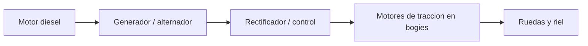
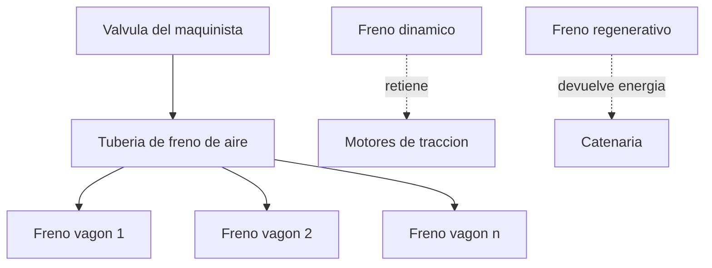

# 🔧 Sistemas mecanicos del tren de carga

[🏠 Inicio](../../../README.md) · [🚂 Curso: Tren de carga](../README.md) · 🔧 Sistemas mecanicos

Este modulo abre el tren de carga por dentro y es el corazon del curso. Explica
cada sistema, como funciona y como se conecta con los demas, con foco en la
traccion, la adherencia rueda-riel, el frenado de gran masa, la composicion del
tren y los enganches. Es la base tecnica para entender los mandos (Modulo 4) y la
fisica de la operacion con carga (Modulo 5).

---

## 1. ⚙️ Traccion diesel-electrica y electrica

La mayoria de las locomotoras de carga son **diesel-electricas**: el motor diesel
no mueve las ruedas de forma directa, sino que arrastra un generador o alternador
que produce electricidad para alimentar los **motores de traccion** montados en los
bogies. Es, en la practica, una central electrica movil sobre rieles.

| Elemento | Funcion |
| --- | --- |
| Motor diesel | Genera potencia mecanica a regimen casi constante. |
| Generador / alternador | Convierte esa potencia en electricidad. |
| Rectificador / control | Regula tension y corriente hacia los motores. |
| Motores de traccion | Mueven los ejes de cada bogie. |

En la **traccion electrica por catenaria**, la locomotora no lleva motor diesel:
toma corriente de un cable aereo (catenaria) mediante un pantografo y alimenta
directamente los motores de traccion. Gana potencia y elimina emisiones locales,
pero depende de la infraestructura electrificada de la via.

| Traccion | Fuente de energia | Ventaja | Limitacion |
| --- | --- | --- | --- |
| Diesel-electrica | Combustible a bordo | Autonoma, va donde haya via. | Emisiones y consumo. |
| Electrica por catenaria | Red electrica externa | Mas potencia, sin emision local. | Requiere linea electrificada. |

---

## 2. 🛞 Bogies, ruedas y adherencia

Cada locomotora y vagon apoya sobre **bogies**, carros pivotantes con dos o mas
ejes que reparten el peso y siguen la via en las curvas. Las **ruedas de pestana**
tienen un reborde interior que guia la rueda sobre el riel e impide que descarrile.

- **Bogie**: soporta la carga, aloja los motores de traccion y absorbe el trazado.
- **Rueda de pestana**: rueda conica con reborde que mantiene el tren sobre el riel.
- **Perfil conico**: ayuda a centrar el eje y a inscribir la curva.

El contacto acero-acero da muy poca **adherencia**: la superficie de apoyo entre
rueda y riel es del tamano de una moneda. Por eso arrancar con gran carga es
critico. Para aumentar el agarre se usa el **arenado**: se lanza arena sobre el
riel, justo delante de la rueda, para que el tren pueda aplicar mas fuerza sin
patinar.

| Concepto | Que es | Importancia |
| --- | --- | --- |
| Adherencia rueda-riel | Agarre disponible del contacto acero-acero. | Limita la fuerza de arranque y frenado. |
| Patinaje | La rueda gira sin avanzar por falta de agarre. | Se controla con arenado y electronica. |
| Arenado | Arena sobre el riel para subir la adherencia. | Clave para arrancar con gran tonelaje. |

---

## 3. 🛑 Frenado de gran masa

Por su enorme inercia, el tren de carga debe disipar mucha energia y frenar de
forma coordinada en toda su longitud. Combina varios sistemas.

- **Freno neumatico automatico**: una **tuberia de freno** con aire recorre todo el
  tren. Al reducir la presion en la tuberia, cada vagon aplica su freno de forma
  automatica y a la vez. Es un diseno a prueba de fallos: si el tren se parte, la
  presion cae y todo el tren frena solo.
- **Freno dinamico**: los motores de traccion actuan como generadores y frenan el
  tren convirtiendo su movimiento en electricidad, que se disipa en resistencias.
  Ahorra las zapatas en descensos largos.
- **Freno regenerativo**: igual que el dinamico, pero en traccion electrica la
  energia se devuelve a la catenaria en vez de disiparse en calor.

| Sistema | Como actua | Nota |
| --- | --- | --- |
| Freno neumatico automatico | Aire de la tuberia de freno en todo el tren. | Frenado principal y a prueba de fallos. |
| Freno dinamico | Motores como generadores, energia a resistencias. | Ahorra zapatas en pendiente. |
| Freno regenerativo | Devuelve energia a la catenaria. | Solo en traccion electrica. |

---

## 4. 🧩 Composicion del tren

La **composicion** es el orden y la cantidad de locomotoras y vagones. En trenes
largos no basta una locomotora al frente: se distribuyen locomotoras a lo largo
del tren para repartir el esfuerzo.

| Elemento | Funcion |
| --- | --- |
| Locomotora lider | Va al frente y la controla el maquinista. |
| Locomotoras remotas | Van intercaladas o al final, mandadas por radio. |
| Distributed power | Reparto de traccion a lo largo del tren. |
| Orden de vagones | Se ordena por peso, destino y tipo de carga. |
| Longitud | Limitada por la via, los frenos y las fuerzas internas. |

- **Distributed power**: las locomotoras remotas replican los mandos de la lider,
  reduciendo las fuerzas longitudinales y permitiendo trenes mas largos.
- **Reparto de carga**: colocar los vagones mas pesados de forma equilibrada evita
  tirones bruscos y descarrilos.

---

## 5. 🔗 Enganches y acoplamientos

Los vagones se unen entre si con **enganches** que transmiten la fuerza de arrastre
y de frenado a lo largo del tren.

| Tipo de enganche | Como funciona | Nota |
| --- | --- | --- |
| Automatico tipo cuchara AAR | Dos cabezas que se abrazan al chocar. | Rapido y seguro, comun en carga. |
| Husillo o tornillo | Gancho y tornillo que se aprieta a mano. | Clasico europeo, mas lento. |
| Topes y barra de traccion | Amortiguan compresion y transmiten arrastre. | Absorben estirones y choques. |

- **Enganche automatico tipo cuchara (AAR)**: se acopla solo al juntar dos vagones;
  agiliza el armado de trenes largos.
- **Enganche de husillo / tornillo**: se conecta a mano con un gancho y un tornillo
  tensor; requiere mas tiempo y personal.
- **Topes y barra de traccion**: la barra transmite el tiro y los topes amortiguan
  las compresiones entre vagones.

---

## 6. ⚖️ Peso por eje, via y senalizacion

La capacidad del tren no la fija solo la potencia, sino cuanto peso admiten los
ejes sobre la via y como esta senalizada la circulacion.

| Concepto | Que es | Importancia |
| --- | --- | --- |
| Peso por eje | Carga que cada eje transmite al riel. | Limita el tonelaje que la via soporta. |
| Ancho de via / trocha | Distancia entre los dos rieles. | Debe coincidir en toda la ruta. |
| Senalizacion | Senales que autorizan o detienen la marcha. | Ordena la circulacion y evita choques. |

- **Peso por eje**: si se excede, se dana la via; por eso se reparte la carga entre
  todos los ejes de cada vagon.
- **Ancho de via (trocha)**: el valor exacto usado en Chile queda por confirmar;
  toda la red de una ruta debe compartir la misma trocha.
- **Senalizacion**: gobierna la circulacion sobre una ruta fija, incluidos los
  pasos a nivel donde la via cruza caminos.

---

## 🔁 Como se conecta todo

1. El **motor diesel** mueve el **generador**, o la **catenaria** entrega corriente.
2. Los **motores de traccion** de los **bogies** mueven las **ruedas de pestana**.
3. El **arenado** compensa la baja **adherencia** para arrancar con gran carga.
4. La **composicion** y el **distributed power** reparten el esfuerzo en el tren.
5. Los **enganches** transmiten el arrastre y el frenado entre vagones.
6. El **freno neumatico** actua en todo el tren; el **dinamico** ahorra zapatas.
7. El **peso por eje** y la **via** limitan cuanto tonelaje se puede mover.

Con esto entendido, el [Modulo 4: Mandos](../mandos/manual-mandos-tren-carga.md)
muestra como el maquinista opera cada uno de estos sistemas.

---

[⬅️ Anterior: Caracteristicas](caracteristicas-tren-carga.md) · [➡️ Siguiente: Mandos e instrumentos](../mandos/manual-mandos-tren-carga.md)
