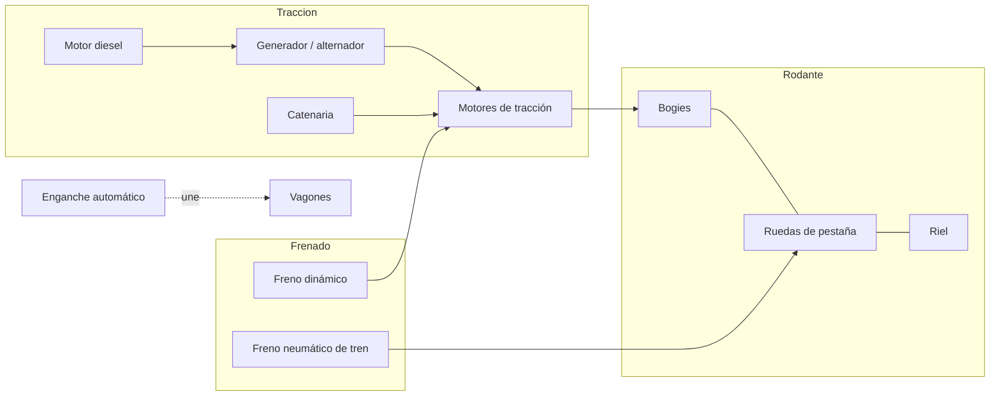
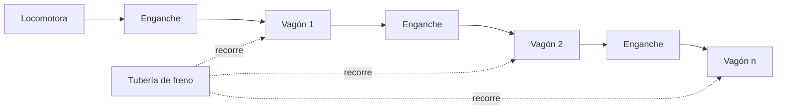

# 🔧 Sistemas mecánicos del tren de carga

[🏠 Inicio](../../../README.md) · [🚂 Curso: Tren de carga](../README.md) · 🔧 Sistemas mecánicos

Este módulo abre el tren de carga por dentro y es el corazón del curso. Explica
cada sistema, como funciona y cómo se conecta con los demás, con foco en la
tracción, la adherencia rueda-riel, el frenado de gran masa, la composición del
tren y los enganches. Es la base técnica para entender los mandos (Módulo 4) y la
física de la operación con carga (Módulo 5).

---

## 1. ⚙️ Tracción diesel-electrica y eléctrica

La mayoría de las locomotoras de carga son **diesel-electricas**: el motor diesel
no mueve las ruedas de forma directa, sino que arrastra un generador o alternador
que produce electricidad para alimentar los **motores de tracción** montados en los
bogies. Es, en la práctica, una central eléctrica móvil sobre rieles.

| Elemento | Función |
| --- | --- |
| Motor diesel | Genera potencia mecánica a régimen casi constante. |
| Generador / alternador | Convierte esa potencia en electricidad. |
| Rectificador / control | Regula tensión y corriente hacia los motores. |
| Motores de tracción | Mueven los ejes de cada bogie. |

En la **tracción eléctrica por catenaria**, la locomotora no lleva motor diesel:
toma corriente de un cable aéreo (catenaria) mediante un pantógrafo y alimenta
directamente los motores de tracción. Gana potencia y elimina emisiones locales,
pero depende de la infraestructura electrificada de la vía.

| Tracción | Fuente de energía | Ventaja | Limitación |
| --- | --- | --- | --- |
| Diesel-electrica | Combustible a bordo | Autónoma, va donde haya vía. | Emisiones y consumo. |
| Eléctrica por catenaria | Red eléctrica externa | Más potencia, sin emisión local. | Requiere línea electrificada. |

---

## 2. 🛞 Bogies, ruedas y adherencia

Cada locomotora y vagón apoya sobre **bogies**, carros pivotantes con dos o más
ejes que reparten el peso y siguen la vía en las curvas. Las **ruedas de pestaña**
tienen un reborde interior que guía la rueda sobre el riel e impide que descarrile.

- **Bogie**: soporta la carga, aloja los motores de tracción y absorbe el trazado.
- **Rueda de pestaña**: rueda cónica con reborde que mantiene el tren sobre el riel.
- **Perfil cónico**: ayuda a centrar el eje y a inscribir la curva.

El contacto acero-acero da muy poca **adherencia**: la superficie de apoyo entre
rueda y riel es del tamaño de una moneda. Por eso arrancar con gran carga es
crítico. Para aumentar el agarre se usa el **arenado**: se lanza arena sobre el
riel, justo delante de la rueda, para que el tren pueda aplicar más fuerza sin
patinar.

| Concepto | Que es | Importancia |
| --- | --- | --- |
| Adherencia rueda-riel | Agarre disponible del contacto acero-acero. | Limita la fuerza de arranque y frenado. |
| Patinaje | La rueda gira sin avanzar por falta de agarre. | Se controla con arenado y electrónica. |
| Arenado | Arena sobre el riel para subir la adherencia. | Clave para arrancar con gran tonelaje. |

---

## 3. 🛑 Frenado de gran masa

Por su enorme inercia, el tren de carga debe disipar mucha energía y frenar de
forma coordinada en toda su longitud. Combina varios sistemas.

- **Freno neumático automático**: una **tubería de freno** con aire recorre todo el
  tren. Al reducir la presión en la tubería, cada vagón aplica su freno de forma
  automática y a la vez. Es un diseño a prueba de fallos: si el tren se parte, la
  presión cae y todo el tren frena solo.
- **Freno dinámico**: los motores de tracción actuan como generadores y frenan el
  tren convirtiendo su movimiento en electricidad, que se disipa en resistencias.
  Ahorra las zapatas en descensos largos.
- **Freno regenerativo**: igual que el dinámico, pero en tracción eléctrica la
  energía se devuelve a la catenaria en vez de disiparse en calor.

| Sistema | Como actua | Nota |
| --- | --- | --- |
| Freno neumático automático | Aire de la tubería de freno en todo el tren. | Frenado principal y a prueba de fallos. |
| Freno dinámico | Motores como generadores, energía a resistencias. | Ahorra zapatas en pendiente. |
| Freno regenerativo | Devuelve energía a la catenaria. | Solo en tracción eléctrica. |

---

## 4. 🧩 Composición del tren

La **composición** es el orden y la cantidad de locomotoras y vagones. En trenes
largos no basta una locomotora al frente: se distribuyen locomotoras a lo largo
del tren para repartir el esfuerzo.

| Elemento | Función |
| --- | --- |
| Locomotora lider | Va al frente y la controla el maquinista. |
| Locomotoras remotas | Van intercaladas o al final, mandadas por radio. |
| Distributed power | Reparto de tracción a lo largo del tren. |
| Orden de vagones | Se ordena por peso, destino y tipo de carga. |
| Longitud | Limitada por la vía, los frenos y las fuerzas internas. |

- **Distributed power**: las locomotoras remotas replican los mandos de la lider,
  reduciendo las fuerzas longitudinales y permitiendo trenes más largos.
- **Reparto de carga**: colocar los vagones más pesados de forma equilibrada evita
  tirones bruscos y descarrilos.

---

## 5. 🔗 Enganches y acoplamientos

Los vagones se unen entre sí con **enganches** que transmiten la fuerza de arrastre
y de frenado a lo largo del tren.

| Tipo de enganche | Como funciona | Nota |
| --- | --- | --- |
| Automático tipo cuchara AAR | Dos cabezas que se abrazan al chocar. | Rápido y seguro, común en carga. |
| Husillo o tornillo | Gancho y tornillo que se aprieta a mano. | Clásico europeo, más lento. |
| Topes y barra de tracción | Amortiguan compresión y transmiten arrastre. | Absorben estirones y choques. |

- **Enganche automático tipo cuchara (AAR)**: se acopla solo al juntar dos vagones;
  agiliza el armado de trenes largos.
- **Enganche de husillo / tornillo**: se conecta a mano con un gancho y un tornillo
  tensor; requiere más tiempo y personal.
- **Topes y barra de tracción**: la barra transmite el tiro y los topes amortiguan
  las compresiones entre vagones.

---

## 6. ⚖️ Peso por eje, vía y señalización

La capacidad del tren no la fija solo la potencia, sino cuanto peso admiten los
ejes sobre la vía y como está senalizada la circulación.

| Concepto | Que es | Importancia |
| --- | --- | --- |
| Peso por eje | Carga que cada eje transmite al riel. | Limita el tonelaje que la vía soporta. |
| Ancho de vía / trocha | Distancia entre los dos rieles. | Debe coincidir en toda la ruta. |
| Señalización | Señales que autorizan o detienen la marcha. | Ordena la circulación y evita choques. |

- **Peso por eje**: si se excede, se dana la vía; por eso se reparte la carga entre
  todos los ejes de cada vagón.
- **Ancho de vía (trocha)**: el valor exacto usado en Chile queda por confirmar;
  toda la red de una ruta debe compartir la misma trocha.
- **Señalización**: gobierna la circulación sobre una ruta fija, incluidos los
  pasos a nivel donde la vía cruza caminos.

---

## 🔁 Cómo se conecta todo

1. El **motor diesel** mueve el **generador**, o la **catenaria** entrega corriente.
2. Los **motores de tracción** de los **bogies** mueven las **ruedas de pestaña**.
3. El **arenado** compensa la baja **adherencia** para arrancar con gran carga.
4. La **composición** y el **distributed power** reparten el esfuerzo en el tren.
5. Los **enganches** transmiten el arrastre y el frenado entre vagones.
6. El **freno neumático** actua en todo el tren; el **dinámico** ahorra zapatas.
7. El **peso por eje** y la **vía** limitan cuanto tonelaje se puede mover.

Con esto entendido, el [Módulo 4: Mandos](../mandos/manual-mandos-tren-carga.md)
muestra como el maquinista opera cada uno de estos sistemas.

---

[⬅️ Anterior: Características](caracteristicas-tren-carga.md) · [➡️ Siguiente: Mandos e instrumentos](../mandos/manual-mandos-tren-carga.md)
