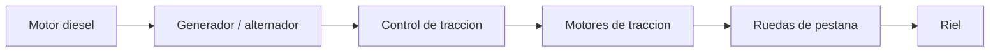

# 🧰 Recursos del tren de carga

[🏠 Inicio](../../../README.md) · [🚂 Curso: Tren de carga](../README.md) · 🧰 Recursos

Glosario especifico, enlaces y diagramas de apoyo del curso de tren de carga.
Amplia el [glosario general](../../../docs/05-glosario-general.md).

---

## 📖 Glosario especifico

| Termino | Definicion |
| --- | --- |
| Bogie | Carro pivotante con ejes que soporta la locomotora o el vagon y sigue la via. |
| Rueda de pestana | Rueda con reborde interior que guia el tren sobre el riel. |
| Adherencia rueda-riel | Agarre disponible del contacto acero-acero antes de patinar. |
| Arenado | Lanzar arena sobre el riel para aumentar la adherencia. |
| Tuberia de freno | Conducto de aire que recorre el tren y acciona el freno de cada vagon. |
| Freno dinamico | Uso de los motores de traccion como generadores para frenar. |
| Distributed power | Reparto de locomotoras a lo largo del tren para repartir el esfuerzo. |
| Enganche AAR | Enganche automatico tipo cuchara que se acopla al juntar vagones. |
| Peso por eje | Carga que cada eje transmite al riel; limita el tonelaje de la via. |
| Trocha | Distancia entre los dos rieles de la via. |

---

## 🗺️ Diagrama de traccion diesel-electrica

---

## 🔗 Enlaces y fuentes

- Marco legal: [⚖️ docs/07-marco-legal-chile.md](../../../docs/07-marco-legal-chile.md)
- Registro de fuentes: [📚 manuales/fuentes.md](../../../manuales/fuentes.md)
- Empresa de los Ferrocarriles del Estado (EFE): ver el registro de fuentes (efe.cl).

Registrar cada recurso nuevo con su origen y licencia, siguiendo
[`recursos/README.md`](../../../recursos/README.md).

---

[🎓 Portada del curso](../README.md) · [⬅️ Anterior: Diseno de simulacion](../simulacion/diseno-simulador-tren-carga.md)
