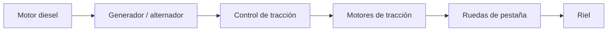

<!-- clase-meta
tipo_documento: clase
clase: 10
codigo: TRENCARGA-10
curso: tren-carga
titulo: "Recursos del tren de carga"
modalidad: "taller documental"
duracion_minutos: 45
nivel: introductorio
prerrequisito: TRENCARGA-09
competencia: "alfabetizacion_tecnica"
resultados_aprendizaje:
  - "Explicar glosario, esquemas y trazabilidad de fuentes con vocabulario propio de Tren de carga."
  - "Aplicar esos conceptos a una decisión segura o a un escenario de simulación de Tren de carga."
evidencia: "Glosario aplicado y ficha breve de trazabilidad."
criterio_aprobacion: "Los términos permiten interpretar el curso y las fuentes se distinguen por autoridad, alcance y vigencia."
fuentes: manuales/fuentes.md
ultima_revision: 2026-09-10
-->

# 🧰 Recursos del tren de carga

[🏠 Inicio](../../../README.md) · [🚂 Curso: Tren de carga](../README.md) · 🧰 Recursos

Glosario específico, enlaces y diagramas de apoyo del curso de tren de carga.
Amplia el [glosario general](../../../docs/05-glosario-general.md).

---

## 📖 Glosario específico

| Término | Definición |
| --- | --- |
| Bogie | Carro pivotante con ejes que soporta la locomotora o el vagón y sigue la vía. |
| Rueda de pestaña | Rueda con reborde interior que guía el tren sobre el riel. |
| Adherencia rueda-riel | Agarre disponible del contacto acero-acero antes de patinar. |
| Arenado | Lanzar arena sobre el riel para aumentar la adherencia. |
| Tubería de freno | Conducto de aire que recorre el tren y acciona el freno de cada vagón. |
| Freno dinámico | Uso de los motores de tracción como generadores para frenar. |
| Distributed power | Reparto de locomotoras a lo largo del tren para repartir el esfuerzo. |
| Enganche AAR | Enganche automático tipo cuchara que se acopla al juntar vagones. |
| Peso por eje | Carga que cada eje transmite al riel; limita el tonelaje de la vía. |
| Trocha | Distancia entre los dos rieles de la vía. |

---

## 🗺️ Diagrama de tracción diesel-eléctrica

```mermaid
flowchart LR
    Diesel[Motor diesel] --> Generador[Generador / alternador]
    Generador --> Control[Control de tracción]
    Control --> Motores[Motores de tracción]
    Motores --> Ruedas[Ruedas de pestaña]
    Ruedas --> Riel[Riel]
```

---

## 🔗 Enlaces y fuentes

- Marco legal: [⚖️ docs/07-marco-legal-chile.md](../../../docs/07-marco-legal-chile.md)
- Registro de fuentes: [📚 manuales/fuentes.md](../../../manuales/fuentes.md)
- Empresa de los Ferrocarriles del Estado (EFE): ver el registro de fuentes (efe.cl).

Registrar cada recurso nuevo con su origen y licencia, siguiendo
[`recursos/README.md`](../../../recursos/README.md).

## 🧭 Guía de estudio aplicada

### Pregunta guía

¿Cómo ayuda **Glosario específico, Diagrama de tracción diesel-eléctrica, Enlaces y fuentes y Guía de estudio aplicada** a **explicar con fuentes los términos locomotora, generador y tracción, enganches y rueda-carril**?

### Explicación razonada

El vocabulario técnico organiza relaciones: locomotora, generador y tracción, enganches y rueda-carril nombran partes distintas de una misma cadena funcional. Una fuente se usa para sostener una afirmación concreta —principio, límite, procedimiento o contexto— y debe distinguirse del manual particular de un fabricante o de una regla narrativa.

Esta clase se conecta con el resto del curso mediante **fuerzas longitudinales del tren y propagación del freno neumático**. El hilo de
seguridad consiste en reconocer a tiempo **rotura de enganche, patinaje o compresión excesiva del convoy** y poder justificar la decisión
**aplicar potencia y freno de modo gradual considerando la longitud completa**; en clases posteriores cambiará el ángulo de análisis, no esa relación causal.
La lectura funcional común sigue **locomotora → generador y tracción → enganches → rueda-carril**, de modo que cada concepto pueda
ubicarse dentro del funcionamiento completo y no quede como un dato aislado.

**Apoyo documental:** [Railroad Operating Practices](https://railroads.fra.dot.gov/railroad-safety/divisions/operating-practices/operating-practices-0) aporta operación, señalización y competencias ferroviarias;
[Human Factors: Tasks and Demands](https://railroads.fra.dot.gov/human-factors/elearning-attention/tasks-demands) se usa para factores humanos y carga de trabajo. Estas fuentes
se contrastan con el alcance de la clase y no sustituyen un manual de equipo concreto.

### Caso resuelto: de la observación a la decisión

1. **Definir en contexto:** explica **locomotora**, **generador y tracción**, **enganches** y **rueda-carril** por su función y relación.
2. **Respaldar:** enlaza cada afirmación importante con una fuente identificable y declara su alcance.
3. **Contrastar:** separa principios generales, requisitos locales, manual de fabricante y —si aplica— canon ficticio.
4. **Reformular:** convierte una definición copiada en una explicación propia con un ejemplo de **Tren de carga**.

### Comprueba tu comprensión

1. Explica la diferencia funcional entre **generador y tracción** y **enganches** sin copiar una definición.
2. ¿Qué fuente respalda el principio «fuerzas longitudinales del tren y propagación del freno neumático» y cuál es su alcance?
3. ¿Qué dato exigiría un manual de fabricante en vez de una fuente general?

Orientación para revisar tus respuestas

- La primera respuesta debe relacionar el eslabón elegido con un efecto posterior, no solo nombrarlo.
- La segunda debe proponer una señal medible u observable y explicar qué tendencia sería preocupante.
- La tercera debe cambiar al menos una variable de capacidad, mando, entorno o margen de seguridad.

## 🎓 Cierre de clase

- **Actividad:** Selecciona términos de glosario, esquemas y trazabilidad de fuentes, explícalos en contexto de Tren de carga y verifica la procedencia de las fuentes utilizadas.
- **Evidencia:** Glosario aplicado y ficha breve de trazabilidad.
- **Criterio de aprobación:** Los términos permiten interpretar el curso y las fuentes se distinguen por autoridad, alcance y vigencia.
- **Transferencia:** explica qué cambiaría al pasar a otra variante de esta máquina.

### Fuentes de esta clase

- [US-FRA-OPS](https://railroads.fra.dot.gov/railroad-safety/divisions/operating-practices/operating-practices-0): Railroad Operating Practices, Federal Railroad Administration. Uso: operación, señalización y competencias ferroviarias.
- [US-FRA-HF](https://railroads.fra.dot.gov/human-factors/elearning-attention/tasks-demands): Human Factors: Tasks and Demands, Federal Railroad Administration. Uso: factores humanos y carga de trabajo.

> Las fuentes sostienen el marco conceptual y normativo; esta clase no reemplaza el manual
> del fabricante, la formación certificada ni la habilitación exigida para operar equipos reales.

---

[🎓 Portada del curso](../README.md) · [⬅️ Anterior: Diseño de simulación](../simulacion/diseno-simulador-tren-carga.md) · [➡️ Siguiente: Ejercicios](../ejercicios/ejercicios-tren-carga.md)
