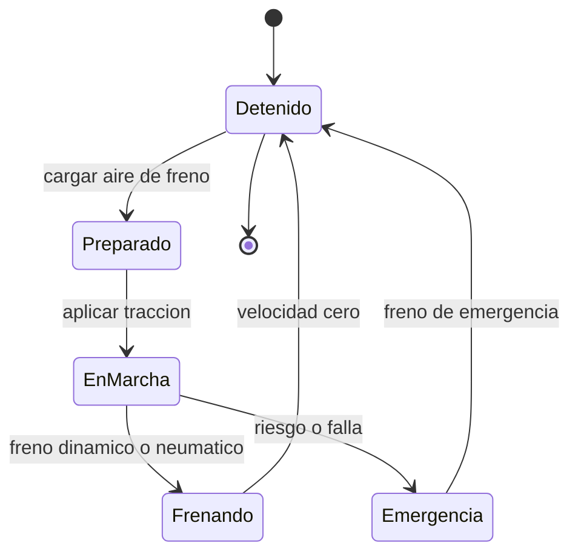

# 🎮 Diseno de simulacion del tren de carga

[🏠 Inicio](../../../README.md) · [🚂 Curso: Tren de carga](../README.md) · 🎮 Simulacion

## Objetivo de la simulacion

Que el usuario aprenda a arrancar con gran carga usando arenado, a mantener la
velocidad respetando la senalizacion, a anticipar la larga distancia de frenado y
a manejar las fuerzas longitudinales del tren, de forma segura y progresiva.

## Nivel de realismo

- Nivel elegido: se ofrece del 1 al 3 (ver `docs/03-niveles-de-realismo.md`).
- Justificacion: el tren de carga lleva al extremo la gestion de masa, por eso se
  ubica como vehiculo avanzado, despues de la moto y del camion.

## Variables principales

| Variable | Tipo | Rango | Afecta a | Comentarios |
| --- | --- | --- | --- | --- |
| Velocidad | numerica | 0-120 km/h | Movimiento y frenado | Central para respetar la via. |
| Esfuerzo de traccion | numerica | 0-100% | Aceleracion | Limitado por la adherencia. |
| Presion de tuberia de freno | numerica | 0-10 bar | Frenado del tren | Bajo el minimo no se debe circular. |
| Adherencia rueda-riel | numerica | 0-1 | Traccion y frenado | Baja con lluvia; sube con arenado. |
| Masa total | numerica | fija + carga | Inercia y frenado | Miles de toneladas segun composicion. |
| Fuerza longitudinal | numerica | tension/compresion | Enganches y estabilidad | Riesgo de rotura o descarrilo. |
| Pendiente | numerica | -grados..+grados | Empuje y retencion | La carga empuja en bajada. |

## Ciclo basico

1. Leer entrada del usuario (traccion, freno automatico, freno independiente, freno dinamico, arenado, sentido).
2. Actualizar estado de traccion y de la tuberia de freno en todo el tren.
3. Calcular fuerzas: traccion, frenado, gravedad en pendiente y adherencia.
4. Calcular las fuerzas longitudinales entre vagones (tension y compresion).
5. Aplicar restricciones del entorno (via, pendiente, clima, senalizacion).
6. Actualizar velocidad y posicion sobre la via.
7. Refrescar instrumentos y retroalimentacion (sonido, testigos, patinaje).

## Modos de juego futuros

- Tutorial guiado del puesto del maquinista.
- Practica libre en un corredor de carga.
- Misiones de armado de tren en patio de maniobras.
- Desafios de frenado y anticipacion en pendiente.
- Situaciones de baja adherencia (riel humedo) sin contenido sensible.

## Elementos fuera de alcance

- Maniobras peligrosas presentadas como recomendables.
- Reproduccion de operacion temeraria como objetivo del juego.
- Datos tecnicos que permitan alterar sistemas reales de un tren.

## Pendientes

- [ ] Definir valores por defecto de cada variable por tipo de tren.
- [ ] Prototipar el ciclo basico en un motor simple.
- [ ] Ajustar el modelo de adherencia rueda-riel con lluvia y arenado.
- [ ] Modelar las fuerzas longitudinales entre vagones.
- [ ] Agregar fuentes tecnicas publicas a [`manuales/fuentes.md`](../../../manuales/fuentes.md).

---

[⬅️ Anterior: Reglamentos](../reglamentos/reglamentos-tren-carga.md) · [➡️ Siguiente: Recursos](../recursos/recursos-tren-carga.md)
