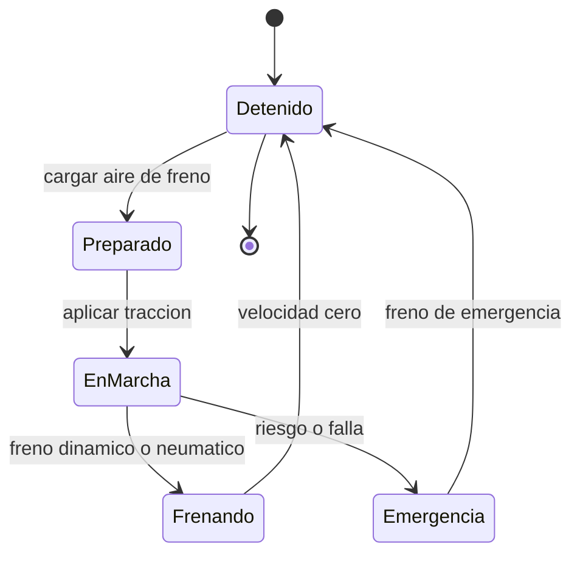

# 🎮 Diseño de simulación del tren de carga

[🏠 Inicio](../../../README.md) · [🚂 Curso: Tren de carga](../README.md) · 🎮 Simulación

## Objetivo de la simulación

Que el usuario aprenda a arrancar con gran carga usando arenado, a mantener la
velocidad respetando la señalización, a anticipar la larga distancia de frenado y
a manejar las fuerzas longitudinales del tren, de forma segura y progresiva.

## Nivel de realismo

- Nivel elegido: se ofrece del 1 al 3 (ver `docs/03-niveles-de-realismo.md`).
- Justificación: el tren de carga lleva al extremo la gestión de masa, por eso se
  ubica como vehículo avanzado, después de la moto y del camión.

## Variables principales

| Variable | Tipo | Rango | Afecta a | Comentarios |
| --- | --- | --- | --- | --- |
| Velocidad | numérica | 0-120 km/h | Movimiento y frenado | Central para respetar la vía. |
| Esfuerzo de tracción | numérica | 0-100% | Aceleración | Limitado por la adherencia. |
| Presión de tubería de freno | numérica | 0-10 bar | Frenado del tren | Bajo el mínimo no se debe circular. |
| Adherencia rueda-riel | numérica | 0-1 | Tracción y frenado | Baja con lluvia; sube con arenado. |
| Masa total | numérica | fija + carga | Inercia y frenado | Miles de toneladas según composición. |
| Fuerza longitudinal | numérica | tensión/compresión | Enganches y estabilidad | Riesgo de rotura o descarrilo. |
| Pendiente | numérica | -grados..+grados | Empuje y retención | La carga empuja en bajada. |

## Ciclo básico

1. Leer entrada del usuario (tracción, freno automático, freno independiente, freno dinámico, arenado, sentido).
2. Actualizar estado de tracción y de la tubería de freno en todo el tren.
3. Calcular fuerzas: tracción, frenado, gravedad en pendiente y adherencia.
4. Calcular las fuerzas longitudinales entre vagones (tensión y compresión).
5. Aplicar restricciones del entorno (vía, pendiente, clima, señalización).
6. Actualizar velocidad y posición sobre la vía.
7. Refrescar instrumentos y retroalimentación (sonido, testigos, patinaje).

## Modos de juego futuros

- Tutorial guiado del puesto del maquinista.
- Práctica libre en un corredor de carga.
- Misiones de armado de tren en patio de maniobras.
- Desafíos de frenado y anticipación en pendiente.
- Situaciones de baja adherencia (riel húmedo) sin contenido sensible.

## Elementos fuera de alcance

- Maniobras peligrosas presentadas como recomendables.
- Reproducción de operación temeraria como objetivo del juego.
- Datos técnicos que permitan alterar sistemas reales de un tren.

## Pendientes

- [ ] Definir valores por defecto de cada variable por tipo de tren.
- [ ] Prototipar el ciclo básico en un motor simple.
- [ ] Ajustar el modelo de adherencia rueda-riel con lluvia y arenado.
- [ ] Modelar las fuerzas longitudinales entre vagones.
- [ ] Agregar fuentes técnicas públicas a [`manuales/fuentes.md`](../../../manuales/fuentes.md).

---

[⬅️ Anterior: Reglamentos](../reglamentos/reglamentos-tren-carga.md) · [➡️ Siguiente: Recursos](../recursos/recursos-tren-carga.md)
