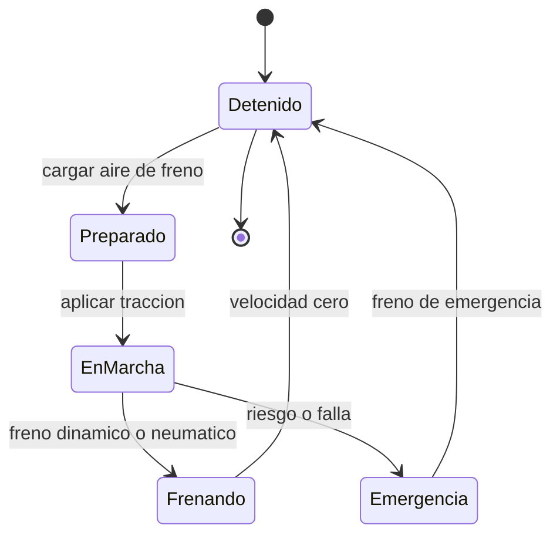
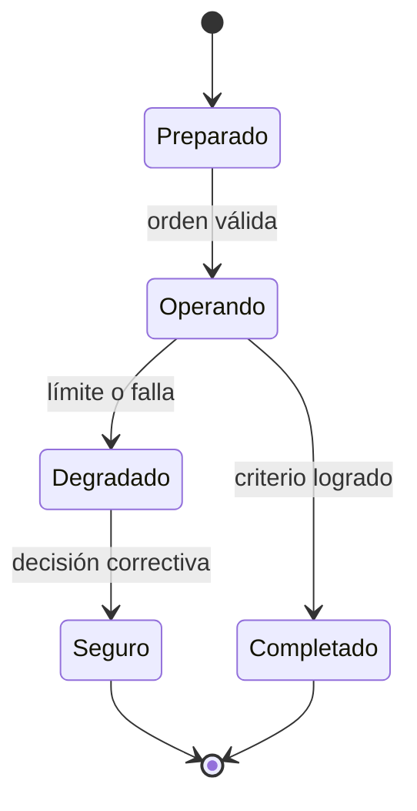

<!-- clase-meta
tipo_documento: clase
clase: 9
codigo: TRENCARGA-09
curso: tren-carga
titulo: "Diseño de simulación del tren de carga"
modalidad: "laboratorio de diseño"
duracion_minutos: 90
nivel: introductorio
prerrequisito: TRENCARGA-08
competencia: "modelado_de_simulacion"
resultados_aprendizaje:
  - "Explicar objetivo, variables, estados, ciclo y escenarios de simulación con vocabulario propio de Tren de carga."
  - "Aplicar esos conceptos a una decisión segura o a un escenario de simulación de Tren de carga."
evidencia: "Ficha de escenario y diagrama de estados."
criterio_aprobacion: "El modelo es específico de la máquina, medible, seguro y trazable a clases anteriores."
fuentes: manuales/fuentes.md
ultima_revision: 2026-09-10
-->

# 🎮 Diseño de simulación del tren de carga

[🏠 Inicio](../../../README.md) · [🚂 Curso: Tren de carga](../README.md) · 🎮 Simulación

```mermaid
stateDiagram-v2
    [*] --> Detenido
    Detenido --> Preparado: cargar aire de freno
    Preparado --> EnMarcha: aplicar traccion
    EnMarcha --> Frenando: freno dinamico o neumatico
    Frenando --> Detenido: velocidad cero
    EnMarcha --> Emergencia: riesgo o falla
    Emergencia --> Detenido: freno de emergencia
    Detenido --> [*]
```

## Objetivo de la simulación

Que el usuario aprenda a arrancar con gran carga usando arenado, a mantener la
velocidad respetando la señalización, a anticipar la larga distancia de frenado y
a manejar las fuerzas longitudinales del tren, de forma segura y progresiva.

## Nivel de realismo

- Nivel elegido: se ofrece del 1 al 3 (ver `docs/03-niveles-de-realismo.md`).
- Justificación: el tren de carga lleva al extremo la gestión de masa, por eso se
  ubica como vehículo avanzado, después de la moto y del camión.

## Variables principales

| Variable | Tipo | Rango | Afecta a | Comentarios |
| --- | --- | --- | --- | --- |
| Velocidad | numérica | 0-120 km/h | Movimiento y frenado | Central para respetar la vía. |
| Esfuerzo de tracción | numérica | 0-100% | Aceleración | Limitado por la adherencia. |
| Presión de tubería de freno | numérica | 0-10 bar | Frenado del tren | Bajo el mínimo no se debe circular. |
| Adherencia rueda-riel | numérica | 0-1 | Tracción y frenado | Baja con lluvia; sube con arenado. |
| Masa total | numérica | fija + carga | Inercia y frenado | Miles de toneladas según composición. |
| Fuerza longitudinal | numérica | tensión/compresión | Enganches y estabilidad | Riesgo de rotura o descarrilo. |
| Pendiente | numérica | -grados..+grados | Empuje y retención | La carga empuja en bajada. |

## Ciclo básico

1. Leer entrada del usuario (tracción, freno automático, freno independiente, freno dinámico, arenado, sentido).
2. Actualizar estado de tracción y de la tubería de freno en todo el tren.
3. Calcular fuerzas: tracción, frenado, gravedad en pendiente y adherencia.
4. Calcular las fuerzas longitudinales entre vagones (tensión y compresión).
5. Aplicar restricciones del entorno (vía, pendiente, clima, señalización).
6. Actualizar velocidad y posición sobre la vía.
7. Refrescar instrumentos y retroalimentación (sonido, testigos, patinaje).

## Modos de juego futuros

- Tutorial guiado del puesto del maquinista.
- Práctica libre en un corredor de carga.
- Misiones de armado de tren en patio de maniobras.
- Desafíos de frenado y anticipación en pendiente.
- Situaciones de baja adherencia (riel húmedo) sin contenido sensible.

## Elementos fuera de alcance

- Maniobras peligrosas presentadas como recomendables.
- Reproducción de operación temeraria como objetivo del juego.
- Datos técnicos que permitan alterar sistemas reales de un tren.

## Pendientes

- [ ] Definir valores por defecto de cada variable por tipo de tren.
- [ ] Prototipar el ciclo básico en un motor simple.
- [ ] Ajustar el modelo de adherencia rueda-riel con lluvia y arenado.
- [ ] Modelar las fuerzas longitudinales entre vagones.
- [ ] Agregar fuentes técnicas públicas a [`manuales/fuentes.md`](../../../manuales/fuentes.md).

## 🧭 Guía de estudio aplicada

### Pregunta guía

¿Cómo ayuda **Objetivo de la simulación, Nivel de realismo, Variables principales y Ciclo básico** a **modelar arranque de un tren largo en rampa con holguras entre enganches como estados, variables y decisiones observables**?

### Explicación razonada

Una simulación de Tren de carga es educativa si representa decisiones y consecuencias. Como mínimo debe modelar el estado de locomotora, la respuesta de generador y tracción, la transición en enganches y el resultado en rueda-carril. El escenario «arranque de un tren largo en rampa con holguras entre enganches» es valioso porque obliga a observar, formular una hipótesis, actuar y comprobar.

```mermaid
stateDiagram-v2
    [*] --> Preparado
    Preparado --> Operando: orden válida
    Operando --> Degradado: límite o falla
    Degradado --> Seguro: decisión correctiva
    Operando --> Completado: criterio logrado
    Seguro --> [*]
    Completado --> [*]
```

Esta clase se conecta con el resto del curso mediante **fuerzas longitudinales del tren y propagación del freno neumático**. El hilo de
seguridad consiste en reconocer a tiempo **rotura de enganche, patinaje o compresión excesiva del convoy** y poder justificar la decisión
**aplicar potencia y freno de modo gradual considerando la longitud completa**; en clases posteriores cambiará el ángulo de análisis, no esa relación causal.
La lectura funcional común sigue **locomotora → generador y tracción → enganches → rueda-carril**, de modo que cada concepto pueda
ubicarse dentro del funcionamiento completo y no quede como un dato aislado.

**Apoyo documental:** [Railroad Operating Practices](https://railroads.fra.dot.gov/railroad-safety/divisions/operating-practices/operating-practices-0) aporta operación, señalización y competencias ferroviarias;
[Human Factors: Tasks and Demands](https://railroads.fra.dot.gov/human-factors/elearning-attention/tasks-demands) se usa para factores humanos y carga de trabajo. Estas fuentes
se contrastan con el alcance de la clase y no sustituyen un manual de equipo concreto.

### Caso resuelto: de la observación a la decisión

1. **Estado inicial:** representa arranque de un tren largo en rampa con holguras entre enganches con valores observables para **locomotora**, **generador y tracción**, **enganches** y **rueda-carril**.
2. **Decisión del estudiante:** ofrece una elección que cambie el estado, no una animación automática.
3. **Consecuencia:** modela la tendencia hacia **rotura de enganche, patinaje o compresión excesiva del convoy** y una señal previa que permita corregir.
4. **Cierre:** evalúa la explicación de la decisión, además de si el estudiante “ganó” el escenario.

### Comprueba tu comprensión

1. ¿Qué cuatro estados mínimos necesita el escenario «arranque de un tren largo en rampa con holguras entre enganches»?
2. ¿Qué variable anticipa **rotura de enganche, patinaje o compresión excesiva del convoy** antes de llegar al estado de falla?
3. ¿Cómo evaluarías la explicación del estudiante y no solo el resultado final?

Orientación para revisar tus respuestas

- La primera respuesta debe relacionar el eslabón elegido con un efecto posterior, no solo nombrarlo.
- La segunda debe proponer una señal medible u observable y explicar qué tendencia sería preocupante.
- La tercera debe cambiar al menos una variable de capacidad, mando, entorno o margen de seguridad.

## 🎓 Cierre de clase

- **Actividad:** Diseña un escenario educativo de Tren de carga basado en objetivo, variables, estados, ciclo y escenarios de simulación, con entradas, estados, variables y criterio de cierre.
- **Evidencia:** Ficha de escenario y diagrama de estados.
- **Criterio de aprobación:** El modelo es específico de la máquina, medible, seguro y trazable a clases anteriores.
- **Transferencia:** explica qué cambiaría al pasar a otra variante de esta máquina.

### Fuentes de esta clase

- [US-FRA-OPS](https://railroads.fra.dot.gov/railroad-safety/divisions/operating-practices/operating-practices-0): Railroad Operating Practices, Federal Railroad Administration. Uso: operación, señalización y competencias ferroviarias.
- [US-FRA-HF](https://railroads.fra.dot.gov/human-factors/elearning-attention/tasks-demands): Human Factors: Tasks and Demands, Federal Railroad Administration. Uso: factores humanos y carga de trabajo.

> Las fuentes sostienen el marco conceptual y normativo; esta clase no reemplaza el manual
> del fabricante, la formación certificada ni la habilitación exigida para operar equipos reales.

---

[⬅️ Anterior: Reglamentos](../reglamentos/reglamentos-tren-carga.md) · [➡️ Siguiente: Recursos](../recursos/recursos-tren-carga.md)
