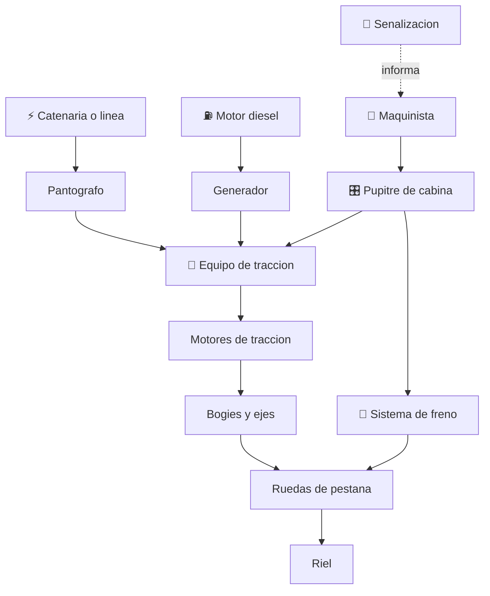

# 🚆 Curso: Tren de pasajeros

[🏠 Inicio](../../README.md) · [🚙 Catalogo de vehiculos](../README.md) · [🎓 Guia de curso](../../docs/08-guia-de-estilo-y-curso.md)

> **Curso del tren de pasajeros.** Documenta el tren de principio a fin:
> historia, caracteristicas, mecanica en profundidad, mandos de cabina, fisica
> de la adherencia rueda-riel, entornos, marco ferroviario chileno y diseno de
> simulacion. Sigue el modelo del curso de motos.

---

## 🎯 Objetivos de aprendizaje

Al terminar este curso deberias poder:

- Explicar como un tren acelera, frena y se guia sobre los rieles.
- Distinguir la traccion electrica de la traccion diesel-electrica.
- Identificar los sistemas mecanicos del tren y como se conectan.
- Reconocer los mandos del puesto del maquinista y su funcion.
- Comprender la adherencia rueda-riel, la gran masa y las distancias de frenado.
- Conocer el marco ferroviario chileno (EFE, MTT, habilitacion del maquinista).
- Traducir todo lo anterior en variables de un simulador educativo.

---

## 🗺️ Mapa del vehiculo

---

## 📚 Modulos del curso

| # | Modulo | Contenido | Enlace |
| :-: | --- | --- | --- |
| 1 | 📜 Historia | Del vapor a la electrificacion y los metros modernos. | [Abrir](historia/historia-tren-pasajeros.md) |
| 2 | 📋 Caracteristicas | Que es un tren de pasajeros y sus tipos. | [Abrir](operacion/caracteristicas-tren-pasajeros.md) |
| 3 | 🔧 Sistemas mecanicos | Traccion, bogies, adherencia, freno, senalizacion. | [Abrir](operacion/sistemas-mecanicos-tren-pasajeros.md) |
| 4 | 🎛️ Mandos e instrumentos | Puesto del maquinista, controles e indicadores. | [Abrir](mandos/manual-mandos-tren-pasajeros.md) |
| 5 | 🧪 Principios y operacion | Adherencia, gran masa y fases de operacion. | [Abrir](operacion/principios-tren-pasajeros.md) |
| 6 | 🌍 Entornos de trabajo | Metro, superficie, interurbano, tuneles, estaciones. | [Abrir](operacion/entornos-tren-pasajeros.md) |
| 7 | ⚖️ Reglamentos | Marco ferroviario chileno: EFE, MTT, habilitacion. | [Abrir](reglamentos/reglamentos-tren-pasajeros.md) |
| 8 | 🎮 Diseno de simulacion | Variables, ciclo y modos de juego. | [Abrir](simulacion/diseno-simulador-tren-pasajeros.md) |
| 9 | 🧰 Recursos | Glosario, enlaces y diagramas. | [Abrir](recursos/recursos-tren-pasajeros.md) |

---

## 🧩 Requisitos previos

Conviene haber revisado antes un vehiculo terrestre mas simple como la moto o el
bus, porque el tren comparte ideas de traccion y frenado pero agrega la guia
sobre rieles, la gran masa y el control por senales. Marco legal comun en
[⚖️ docs/07-marco-legal-chile.md](../../docs/07-marco-legal-chile.md).

---

[➡️ Empezar por el Modulo 1: Historia](historia/historia-tren-pasajeros.md)
