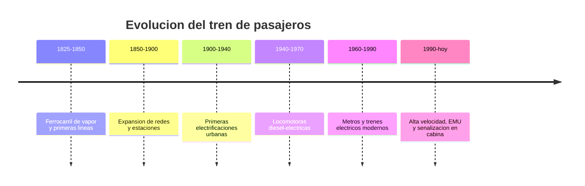

# 📜 Historia del tren de pasajeros

[🏠 Inicio](../../../README.md) · [🚆 Curso: Tren de pasajeros](../README.md) · 📜 Historia

## Origen

El tren de pasajeros nace en el siglo XIX cuando la locomotora de vapor permite
arrastrar coches sobre rieles de hierro. La vía guiada y la baja resistencia de
la rueda de acero sobre el riel hacen posible mover mucha carga y muchas personas
con poca energía, lo que transforma el transporte terrestre.

## Línea de tiempo

| Periodo | Hito | Importancia |
| --- | --- | --- |
| 1825-1850 | Ferrocarril de vapor y primeras líneas | Nace el transporte guiado sobre rieles. |
| 1850-1900 | Expansión de redes y estaciones | El tren conecta ciudades y puertos. |
| 1900-1940 | Primeras electrificaciones urbanas | Tranvias y trenes eléctricos de cercanías. |
| 1940-1970 | Locomotoras diesel-electricas | Reemplazan al vapor con más autonomía. |
| 1960-1990 | Metros y trenes eléctricos modernos | Alta capacidad urbana y suburbana. |
| 1990-presente | Alta velocidad, EMU y ATP en cabina | Más velocidad, seguridad y eficiencia. |

## Evolución tecnológica

- **Propulsión**: del vapor al diesel-electrico y a la tracción eléctrica pura.
- **Alimentación**: aparición de la catenaria, el pantógrafo y el tercer riel.
- **Materiales**: de coches pesados de acero a cajas más ligeras y aerodinámicas.
- **Frenado**: del freno de husillo al freno neumático, dinámico y regenerativo.
- **Señalización**: de señales de vía a sistemas ATP/ATC repetidos en cabina.
- **Composición**: de locomotora más coches a unidades múltiples autopropulsadas.

## Tipos representativos

| Tipo | Uso típico | Característica destacada |
| --- | --- | --- |
| Metro | Ciudad, alta frecuencia | Tracción eléctrica, gran capacidad. |
| Tren suburbano | Cercanías urbanas | Paradas frecuentes, EMU eléctrica. |
| Tren regional | Ciudades intermedias | Distancias medias, diesel o eléctrico. |
| Tren interurbano | Larga distancia | Coches remolcados por locomotora. |
| Tren-tram | Ciudad y periferia | Circula en calle y en vía férrea. |

## Impacto social y económico

El ferrocarril de pasajeros permitió la movilidad masiva entre ciudades y, con
los metros, la movilidad urbana de alta capacidad con bajo consumo por pasajero.
En Chile, la Empresa de los Ferrocarriles del Estado (EFE) opera de forma general
servicios de cercanías y regionales, y mantiene el rol histórico del tren en la
red nacional.

## Fuentes

- Registrar aquí las fuentes públicas consultadas.
- Enlazar cada fuente también en [`manuales/fuentes.md`](../../../manuales/fuentes.md).

---

[🎓 Portada del curso](../README.md) · [➡️ Siguiente: Características](../operacion/caracteristicas-tren-pasajeros.md)
