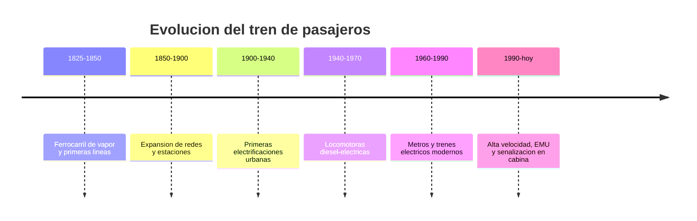

# 📜 Historia del tren de pasajeros

[🏠 Inicio](../../../README.md) · [🚆 Curso: Tren de pasajeros](../README.md) · 📜 Historia

## Origen

El tren de pasajeros nace en el siglo XIX cuando la locomotora de vapor permite
arrastrar coches sobre rieles de hierro. La via guiada y la baja resistencia de
la rueda de acero sobre el riel hacen posible mover mucha carga y muchas personas
con poca energia, lo que transforma el transporte terrestre.

## Linea de tiempo

| Periodo | Hito | Importancia |
| --- | --- | --- |
| 1825-1850 | Ferrocarril de vapor y primeras lineas | Nace el transporte guiado sobre rieles. |
| 1850-1900 | Expansion de redes y estaciones | El tren conecta ciudades y puertos. |
| 1900-1940 | Primeras electrificaciones urbanas | Tranvias y trenes electricos de cercanias. |
| 1940-1970 | Locomotoras diesel-electricas | Reemplazan al vapor con mas autonomia. |
| 1960-1990 | Metros y trenes electricos modernos | Alta capacidad urbana y suburbana. |
| 1990-presente | Alta velocidad, EMU y ATP en cabina | Mas velocidad, seguridad y eficiencia. |

## Evolucion tecnologica

- **Propulsion**: del vapor al diesel-electrico y a la traccion electrica pura.
- **Alimentacion**: aparicion de la catenaria, el pantografo y el tercer riel.
- **Materiales**: de coches pesados de acero a cajas mas ligeras y aerodinamicas.
- **Frenado**: del freno de husillo al freno neumatico, dinamico y regenerativo.
- **Senalizacion**: de senales de via a sistemas ATP/ATC repetidos en cabina.
- **Composicion**: de locomotora mas coches a unidades multiples autopropulsadas.

## Tipos representativos

| Tipo | Uso tipico | Caracteristica destacada |
| --- | --- | --- |
| Metro | Ciudad, alta frecuencia | Traccion electrica, gran capacidad. |
| Tren suburbano | Cercanias urbanas | Paradas frecuentes, EMU electrica. |
| Tren regional | Ciudades intermedias | Distancias medias, diesel o electrico. |
| Tren interurbano | Larga distancia | Coches remolcados por locomotora. |
| Tren-tram | Ciudad y periferia | Circula en calle y en via ferrea. |

## Impacto social y economico

El ferrocarril de pasajeros permitio la movilidad masiva entre ciudades y, con
los metros, la movilidad urbana de alta capacidad con bajo consumo por pasajero.
En Chile, la Empresa de los Ferrocarriles del Estado (EFE) opera de forma general
servicios de cercanias y regionales, y mantiene el rol historico del tren en la
red nacional.

## Fuentes

- Registrar aqui las fuentes publicas consultadas.
- Enlazar cada fuente tambien en [`manuales/fuentes.md`](../../../manuales/fuentes.md).

---

[🎓 Portada del curso](../README.md) · [➡️ Siguiente: Caracteristicas](../operacion/caracteristicas-tren-pasajeros.md)
