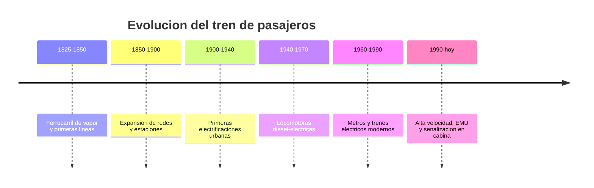

<!-- clase-meta
tipo_documento: clase
clase: 1
codigo: TRENPASAJERO-01
curso: tren-pasajeros
titulo: "Historia del tren de pasajeros"
modalidad: "teórica dialogada"
duracion_minutos: 45
nivel: introductorio
prerrequisito: ninguno
competencia: "contexto_historico"
resultados_aprendizaje:
  - "Explicar origen, evolución tecnológica, variantes representativas e impacto con vocabulario propio de Tren de pasajeros."
  - "Aplicar esos conceptos a una decisión segura o a un escenario de simulación de Tren de pasajeros."
evidencia: "Línea de tiempo comentada con cuatro hitos o más."
criterio_aprobacion: "Los hitos están ordenados, son pertinentes y dos relaciones de causa y efecto quedan justificadas."
fuentes: manuales/fuentes.md
ultima_revision: 2026-09-10
-->

# 📜 Historia del tren de pasajeros

[🏠 Inicio](../../../README.md) · [🚆 Curso: Tren de pasajeros](../README.md) · 📜 Historia

```mermaid
timeline
    title Evolucion del tren de pasajeros
    1825-1850 : Ferrocarril de vapor y primeras lineas
    1850-1900 : Expansion de redes y estaciones
    1900-1940 : Primeras electrificaciones urbanas
    1940-1970 : Locomotoras diesel-electricas
    1960-1990 : Metros y trenes electricos modernos
    1990-hoy : Alta velocidad, EMU y senalizacion en cabina
```

## Origen

El tren de pasajeros nace en el siglo XIX cuando la locomotora de vapor permite
arrastrar coches sobre rieles de hierro. La vía guiada y la baja resistencia de
la rueda de acero sobre el riel hacen posible mover mucha carga y muchas personas
con poca energía, lo que transforma el transporte terrestre.

## Línea de tiempo

| Periodo | Hito | Importancia |
| --- | --- | --- |
| 1825-1850 | Ferrocarril de vapor y primeras líneas | Nace el transporte guiado sobre rieles. |
| 1850-1900 | Expansión de redes y estaciones | El tren conecta ciudades y puertos. |
| 1900-1940 | Primeras electrificaciones urbanas | Tranvias y trenes eléctricos de cercanías. |
| 1940-1970 | Locomotoras diesel-eléctricas | Reemplazan al vapor con más autonomía. |
| 1960-1990 | Metros y trenes eléctricos modernos | Alta capacidad urbana y suburbana. |
| 1990-presente | Alta velocidad, EMU y ATP en cabina | Más velocidad, seguridad y eficiencia. |

## Evolución tecnológica

- **Propulsión**: del vapor al diesel-eléctrico y a la tracción eléctrica pura.
- **Alimentación**: aparición de la catenaria, el pantógrafo y el tercer riel.
- **Materiales**: de coches pesados de acero a cajas más ligeras y aerodinámicas.
- **Frenado**: del freno de husillo al freno neumático, dinámico y regenerativo.
- **Señalización**: de señales de vía a sistemas ATP/ATC repetidos en cabina.
- **Composición**: de locomotora más coches a unidades múltiples autopropulsadas.

## Tipos representativos

| Tipo | Uso típico | Característica destacada |
| --- | --- | --- |
| Metro | Ciudad, alta frecuencia | Tracción eléctrica, gran capacidad. |
| Tren suburbano | Cercanías urbanas | Paradas frecuentes, EMU eléctrica. |
| Tren regional | Ciudades intermedias | Distancias medias, diesel o eléctrico. |
| Tren interurbano | Larga distancia | Coches remolcados por locomotora. |
| Tren-tram | Ciudad y periferia | Circula en calle y en vía férrea. |

## Impacto social y económico

El ferrocarril de pasajeros permitió la movilidad masiva entre ciudades y, con
los metros, la movilidad urbana de alta capacidad con bajo consumo por pasajero.
En Chile, la Empresa de los Ferrocarriles del Estado (EFE) opera de forma general
servicios de cercanías y regionales, y mantiene el rol histórico del tren en la
red nacional.

## 🧭 Guía de estudio aplicada

### Pregunta guía

¿Cómo ayuda **Origen, Línea de tiempo, Evolución tecnológica y Tipos representativos** a **explicar cómo la evolución hizo posibles alternativas como unidad eléctrica múltiple frente a tren remolcado**?

### Explicación razonada

La evolución de Tren de pasajeros se comprende mejor como una sucesión de respuestas a problemas, no como una lista de fechas. Los cambios en captación o motor, convertidor de tracción, motores de eje y rueda-carril alteraron qué podía hacer la máquina, quién podía usarla y qué riesgos debían controlarse. El contraste «unidad eléctrica múltiple frente a tren remolcado» permite observar qué decisiones de diseño permanecieron y cuáles cambiaron con la tecnología y el propósito.

Esta clase se conecta con el resto del curso mediante **adherencia rueda-carril, curva de frenado y cumplimiento de señales**. El hilo de
seguridad consiste en reconocer a tiempo **rebasar el punto de parada o comprometer la comodidad por frenar tarde** y poder justificar la decisión
**anticipar la frenada según señal, pendiente, adherencia y carga**; en clases posteriores cambiará el ángulo de análisis, no esa relación causal.
La lectura funcional común sigue **captación o motor → convertidor de tracción → motores de eje → rueda-carril**, de modo que cada concepto pueda
ubicarse dentro del funcionamiento completo y no quede como un dato aislado.

**Apoyo documental:** [Railroad Operating Practices](https://railroads.fra.dot.gov/railroad-safety/divisions/operating-practices/operating-practices-0) aporta operación, señalización y competencias ferroviarias;
[Human Factors: Tasks and Demands](https://railroads.fra.dot.gov/human-factors/elearning-attention/tasks-demands) se usa para factores humanos y carga de trabajo. Estas fuentes
se contrastan con el alcance de la clase y no sustituyen un manual de equipo concreto.

### Caso resuelto: de la observación a la decisión

1. **Situar:** ordena los hitos que explican cómo se llegó a **unidad eléctrica múltiple frente a tren remolcado** y describe la necesidad que impulsó cada cambio.
2. **Relacionar:** explica qué se modificó en **captación o motor**, **convertidor de tracción**, **motores de eje** o **rueda-carril**; una fecha sin mecanismo no basta.
3. **Interpretar:** vincula el cambio con una capacidad nueva y también con el riesgo **rebasar el punto de parada o comprometer la comodidad por frenar tarde**.
4. **Transferir:** usa la evolución para justificar por qué hoy conviene **anticipar la frenada según señal, pendiente, adherencia y carga**.

### Comprueba tu comprensión

1. ¿Qué necesidad histórica impulsó un cambio en **captación o motor** o **convertidor de tracción**?
2. ¿Qué hito modificó la relación entre capacidad y **rebasar el punto de parada o comprometer la comodidad por frenar tarde**?
3. ¿Por qué **unidad eléctrica múltiple frente a tren remolcado** no puede explicarse como una simple diferencia estética?

Orientación para revisar tus respuestas

- La primera respuesta debe relacionar el eslabón elegido con un efecto posterior, no solo nombrarlo.
- La segunda debe proponer una señal medible u observable y explicar qué tendencia sería preocupante.
- La tercera debe cambiar al menos una variable de capacidad, mando, entorno o margen de seguridad.

## 🎓 Cierre de clase

- **Actividad:** Construye una línea de tiempo de Tren de pasajeros y explica cómo dos cambios históricos transformaron su función o su puesto de mando.
- **Evidencia:** Línea de tiempo comentada con cuatro hitos o más.
- **Criterio de aprobación:** Los hitos están ordenados, son pertinentes y dos relaciones de causa y efecto quedan justificadas.
- **Transferencia:** explica qué cambiaría al pasar a otra variante de esta máquina.

### Fuentes de esta clase

- [US-FRA-OPS](https://railroads.fra.dot.gov/railroad-safety/divisions/operating-practices/operating-practices-0): Railroad Operating Practices, Federal Railroad Administration. Uso: operación, señalización y competencias ferroviarias.
- [US-FRA-HF](https://railroads.fra.dot.gov/human-factors/elearning-attention/tasks-demands): Human Factors: Tasks and Demands, Federal Railroad Administration. Uso: factores humanos y carga de trabajo.

> Las fuentes sostienen el marco conceptual y normativo; esta clase no reemplaza el manual
> del fabricante, la formación certificada ni la habilitación exigida para operar equipos reales.

---

[🎓 Portada del curso](../README.md) · [➡️ Siguiente: Características](../operacion/caracteristicas-tren-pasajeros.md)
