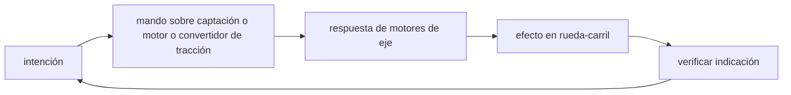

<!-- clase-meta
tipo_documento: clase
clase: 5
codigo: TRENPASAJERO-05
curso: tren-pasajeros
titulo: "Mandos e instrumentos del tren de pasajeros"
modalidad: "taller de simulación"
duracion_minutos: 60
nivel: introductorio
prerrequisito: TRENPASAJERO-04
competencia: "lectura_y_mando"
resultados_aprendizaje:
  - "Explicar controles, instrumentos, entradas y estados del sistema con vocabulario propio de Tren de pasajeros."
  - "Aplicar esos conceptos a una decisión segura o a un escenario de simulación de Tren de pasajeros."
evidencia: "Mapa de mandos y resolución de dos estados del tablero."
criterio_aprobacion: "Reconoce los controles críticos y responde a los estados sin introducir acciones inseguras."
fuentes: manuales/fuentes.md
ultima_revision: 2026-09-10
-->

# 🎛️ Mandos e instrumentos del tren de pasajeros

[🏠 Inicio](../../../README.md) · [🚆 Curso: Tren de pasajeros](../README.md) · 🎛️ Mandos

## Vista general

El puesto de mando del tren es la cabina del maquinista, ubicada en el extremo de
la composición. A diferencia de un auto, el maquinista no dirige la trayectoria:
la vía lo hace. Su trabajo es regular la tracción y el freno, vigilar la
señalización y respetar las velocidades. El control central suele ser un
manipulador que combina tracción y freno, o dos palancas separadas.

## Mapa de controles

| Zona | Control | Tipo | Función | Prioridad | Comentarios |
| --- | --- | --- | --- | --- | --- |
| Pupitre | Manipulador de tracción | Palanca | Regular la fuerza de tracción | Alta | Puede ir combinado con el freno. |
| Pupitre | Manipulador de freno | Palanca | Regular el freno de servicio | Alta | Neumático y dinámico combinados. |
| Pupitre | Palanca inversora | Selector | Elegir sentido de marcha | Alta | Adelante, neutro o atrás. |
| Pupitre | Freno de emergencia | Mando | Detención máxima | Alta | Aplica todo el freno disponible. |
| Piso o pupitre | Hombre muerto | Pedal o botón | Detectar al maquinista activo | Alta | Frena el tren si se suelta. |
| Pupitre | Vigilante | Botón | Confirmar atención | Alta | Exige respuesta periódica. |
| Pupitre | Areneros | Botón | Soltar arena al riel | Media | Mejora la adherencia. |
| Pupitre | Bocina o silbato | Botón | Advertir | Media | Uso en pasos a nivel y andenes. |
| Pupitre | Mando de puertas | Botón | Abrir y cerrar puertas | Alta | Con enclavamiento de marcha. |
| Pupitre | Radio tren-tierra | Equipo | Comunicar con control | Alta | Coordinación con el puesto central. |

## Instrumentos principales

| Instrumento | Mide o muestra | Unidad | Importancia | Notas |
| --- | --- | --- | --- | --- |
| Velocímetro | Velocidad del tren | km/h | Alta | Central para respetar límites. |
| Manómetro de freno | Presión de la tubería de freno | bar | Alta | Vigila el sistema neumático. |
| Indicador de tensión de línea | Tensión de la catenaria | kV | Alta | Confirma alimentación eléctrica. |
| Amperímetro de tracción | Corriente de tracción | A | Media | Ayuda a dosificar el esfuerzo. |
| Panel ATP | Límite y estado de la señal | luz/número | Alta | Repite la señal en cabina. |
| Testigos | Estado de sistemas | luz | Alta | Puertas, freno, hombre muerto. |

## Entradas de simulación

| Acción | Teclado | Controlador | Pantalla táctil | Comentarios |
| --- | --- | --- | --- | --- |
| Aplicar tracción | Flecha arriba | Gatillo derecho | Palanca tracción | Progresivo, no on/off. |
| Aplicar freno | Flecha abajo | Gatillo izquierdo | Palanca freno | Modula la fuerza. |
| Freno de emergencia | Barra espaciadora | Botón rojo | Botón emergencia | Detención máxima. |
| Cambiar sentido | R | Botón lateral | Selector inversor | Adelante, neutro, atrás. |
| Confirmar vigilante | V | Botón superior | Botón vigilante | Respuesta periódica. |
| Arenado | S | Cruceta abajo | Botón arena | Mejora adherencia. |
| Abrir o cerrar puertas | P | Cruceta arriba | Botón puertas | Solo con tren detenido. |

## Estados del sistema

| Estado | Descripción | Indicadores | Acciones disponibles |
| --- | --- | --- | --- |
| Apagado | Cabina sin energía | Panel off | Encender, revisar sistemas. |
| Preparado | Cabina activa, detenido | Tensión de línea presente | Cerrar puertas, seleccionar sentido. |
| En marcha | Circulando | Velocímetro activo | Aplicar tracción, frenar, vigilar señal. |
| Emergencia | Riesgo o falla | Testigos de alerta | Freno de emergencia, avisar por radio. |

## Observaciones ergonomicas

- El velocímetro y el panel ATP deben verse siempre desde la posición normal.
- El hombre muerto y el vigilante son dispositivos de seguridad: la simulación
  debe representarlos como confirmaciones periódicas, no como estorbos.
- El freno de emergencia debe ser accesible y reconocible al instante.
- El mando de puertas debe estar enclavado para no abrir con el tren en marcha.
- En niveles de realismo altos, la interfaz debería exigir presión de freno
  suficiente antes de autorizar la marcha.

## 🧭 Guía de estudio aplicada

### Pregunta guía

¿Cómo ayuda **Vista general, Mapa de controles, Instrumentos principales y Entradas de simulación** a **interpretar mandos e indicaciones durante aproximación a estación con lluvia y alta ocupación**?

### Explicación razonada

Un mando no se aprende memorizando su nombre, sino recorriendo el ciclo intención → acción → indicación → verificación. En Tren de pasajeros, el operador actúa sobre captación o motor o convertidor de tracción, observa la respuesta en motores de eje y confirma el efecto en rueda-carril. Una indicación inesperada exige detener la secuencia mental, identificar el modo activo y evitar una segunda orden que agrave el estado.

Esta clase se conecta con el resto del curso mediante **adherencia rueda-carril, curva de frenado y cumplimiento de señales**. El hilo de
seguridad consiste en reconocer a tiempo **rebasar el punto de parada o comprometer la comodidad por frenar tarde** y poder justificar la decisión
**anticipar la frenada según señal, pendiente, adherencia y carga**; en clases posteriores cambiará el ángulo de análisis, no esa relación causal.
La lectura funcional común sigue **captación o motor → convertidor de tracción → motores de eje → rueda-carril**, de modo que cada concepto pueda
ubicarse dentro del funcionamiento completo y no quede como un dato aislado.

**Apoyo documental:** [Railroad Operating Practices](https://railroads.fra.dot.gov/railroad-safety/divisions/operating-practices/operating-practices-0) aporta operación, señalización y competencias ferroviarias;
[Human Factors: Tasks and Demands](https://railroads.fra.dot.gov/human-factors/elearning-attention/tasks-demands) se usa para factores humanos y carga de trabajo. Estas fuentes
se contrastan con el alcance de la clase y no sustituyen un manual de equipo concreto.

### Caso resuelto: de la observación a la decisión

1. **Intención:** formula qué cambio se necesita durante **aproximación a estación con lluvia y alta ocupación**.
2. **Mando:** identifica el control que actúa sobre **captación o motor** o **convertidor de tracción** y el modo que debe estar activo.
3. **Lectura:** localiza la indicación que confirma la respuesta de **motores de eje** y el efecto en **rueda-carril**.
4. **Verificación:** si la lectura no coincide, no acumules órdenes; estabiliza e investiga el estado.

### Comprueba tu comprensión

1. ¿Qué mando inicia la respuesta y qué instrumento confirma que el modo correcto está activo?
2. ¿Qué indicación temprana advertiría **rebasar el punto de parada o comprometer la comodidad por frenar tarde**?
3. ¿Qué secuencia usarías si la respuesta de **rueda-carril** no coincide con la orden?

Orientación para revisar tus respuestas

- La primera respuesta debe relacionar el eslabón elegido con un efecto posterior, no solo nombrarlo.
- La segunda debe proponer una señal medible u observable y explicar qué tendencia sería preocupante.
- La tercera debe cambiar al menos una variable de capacidad, mando, entorno o margen de seguridad.

## 🎓 Cierre de clase

- **Actividad:** Recorre el puesto de mando simulado de Tren de pasajeros: localiza los controles de controles, instrumentos, entradas y estados del sistema y asocia cada indicación con una decisión.
- **Evidencia:** Mapa de mandos y resolución de dos estados del tablero.
- **Criterio de aprobación:** Reconoce los controles críticos y responde a los estados sin introducir acciones inseguras.
- **Transferencia:** explica qué cambiaría al pasar a otra variante de esta máquina.

### Fuentes de esta clase

- [US-FRA-OPS](https://railroads.fra.dot.gov/railroad-safety/divisions/operating-practices/operating-practices-0): Railroad Operating Practices, Federal Railroad Administration. Uso: operación, señalización y competencias ferroviarias.
- [US-FRA-HF](https://railroads.fra.dot.gov/human-factors/elearning-attention/tasks-demands): Human Factors: Tasks and Demands, Federal Railroad Administration. Uso: factores humanos y carga de trabajo.

> Las fuentes sostienen el marco conceptual y normativo; esta clase no reemplaza el manual
> del fabricante, la formación certificada ni la habilitación exigida para operar equipos reales.

---

[⬅️ Anterior: Sistemas mecánicos](../operacion/sistemas-mecanicos-tren-pasajeros.md) · [➡️ Siguiente: Principios y operación](../operacion/principios-tren-pasajeros.md)
