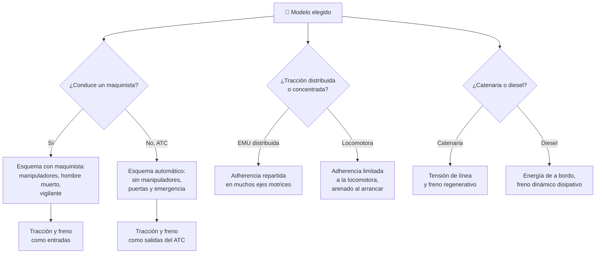

# 🧩 Modelos y variantes del tren de pasajeros

[🏠 Inicio](../../../README.md) · [🚆 Curso: Tren de pasajeros](../README.md) · 🧩 Modelos

El [Módulo 2](../operacion/caracteristicas-tren-pasajeros.md) ya dijo qué tipos de
tren de pasajeros existen y para qué sirve cada uno. Este módulo responde a lo
siguiente: **no todos se manejan igual**, y esa diferencia no es de matiz. Cambia
qué mandos tiene la máquina y, por tanto, qué debe modelar el simulador.

> 🎯 **La idea que sostiene el módulo.** "Un tren" no es una sola máquina desde el
> punto de vista del mando. En un metro automático no hay manipulador de tracción
> que empujar: no es que sea más fácil de conducir, es que **no hay maquinista
> conduciendo**. Un simulador que presente un solo esquema de control está
> representando un tren concreto aunque diga representarlos todos.

---

## 🧭 Por qué el modelo decide el simulador

El [Módulo 5](../mandos/manual-mandos-tren-pasajeros.md) describe un puesto de
mando con **manipulador de tracción** y **manipulador de freno** en el pupitre, un
**hombre muerto** que frena el tren si el maquinista lo suelta y un **panel ATP**
que repite la señal. El [Módulo 9](../simulacion/diseno-simulador-tren-pasajeros.md)
expone una variable `Tracción aplicada` con rango `0-100%` que el usuario dosifica.
Ambos describen un tren **conducido por un maquinista**.

En un metro automático (ATC) esa `Tracción aplicada` no es una entrada del usuario:
es una salida del sistema, calculada contra el perfil de velocidad. El hombre
muerto tampoco tiene a quién vigilar. Si el simulador se construye sobre el esquema
con maquinista y luego se le "añade" el metro automático, el resultado es un metro
automático con hombre muerto, que no existe.

La segunda bisagra es dónde vive la tracción. El
[Módulo 4](../operacion/sistemas-mecanicos-tren-pasajeros.md) explica que la
adherencia depende del **peso por eje**: más carga sobre el eje, más agarre
disponible. En una EMU casi todos los ejes son motrices y el peso se reparte; en un
interurbano de locomotora más coches, toda la tracción sale de los ejes de la
locomotora y arrastra un remolque muerto. `Adherencia` deja de ser un valor único
del tren y pasa a ser un valor del bogie que tracciona.

---

## 🗂️ Qué cambia en el manejo

| Modelo | Qué cambia al conducirlo |
| --- | --- |
| Regional EMU | La referencia del curso: tracción distribuida en varios coches, arranque y frenada firmes, patinaje poco probable. |
| Metro / subterráneo | Recorrido corto entre paradas y alta frecuencia: la parada en andén domina la jornada. Con ATC, el maquinista supervisa en vez de conducir. |
| Suburbano / cercanías | Paradas frecuentes con masa que cambia en cada andén: el mismo tren frena distinto lleno que vacío. |
| Tren-tram | Circula en calle y en línea férrea: alterna la marcha por señal con la marcha a la vista, y el entorno deja de ser exclusivo. |
| Interurbano (locomotora más coches) | Toda la tracción sale de un extremo y arrastra la composición: el arranque es más propenso al patinaje y exige arenado. |
| Regional diesel-eléctrico | Sin catenaria: la energía es de a bordo y no hay línea a la que devolver el freno regenerativo. |

---

## 🎛️ Qué cambia en el mando

| Modelo | Qué mando aparece o desaparece | Consecuencia |
| --- | --- | --- |
| Regional EMU, Suburbano, Interurbano | Ninguno: el mapa de controles del Módulo 5 aplica tal cual. | Cambian los rangos y la dosificación, no los controles. |
| Metro automático (ATC) | **Desaparecen** el manipulador de tracción, el manipulador de freno y el hombre muerto. **Queda** el mando de puertas, el freno de emergencia y la radio tren-tierra. | El usuario deja de conducir y pasa a supervisar y despachar. Es otro modo de control, no otra dificultad. |
| Metro con maquinista | Ninguno desaparece, pero el **panel ATP** manda sobre el manipulador. | La señal deja de ser información y pasa a ser un límite duro. |
| Tren-tram | **Aparece** la marcha a la vista junto a la señal. | El panel ATP deja de ser la única autoridad: el maquinista vuelve a mirar el camino. |
| Regional diesel-eléctrico | **Desaparece** el indicador de tensión de línea de la catenaria. El freno dinámico deja de ser regenerativo. | Un instrumento de alta importancia del Módulo 5 queda sin señal que mostrar. |
| Interurbano | **Sube de prioridad** el arenero: pasa de ayuda ocasional a mando de arranque. | El botón de arena entra en el ciclo normal, no solo en riel húmedo. |

---

## 🎮 Qué cambia en el simulador

Contrastado con las variables del
[Módulo 9](../simulacion/diseno-simulador-tren-pasajeros.md):

| Modelo | Variables que cambian | Esquema de control |
| --- | --- | --- |
| Regional EMU | Ninguna: es el caso base. | El del Módulo 5. |
| Metro automático (ATC) | `Tracción aplicada` y `Freno aplicado` **dejan de ser entradas** y pasan a ser salidas calculadas contra `Estado de la señal`. | Sin manipuladores ni hombre muerto: solo puertas, emergencia y radio. |
| Metro con maquinista | `Velocidad` **reduce** su rango útil frente a los 0-160 km/h del caso base; `Estado de la señal` gobierna el ciclo. | El mismo, con el ATP como techo permanente. |
| Suburbano / cercanías | `Masa del tren` deja de ser `fijo + pasajeros` al empezar y pasa a variar en cada andén durante la partida. | El mismo. |
| Tren-tram | `Estado de la señal` deja de ser la única restricción: se suma el entorno de calle. | El mismo, con marcha a la vista añadida. |
| Interurbano | `Adherencia` deja de ser un valor del tren y pasa a calcularse sobre los ejes motrices de la locomotora; `Masa del tren` crece frente a los ejes que traccionan. | El mismo, con arenado en el arranque. |
| Regional diesel-eléctrico | La tensión de línea **desaparece** del cuadro de instrumentos; el freno dinámico disipa en vez de devolver. `Presión de freno` no cambia. | El mismo. |

---

## 🗺️ Del modelo al esquema de control

---

## ⚠️ Qué modelos no comparten simulador

Dos familias no se resuelven con un ajuste de parámetros, porque su esquema de
control es otro:

- **El metro automático** frente al resto: faltan los dos manipuladores y el hombre
  muerto, y las dos variables centrales cambian de sentido, de entrada del usuario
  a salida del sistema. Lo que el usuario aprende ahí es supervisar y despachar, no
  conducir. Es un modo de control distinto, no una dificultad distinta.
- **El suburbano con masa variable** frente a los demás: obliga a que `Masa del
  tren` sea una variable viva que cambia en cada andén, no una constante que se
  fija al empezar la partida.

El resto de modelos sí caben en un mismo simulador ajustando rangos, tal como
plantean los [niveles de realismo](../../../docs/03-niveles-de-realismo.md): en el
nivel 1 casi todos se comportan igual, y las diferencias de tracción distribuida,
adherencia y arenado emergen a medida que el nivel sube.

Queda **por confirmar** el ancho de vía de la red chilena, tal como advierten el
[Módulo 4](../operacion/sistemas-mecanicos-tren-pasajeros.md) y el
[Módulo 9](../simulacion/diseno-simulador-tren-pasajeros.md). Mientras no se
confirme en la fuente oficial, ningún modelo de este cuadro debería fijar valores
por defecto de vía.

---

[⬅️ Anterior: Características](../operacion/caracteristicas-tren-pasajeros.md) · [➡️ Siguiente: Sistemas mecánicos](../operacion/sistemas-mecanicos-tren-pasajeros.md)
