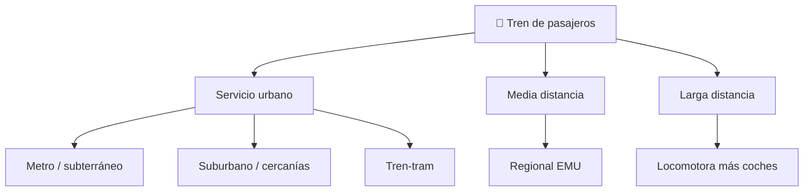

# 📋 Características funcionales del tren de pasajeros

[🏠 Inicio](../../../README.md) · [🚆 Curso: Tren de pasajeros](../README.md) · 📋 Características

Que es un tren de pasajeros, que tipos existen y para que sirve cada uno. Este
módulo da el contexto antes de abrir la mecánica (Módulo 3).

---

## 🧭 Definición

Un tren de pasajeros es una composición guiada que circula sobre rieles de acero,
formada por uno o varios vehículos unidos, con gran capacidad de transporte y
alta eficiencia energética. A diferencia de un vehículo de carretera, no elige su
trayectoria: la vía lo guía, y su seguridad depende de la señalización y de las
distancias de frenado.

---

## 🧬 Características clave

| Característica | Descripción |
| --- | --- |
| Guía sobre rieles | La rueda de pestaña sigue el riel; no se conduce girando. |
| Gran capacidad | Transporta cientos o miles de pasajeros por composición. |
| Alta eficiencia | La rueda de acero sobre riel tiene muy baja resistencia. |
| Gran masa | Mucha inercia; acelera y frena lentamente. |
| Distancias largas | La frenada exige cientos de metros a alta velocidad. |
| Ruta fija | Circula por una vía predefinida controlada por señales. |

---

## 🗂️ Tipos de tren de pasajeros

| Tipo | Uso típico | Rasgo destacado |
| --- | --- | --- |
| Metro / subterráneo | Ciudad, alta frecuencia | Tracción eléctrica, gran capacidad. |
| Suburbano / cercanías | Periferia urbana | Paradas frecuentes, unidad múltiple. |
| Tren-tram | Ciudad y vía férrea | Circula en calle y en línea de tren. |
| Regional | Ciudades intermedias | EMU eléctrica o diesel-eléctrica. |
| Interurbano | Larga distancia | Locomotora que remolca coches. |

---

## 🎯 Para qué se usa

- Movilidad urbana masiva de alta frecuencia (metro).
- Transporte de cercanías entre la ciudad y su periferia.
- Conexión regional entre ciudades intermedias.
- Servicios interurbanos de larga distancia.
- Transporte eficiente con bajo consumo de energía por pasajero.

---

[⬅️ Anterior: Historia](../historia/historia-tren-pasajeros.md) · [➡️ Siguiente: Sistemas mecánicos](sistemas-mecanicos-tren-pasajeros.md)
