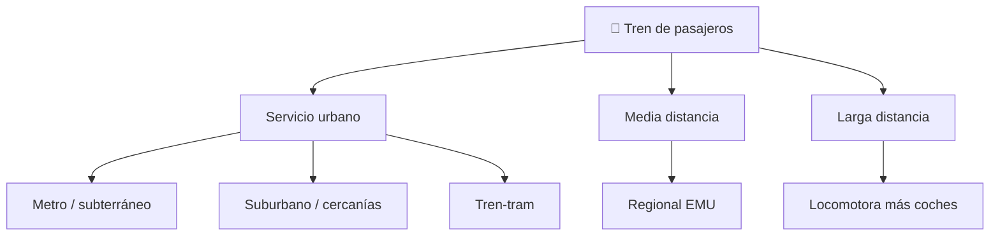

<!-- clase-meta
tipo_documento: clase
clase: 2
codigo: TRENPASAJERO-02
curso: tren-pasajeros
titulo: "Características funcionales del tren de pasajeros"
modalidad: "teórica aplicada"
duracion_minutos: 45
nivel: introductorio
prerrequisito: TRENPASAJERO-01
competencia: "identificacion_funcional"
resultados_aprendizaje:
  - "Explicar definición, rasgos funcionales, tipos y usos con vocabulario propio de Tren de pasajeros."
  - "Aplicar esos conceptos a una decisión segura o a un escenario de simulación de Tren de pasajeros."
evidencia: "Matriz comparativa y decisión justificada."
criterio_aprobacion: "La elección considera función, límites, mando y efecto en la simulación; no se apoya solo en preferencias."
fuentes: manuales/fuentes.md
ultima_revision: 2026-09-10
-->

# 📋 Características funcionales del tren de pasajeros

[🏠 Inicio](../../../README.md) · [🚆 Curso: Tren de pasajeros](../README.md) · 📋 Características

Que es un tren de pasajeros, que tipos existen y para que sirve cada uno. Este
módulo da el contexto antes de abrir la mecánica (Clase 4).

---

## 🧭 Definición

Un tren de pasajeros es una composición guiada que circula sobre rieles de acero,
formada por uno o varios vehículos unidos, con gran capacidad de transporte y
alta eficiencia energética. A diferencia de un vehículo de carretera, no elige su
trayectoria: la vía lo guía, y su seguridad depende de la señalización y de las
distancias de frenado.

---

## 🧬 Características clave

| Característica | Descripción |
| --- | --- |
| Guía sobre rieles | La rueda de pestaña sigue el riel; no se conduce girando. |
| Gran capacidad | Transporta cientos o miles de pasajeros por composición. |
| Alta eficiencia | La rueda de acero sobre riel tiene muy baja resistencia. |
| Gran masa | Mucha inercia; acelera y frena lentamente. |
| Distancias largas | La frenada exige cientos de metros a alta velocidad. |
| Ruta fija | Circula por una vía predefinida controlada por señales. |

---

## 🗂️ Tipos de tren de pasajeros

```mermaid
flowchart TD
    Tren[🚆 Tren de pasajeros] --> Urbano[Servicio urbano]
    Tren --> Media[Media distancia]
    Tren --> Larga[Larga distancia]
    Urbano --> Metro[Metro / subterráneo]
    Urbano --> Suburbano[Suburbano / cercanías]
    Urbano --> TrenTram[Tren-tram]
    Media --> Regional[Regional EMU]
    Larga --> Interurbano[Locomotora más coches]
```

| Tipo | Uso típico | Rasgo destacado |
| --- | --- | --- |
| Metro / subterráneo | Ciudad, alta frecuencia | Tracción eléctrica, gran capacidad. |
| Suburbano / cercanías | Periferia urbana | Paradas frecuentes, unidad múltiple. |
| Tren-tram | Ciudad y vía férrea | Circula en calle y en línea de tren. |
| Regional | Ciudades intermedias | EMU eléctrica o diesel-eléctrica. |
| Interurbano | Larga distancia | Locomotora que remolca coches. |

---

## 🎯 Para qué se usa

- Movilidad urbana masiva de alta frecuencia (metro).
- Transporte de cercanías entre la ciudad y su periferia.
- Conexión regional entre ciudades intermedias.
- Servicios interurbanos de larga distancia.
- Transporte eficiente con bajo consumo de energía por pasajero.

## 🧭 Guía de estudio aplicada

### Pregunta guía

¿Cómo ayuda **Definición, Características clave, Tipos de tren de pasajeros y Para qué se usa** a **elegir una configuración adecuada para aproximación a estación con lluvia y alta ocupación**?

### Explicación razonada

Una característica solo es útil cuando permite anticipar comportamiento. En Tren de pasajeros, la relación entre captación o motor, convertidor de tracción, motores de eje y rueda-carril determina capacidad, respuesta y límites. Por eso «unidad eléctrica múltiple frente a tren remolcado» no se compara por apariencia: se compara por misión, entorno, carga de trabajo y exposición al riesgo «rebasar el punto de parada o comprometer la comodidad por frenar tarde».

Esta clase se conecta con el resto del curso mediante **adherencia rueda-carril, curva de frenado y cumplimiento de señales**. El hilo de
seguridad consiste en reconocer a tiempo **rebasar el punto de parada o comprometer la comodidad por frenar tarde** y poder justificar la decisión
**anticipar la frenada según señal, pendiente, adherencia y carga**; en clases posteriores cambiará el ángulo de análisis, no esa relación causal.
La lectura funcional común sigue **captación o motor → convertidor de tracción → motores de eje → rueda-carril**, de modo que cada concepto pueda
ubicarse dentro del funcionamiento completo y no quede como un dato aislado.

**Apoyo documental:** [Railroad Operating Practices](https://railroads.fra.dot.gov/railroad-safety/divisions/operating-practices/operating-practices-0) aporta operación, señalización y competencias ferroviarias;
[Human Factors: Tasks and Demands](https://railroads.fra.dot.gov/human-factors/elearning-attention/tasks-demands) se usa para factores humanos y carga de trabajo. Estas fuentes
se contrastan con el alcance de la clase y no sustituyen un manual de equipo concreto.

### Caso resuelto: de la observación a la decisión

1. **Definir la necesidad:** convierte «aproximación a estación con lluvia y alta ocupación» en requisitos de capacidad, entorno y respuesta.
2. **Comparar:** contrasta **unidad eléctrica múltiple frente a tren remolcado** usando esos requisitos y la cadena **captación o motor → convertidor de tracción → motores de eje → rueda-carril**.
3. **Descartar:** elimina la alternativa que deja menos margen frente a **rebasar el punto de parada o comprometer la comodidad por frenar tarde**.
4. **Elegir:** declara la variante escogida, la evidencia usada y una limitación que todavía debe respetarse.

### Comprueba tu comprensión

1. ¿Qué característica de **rueda-carril** condiciona primero el caso «aproximación a estación con lluvia y alta ocupación»?
2. ¿Qué requisito descartaría una de las alternativas **unidad eléctrica múltiple frente a tren remolcado**?
3. ¿Qué límite debe declararse junto con la variante elegida?

Orientación para revisar tus respuestas

- La primera respuesta debe relacionar el eslabón elegido con un efecto posterior, no solo nombrarlo.
- La segunda debe proponer una señal medible u observable y explicar qué tendencia sería preocupante.
- La tercera debe cambiar al menos una variable de capacidad, mando, entorno o margen de seguridad.

## 🎓 Cierre de clase

- **Actividad:** Compara variantes de Tren de pasajeros mediante los ejes «definición, rasgos funcionales, tipos y usos» y elige una para un caso de uso razonado.
- **Evidencia:** Matriz comparativa y decisión justificada.
- **Criterio de aprobación:** La elección considera función, límites, mando y efecto en la simulación; no se apoya solo en preferencias.
- **Transferencia:** explica qué cambiaría al pasar a otra variante de esta máquina.

### Fuentes de esta clase

- [US-FRA-OPS](https://railroads.fra.dot.gov/railroad-safety/divisions/operating-practices/operating-practices-0): Railroad Operating Practices, Federal Railroad Administration. Uso: operación, señalización y competencias ferroviarias.
- [US-FRA-HF](https://railroads.fra.dot.gov/human-factors/elearning-attention/tasks-demands): Human Factors: Tasks and Demands, Federal Railroad Administration. Uso: factores humanos y carga de trabajo.

> Las fuentes sostienen el marco conceptual y normativo; esta clase no reemplaza el manual
> del fabricante, la formación certificada ni la habilitación exigida para operar equipos reales.

---

[⬅️ Anterior: Historia](../historia/historia-tren-pasajeros.md) · [➡️ Siguiente: Modelos y variantes](../modelos/modelos-tren-pasajeros.md)
