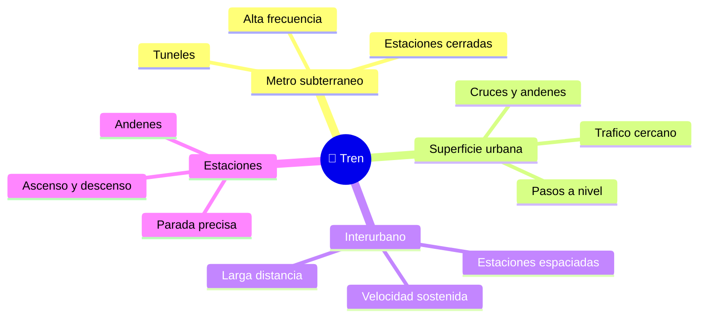

# 🌍 Entornos de trabajo del tren de pasajeros

[🏠 Inicio](../../../README.md) · [🚆 Curso: Tren de pasajeros](../README.md) · 🌍 Entornos

Donde opera un tren de pasajeros y como cambia la conduccion segun el entorno.
Cada entorno implica reglas, riesgos y ajustes distintos, y en simulacion se
traduce en escenarios diferentes.

---

## 🗺️ Entornos principales

| Entorno | Caracteristicas | Riesgos tipicos | Ajuste de conduccion |
| --- | --- | --- | --- |
| Metro subterraneo | Tuneles, alta frecuencia. | Poca visibilidad, distancias cortas entre trenes. | Respetar el ATP, paradas precisas. |
| Superficie urbana | Andenes, cruces, pasos a nivel. | Peatones y autos en pasos a nivel. | Silbato, velocidad prudente, atencion. |
| Interurbano | Larga distancia, alta velocidad. | Distancias de frenado muy largas. | Anticipar senales, frenado temprano. |
| Estaciones y andenes | Ascenso y descenso de pasajeros. | Atrapamiento en puertas, hueco al anden. | Parada exacta, enclavamiento de puertas. |
| Tuneles | Confinamiento y ventilacion. | Evacuacion compleja. | Procedimientos y comunicacion por radio. |

---

## 🌦️ Factores del entorno

- **Clima**: lluvia, hojas y humedad reducen la adherencia rueda-riel.
- **Superficie de via**: subterranea, en superficie o elevada cambia la operacion.
- **Pasos a nivel**: cruces con carretera que exigen senalizacion y advertencia.
- **Trafico ferroviario**: la frecuencia y las distancias entre trenes fijan el
  ritmo, controlado por senales y ATP.

---

## 🎮 Traduccion a simulacion

Cada entorno es un escenario con su tipo de via, clima, senalizacion y densidad
de trafico ferroviario. Ver como se modela en el
[Modulo 8: Diseno de simulacion](../simulacion/diseno-simulador-tren-pasajeros.md).

---

[⬅️ Anterior: Principios y operacion](principios-tren-pasajeros.md) · [➡️ Siguiente: Reglamentos](../reglamentos/reglamentos-tren-pasajeros.md)
