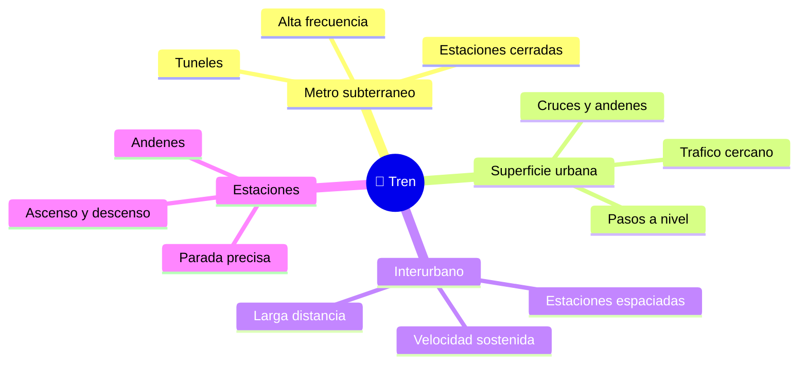

# 🌍 Entornos de trabajo del tren de pasajeros

[🏠 Inicio](../../../README.md) · [🚆 Curso: Tren de pasajeros](../README.md) · 🌍 Entornos

Dónde opera un tren de pasajeros y cómo cambia la conducción según el entorno.
Cada entorno implica reglas, riesgos y ajustes distintos, y en simulación se
traduce en escenarios diferentes.

---

## 🗺️ Entornos principales

| Entorno | Características | Riesgos típicos | Ajuste de conducción |
| --- | --- | --- | --- |
| Metro subterráneo | Túneles, alta frecuencia. | Poca visibilidad, distancias cortas entre trenes. | Respetar el ATP, paradas precisas. |
| Superficie urbana | Andenes, cruces, pasos a nivel. | Peatones y autos en pasos a nivel. | Silbato, velocidad prudente, atención. |
| Interurbano | Larga distancia, alta velocidad. | Distancias de frenado muy largas. | Anticipar señales, frenado temprano. |
| Estaciones y andenes | Ascenso y descenso de pasajeros. | Atrapamiento en puertas, hueco al andén. | Parada exacta, enclavamiento de puertas. |
| Túneles | Confinamiento y ventilación. | Evacuación compleja. | Procedimientos y comunicación por radio. |

---

## 🌦️ Factores del entorno

- **Clima**: lluvia, hojas y humedad reducen la adherencia rueda-riel.
- **Superficie de vía**: subterránea, en superficie o elevada cambia la operación.
- **Pasos a nivel**: cruces con carretera que exigen señalización y advertencia.
- **Tráfico ferroviario**: la frecuencia y las distancias entre trenes fijan el
  ritmo, controlado por señales y ATP.

---

## 🎮 Traducción a simulación

Cada entorno es un escenario con su tipo de vía, clima, señalización y densidad
de tráfico ferroviario. Ver cómo se modela en el
[Módulo 8: Diseño de simulación](../simulacion/diseno-simulador-tren-pasajeros.md).

---

[⬅️ Anterior: Principios y operación](principios-tren-pasajeros.md) · [➡️ Siguiente: Reglamentos](../reglamentos/reglamentos-tren-pasajeros.md)
