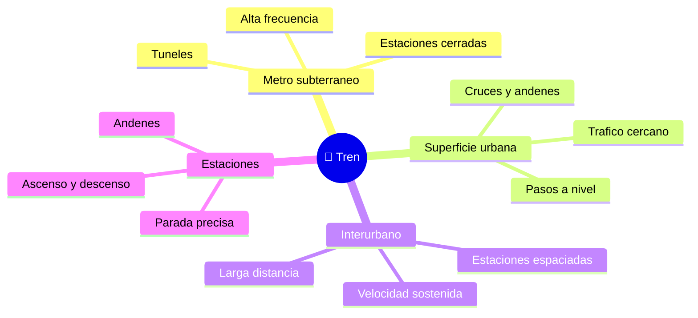

<!-- clase-meta
tipo_documento: clase
clase: 7
codigo: TRENPASAJERO-07
curso: tren-pasajeros
titulo: "Entornos de trabajo del tren de pasajeros"
modalidad: "análisis de escenarios"
duracion_minutos: 60
nivel: introductorio
prerrequisito: TRENPASAJERO-06
competencia: "adaptacion_al_entorno"
resultados_aprendizaje:
  - "Explicar entornos, factores ambientales, riesgos y respuesta de simulación con vocabulario propio de Tren de pasajeros."
  - "Aplicar esos conceptos a una decisión segura o a un escenario de simulación de Tren de pasajeros."
evidencia: "Matriz entorno–cambio–riesgo–respuesta."
criterio_aprobacion: "Cada respuesta se adapta al entorno y distingue riesgos que no son intercambiables entre escenarios."
fuentes: manuales/fuentes.md
ultima_revision: 2026-09-10
-->

# 🌍 Entornos de trabajo del tren de pasajeros

[🏠 Inicio](../../../README.md) · [🚆 Curso: Tren de pasajeros](../README.md) · 🌍 Entornos

Dónde opera un tren de pasajeros y cómo cambia la conducción según el entorno.
Cada entorno implica reglas, riesgos y ajustes distintos, y en simulación se
traduce en escenarios diferentes.

---

## 🗺️ Entornos principales

```mermaid
mindmap
  root((🚆 Tren))
    Metro subterraneo
      Tuneles
      Estaciones cerradas
      Alta frecuencia
    Superficie urbana
      Cruces y andenes
      Pasos a nivel
      Trafico cercano
    Interurbano
      Larga distancia
      Velocidad sostenida
      Estaciones espaciadas
    Estaciones
      Andenes
      Ascenso y descenso
      Parada precisa
```

| Entorno | Características | Riesgos típicos | Ajuste de conducción |
| --- | --- | --- | --- |
| Metro subterráneo | Túneles, alta frecuencia. | Poca visibilidad, distancias cortas entre trenes. | Respetar el ATP, paradas precisas. |
| Superficie urbana | Andenes, cruces, pasos a nivel. | Peatones y autos en pasos a nivel. | Silbato, velocidad prudente, atención. |
| Interurbano | Larga distancia, alta velocidad. | Distancias de frenado muy largas. | Anticipar señales, frenado temprano. |
| Estaciones y andenes | Ascenso y descenso de pasajeros. | Atrapamiento en puertas, hueco al andén. | Parada exacta, enclavamiento de puertas. |
| Túneles | Confinamiento y ventilación. | Evacuación compleja. | Procedimientos y comunicación por radio. |

---

## 🌦️ Factores del entorno

- **Clima**: lluvia, hojas y humedad reducen la adherencia rueda-riel.
- **Superficie de vía**: subterránea, en superficie o elevada cambia la operación.
- **Pasos a nivel**: cruces con carretera que exigen señalización y advertencia.
- **Tráfico ferroviario**: la frecuencia y las distancias entre trenes fijan el
  ritmo, controlado por señales y ATP.

---

## 🎮 Traducción a simulación

Cada entorno es un escenario con su tipo de vía, clima, señalización y densidad
de tráfico ferroviario. Ver cómo se modela en el
[Clase 9: Diseño de simulación](../simulacion/diseno-simulador-tren-pasajeros.md).

## 🧭 Guía de estudio aplicada

### Pregunta guía

¿Cómo ayuda **Entornos principales, Factores del entorno, Traducción a simulación y Guía de estudio aplicada** a **adaptar aproximación a estación con lluvia y alta ocupación a tres condiciones ambientales distintas**?

### Explicación razonada

El entorno no es decoración: modifica las fuerzas, la percepción y el tiempo disponible. En el caso «aproximación a estación con lluvia y alta ocupación», cambia el comportamiento de rueda-carril y aumenta la probabilidad de rebasar el punto de parada o comprometer la comodidad por frenar tarde. La respuesta correcta empieza por reconocer qué variable cambió y después adaptar límites, ruta o misión.

Esta clase se conecta con el resto del curso mediante **adherencia rueda-carril, curva de frenado y cumplimiento de señales**. El hilo de
seguridad consiste en reconocer a tiempo **rebasar el punto de parada o comprometer la comodidad por frenar tarde** y poder justificar la decisión
**anticipar la frenada según señal, pendiente, adherencia y carga**; en clases posteriores cambiará el ángulo de análisis, no esa relación causal.
La lectura funcional común sigue **captación o motor → convertidor de tracción → motores de eje → rueda-carril**, de modo que cada concepto pueda
ubicarse dentro del funcionamiento completo y no quede como un dato aislado.

**Apoyo documental:** [Railroad Operating Practices](https://railroads.fra.dot.gov/railroad-safety/divisions/operating-practices/operating-practices-0) aporta operación, señalización y competencias ferroviarias;
[Human Factors: Tasks and Demands](https://railroads.fra.dot.gov/human-factors/elearning-attention/tasks-demands) se usa para factores humanos y carga de trabajo. Estas fuentes
se contrastan con el alcance de la clase y no sustituyen un manual de equipo concreto.

### Caso resuelto: de la observación a la decisión

1. **Escenario base:** conserva la misión «aproximación a estación con lluvia y alta ocupación» para poder comparar.
2. **Cambiar una condición:** modifica sucesivamente superficie o medio, visibilidad y perturbación externa.
3. **Recalcular margen:** explica cómo cada cambio afecta **rueda-carril** y acerca o aleja **rebasar el punto de parada o comprometer la comodidad por frenar tarde**.
4. **Adaptar:** cambia límite, ruta, configuración o incluso cancela; no mantengas la misma respuesta por hábito.

### Comprueba tu comprensión

1. ¿Cómo cambiaría **rueda-carril** si empeora la perturbación externa?
2. ¿Qué condición ambiental acerca más el escenario a **rebasar el punto de parada o comprometer la comodidad por frenar tarde**?
3. ¿Cuándo adaptarías la maniobra y cuándo la cancelarías?

Orientación para revisar tus respuestas

- La primera respuesta debe relacionar el eslabón elegido con un efecto posterior, no solo nombrarlo.
- La segunda debe proponer una señal medible u observable y explicar qué tendencia sería preocupante.
- La tercera debe cambiar al menos una variable de capacidad, mando, entorno o margen de seguridad.

## 🎓 Cierre de clase

- **Actividad:** Contrasta tres entornos de Tren de pasajeros a partir de entornos, factores ambientales, riesgos y respuesta de simulación y determina cómo cambian variables, percepción, riesgos y respuesta.
- **Evidencia:** Matriz entorno–cambio–riesgo–respuesta.
- **Criterio de aprobación:** Cada respuesta se adapta al entorno y distingue riesgos que no son intercambiables entre escenarios.
- **Transferencia:** explica qué cambiaría al pasar a otra variante de esta máquina.

### Fuentes de esta clase

- [US-FRA-OPS](https://railroads.fra.dot.gov/railroad-safety/divisions/operating-practices/operating-practices-0): Railroad Operating Practices, Federal Railroad Administration. Uso: operación, señalización y competencias ferroviarias.
- [US-FRA-HF](https://railroads.fra.dot.gov/human-factors/elearning-attention/tasks-demands): Human Factors: Tasks and Demands, Federal Railroad Administration. Uso: factores humanos y carga de trabajo.

> Las fuentes sostienen el marco conceptual y normativo; esta clase no reemplaza el manual
> del fabricante, la formación certificada ni la habilitación exigida para operar equipos reales.

---

[⬅️ Anterior: Principios y operación](principios-tren-pasajeros.md) · [➡️ Siguiente: Reglamentos](../reglamentos/reglamentos-tren-pasajeros.md)
