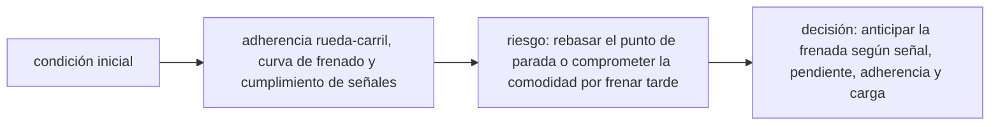

<!-- clase-meta
tipo_documento: clase
clase: 6
codigo: TRENPASAJERO-06
curso: tren-pasajeros
titulo: "Principios y operación del tren de pasajeros"
modalidad: "resolución de problemas"
duracion_minutos: 90
nivel: introductorio
prerrequisito: TRENPASAJERO-05
competencia: "razonamiento_operacional"
resultados_aprendizaje:
  - "Explicar principios físicos, fases de operación, decisiones y errores frecuentes con vocabulario propio de Tren de pasajeros."
  - "Aplicar esos conceptos a una decisión segura o a un escenario de simulación de Tren de pasajeros."
evidencia: "Resolución argumentada de un escenario operacional."
criterio_aprobacion: "Aplica los principios correctos, anticipa consecuencias y respeta los límites del curso."
fuentes: manuales/fuentes.md
ultima_revision: 2026-09-10
-->

# 🧪 Principios y operación del tren de pasajeros

[🏠 Inicio](../../../README.md) · [🚆 Curso: Tren de pasajeros](../README.md) · 🧪 Principios

Documento general y educativo. No sustituye la formación certificada del operador
ferroviario ni los manuales del fabricante. Describe cómo se opera un tren en
simulación y que principios físicos conviene representar.

## Principios de funcionamiento

- **Tracción**: los motores de tracción, alimentados por catenaria o por un grupo
  diesel-generador, entregan par a los ejes motrices.
- **Guía sobre rieles**: la rueda de pestaña con perfil cónico sigue el riel; el
  tren no cambia de rumbo por voluntad del maquinista, la vía lo guía.
- **Adherencia**: el contacto acero-acero tiene bajo agarre, lo que limita la
  fuerza de tracción y de freno antes de patinar o bloquear.
- **Gran masa**: la enorme inercia hace que el tren acelere y frene despacio, con
  distancias de frenado de cientos de metros.
- **Control por señales**: la circulación se ordena con señales de vía y ATP; el
  maquinista respeta la señal, no la vista libre del camino.

## Fases de operación

| Fase | Que ocurre | Puntos clave |
| --- | --- | --- |
| Inspección previa | Revisión básica | Presión de freno, puertas, luces, ATP. |
| Puesta en servicio | Activar la cabina | Tensión de línea, sentido de marcha, vigilante. |
| Arranque | Iniciar la marcha | Tracción progresiva, vigilar patinaje y señal. |
| Marcha | Circular con seguridad | Respetar límites, anticipar señales y andenes. |
| Frenado | Reducir con anticipación | Combinar freno dinámico y neumático, cuidar la adherencia. |
| Parada en andén | Detener en el punto exacto | Alinear puertas con el andén, freno suave. |
| Cierre | Dejar seguro | Puertas cerradas, freno aplicado, cabina apagada. |

## Frenado anticipado: idea general

1. Identificar la señal o el andén objetivo con mucha antelación.
2. Comenzar a frenar mucho antes que un vehículo de carretera.
3. Usar primero el freno dinámico o regenerativo para cuidar las zapatas.
4. Complementar con el freno neumático según la distancia restante.
5. Ajustar la fuerza a la adherencia disponible para no bloquear ruedas.

## Errores comunes que la simulación puede enseñar a evitar

- Frenar tarde, olvidando la gran masa y las distancias largas.
- Aplicar demasiada tracción y provocar patinaje en riel húmedo.
- Ignorar la señal o el límite del ATP.
- No alinear las puertas con el andén al detenerse.
- Descuidar la presión de la tubería de freno antes de arrancar.

## Relación con los niveles de realismo

- **Nivel 1 (educativo)**: aplicar tracción, frenar y respetar señales.
- **Nivel 2 (simplificado)**: agregar inercia, gran masa y distancia de frenado.
- **Nivel 3 (técnico)**: sumar adherencia variable, freno dinámico, ATP y arenado.

Ver [`docs/03-niveles-de-realismo.md`](../../../docs/03-niveles-de-realismo.md) para el detalle de cada nivel.

## 🧭 Guía de estudio aplicada

### Pregunta guía

¿Cómo ayuda **Principios de funcionamiento, Fases de operación, Frenado anticipado: idea general y Errores comunes que la simulación puede enseñar a evitar** a **resolver aproximación a estación con lluvia y alta ocupación sin agotar el margen operacional**?

### Explicación razonada

El principio rector puede resumirse así: adherencia rueda-carril, curva de frenado y cumplimiento de señales. Esto explica por qué una misma orden produce resultados distintos cuando cambian velocidad, carga, configuración o entorno. Operar bien consiste en leer la tendencia antes de agotar el margen y tomar esta decisión: anticipar la frenada según señal, pendiente, adherencia y carga.

Esta clase se conecta con el resto del curso mediante **adherencia rueda-carril, curva de frenado y cumplimiento de señales**. El hilo de
seguridad consiste en reconocer a tiempo **rebasar el punto de parada o comprometer la comodidad por frenar tarde** y poder justificar la decisión
**anticipar la frenada según señal, pendiente, adherencia y carga**; en clases posteriores cambiará el ángulo de análisis, no esa relación causal.
La lectura funcional común sigue **captación o motor → convertidor de tracción → motores de eje → rueda-carril**, de modo que cada concepto pueda
ubicarse dentro del funcionamiento completo y no quede como un dato aislado.

**Apoyo documental:** [Railroad Operating Practices](https://railroads.fra.dot.gov/railroad-safety/divisions/operating-practices/operating-practices-0) aporta operación, señalización y competencias ferroviarias;
[Human Factors: Tasks and Demands](https://railroads.fra.dot.gov/human-factors/elearning-attention/tasks-demands) se usa para factores humanos y carga de trabajo. Estas fuentes
se contrastan con el alcance de la clase y no sustituyen un manual de equipo concreto.

### Caso resuelto: de la observación a la decisión

1. **Datos:** reconoce condiciones, configuración y margen disponibles en **aproximación a estación con lluvia y alta ocupación**.
2. **Modelo:** aplica **adherencia rueda-carril, curva de frenado y cumplimiento de señales** para predecir una tendencia antes de actuar.
3. **Riesgo:** explica mediante qué cadena de causas podría ocurrir **rebasar el punto de parada o comprometer la comodidad por frenar tarde**.
4. **Decisión:** ejecuta mentalmente **anticipar la frenada según señal, pendiente, adherencia y carga** y define qué observación confirmaría que funcionó.

### Comprueba tu comprensión

1. ¿Qué variable del principio «adherencia rueda-carril, curva de frenado y cumplimiento de señales» cambia primero en el caso?
2. ¿Cómo se propaga ese cambio hasta **rueda-carril**?
3. ¿Qué evidencia confirmaría que **anticipar la frenada según señal, pendiente, adherencia y carga** conservó margen operacional?

Orientación para revisar tus respuestas

- La primera respuesta debe relacionar el eslabón elegido con un efecto posterior, no solo nombrarlo.
- La segunda debe proponer una señal medible u observable y explicar qué tendencia sería preocupante.
- La tercera debe cambiar al menos una variable de capacidad, mando, entorno o margen de seguridad.

## 🎓 Cierre de clase

- **Actividad:** Resuelve un escenario de Tren de pasajeros explicando, paso a paso, cómo intervienen principios físicos, fases de operación, decisiones y errores frecuentes.
- **Evidencia:** Resolución argumentada de un escenario operacional.
- **Criterio de aprobación:** Aplica los principios correctos, anticipa consecuencias y respeta los límites del curso.
- **Transferencia:** explica qué cambiaría al pasar a otra variante de esta máquina.

### Fuentes de esta clase

- [US-FRA-OPS](https://railroads.fra.dot.gov/railroad-safety/divisions/operating-practices/operating-practices-0): Railroad Operating Practices, Federal Railroad Administration. Uso: operación, señalización y competencias ferroviarias.
- [US-FRA-HF](https://railroads.fra.dot.gov/human-factors/elearning-attention/tasks-demands): Human Factors: Tasks and Demands, Federal Railroad Administration. Uso: factores humanos y carga de trabajo.

> Las fuentes sostienen el marco conceptual y normativo; esta clase no reemplaza el manual
> del fabricante, la formación certificada ni la habilitación exigida para operar equipos reales.

---

[⬅️ Anterior: Mandos](../mandos/manual-mandos-tren-pasajeros.md) · [➡️ Siguiente: Entornos de trabajo](entornos-tren-pasajeros.md)
