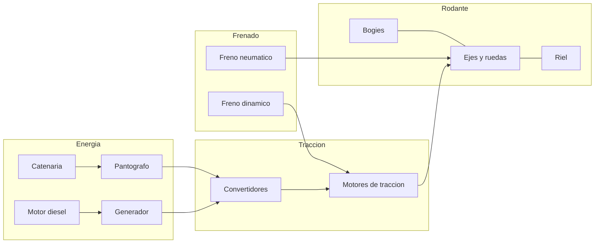
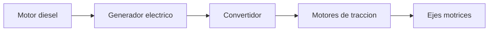
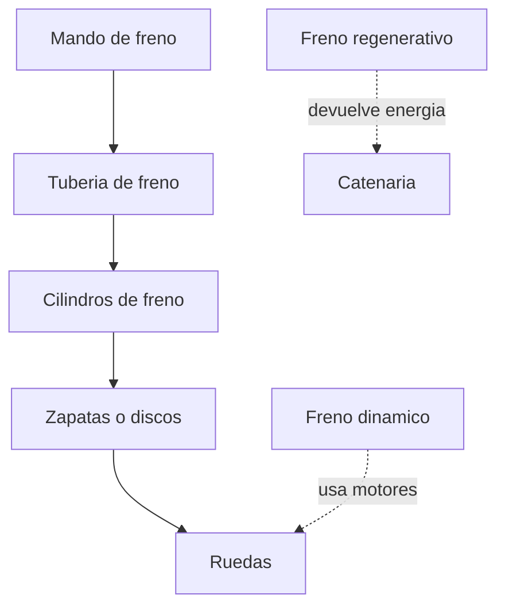

# 🔧 Sistemas mecanicos del tren de pasajeros

[🏠 Inicio](../../../README.md) · [🚆 Curso: Tren de pasajeros](../README.md) · 🔧 Sistemas mecanicos

Este modulo abre el tren por dentro. Explica cada sistema, como funciona y como
se conecta con los demas, con foco en la traccion, la guia sobre rieles, la
adherencia y el frenado de gran masa. Es la base tecnica para entender los mandos
(Modulo 4) y la operacion con pasajeros (Modulo 5).

---

## 1. ⚡ Traccion electrica

En la traccion electrica el tren toma energia de una fuente externa y no lleva
combustible. Es la propulsion tipica de metros, suburbanos y EMU.

- **Pantografo y catenaria**: el pantografo es un brazo articulado sobre el techo
  que roza la catenaria, un cable aereo bajo tension, y capta la corriente.
- **Tercer riel**: alternativa usada en algunos metros; una zapata toma la
  corriente de un riel adicional a nivel de la via.
- **Convertidores**: adaptan la tension y la frecuencia para regular los motores.
- **Motores de traccion**: transforman la electricidad en giro de los ejes.

| Toma de corriente | Como funciona | Uso tipico |
| --- | --- | --- |
| Pantografo y catenaria | Contacto aereo con cable bajo tension | Metro, suburbano, larga distancia. |
| Tercer riel | Zapata sobre un riel lateral energizado | Metros urbanos. |

---

## 2. ⛽ Traccion diesel-electrica

Cuando no hay catenaria, el tren genera su propia electricidad a bordo. El motor
diesel no mueve las ruedas de forma directa: mueve un generador.

- **Motor diesel**: quema combustible y entrega par a un generador.
- **Generador**: convierte ese giro en energia electrica.
- **Motores de traccion**: la misma familia de motores de la traccion electrica
  mueve los ejes, pero alimentados por el generador de a bordo.
- **Ventaja**: no necesita catenaria; sirve en vias sin electrificar.

| Elemento | Funcion | Nota |
| --- | --- | --- |
| Motor diesel | Genera par mecanico | No mueve las ruedas de forma directa. |
| Generador | Produce electricidad | Alimenta los motores de traccion. |
| Motores de traccion | Mueven los ejes | Iguales a los de traccion electrica. |

---

## 3. 🛞 Bogies y ruedas de pestana

El bogie es el carro de ejes bajo cada vehiculo. Soporta la caja, aloja los ejes
y sigue el trazado de la via.

- **Bogie**: bastidor con dos ejes que gira respecto a la caja para tomar curvas.
- **Perfil conico**: la rueda no es cilindrica; su banda de rodadura es conica, y
  eso centra el eje en la via y ayuda en curva.
- **Pestana**: un reborde en el lado interior de la rueda que impide el
  descarrilamiento y guia al eje sobre el riel.

| Elemento | Funcion |
| --- | --- |
| Bastidor del bogie | Une los ejes y transmite el peso a la via. |
| Eje montado | Dos ruedas unidas por un eje rigido. |
| Perfil conico | Centra el eje y reparte el rodado en curva. |
| Pestana | Guia el eje y evita que se salga del riel. |
| Suspension del bogie | Absorbe el camino y da confort al pasajero. |

---

## 4. 🧲 Adherencia rueda-riel

Toda la traccion y el frenado pasan por el contacto acero-acero entre la rueda y
el riel. Ese contacto es muy pequeno y el coeficiente de adherencia es **bajo**,
mucho menor que el de un neumatico sobre asfalto.

- **Baja adherencia**: limita cuanta fuerza de traccion o de freno se puede
  aplicar antes de que la rueda patine o se bloquee.
- **Arenado**: los trenes llevan areneros que dejan caer arena sobre el riel para
  aumentar el agarre en arrancadas y frenadas dificiles.
- **Contaminacion**: hojas, humedad o grasa reducen aun mas la adherencia.

| Factor | Efecto en la adherencia |
| --- | --- |
| Contacto acero-acero | Muy eficiente pero de bajo agarre. |
| Humedad y hojas | Reducen el agarre; riesgo de patinaje. |
| Arenado | Aumenta el agarre de forma puntual. |
| Peso por eje | Mas carga sobre el eje, mas adherencia disponible. |

---

## 5. 🛑 Frenado de gran masa

Frenar un tren es el reto central: mucha masa y baja adherencia obligan a combinar
varios sistemas y a frenar con mucha anticipacion.

- **Freno neumatico**: usa aire comprimido en una tuberia de freno a lo largo de
  todo el tren; al bajar la presion, cada vehiculo aplica sus zapatas. Es a
  prueba de fallos: si se corta la tuberia, el tren frena solo.
- **Freno dinamico**: los motores de traccion trabajan como generadores y frenan
  el tren transformando el movimiento en electricidad.
- **Freno regenerativo**: variante del dinamico que **devuelve** esa energia a la
  catenaria para que la usen otros trenes, en vez de disiparla en calor.

| Sistema | Como frena | Ventaja |
| --- | --- | --- |
| Freno neumatico | Aire que aplica zapatas o discos | Fiable, a prueba de fallos. |
| Freno dinamico | Motores en modo generador | Ahorra desgaste de zapatas. |
| Freno regenerativo | Devuelve energia a la linea | Recupera energia, mas eficiente. |

---

## 6. 🚦 Senalizacion y control

El tren no elige su ruta ni se detiene a la vista como un auto: obedece un sistema
de senales que ordena la circulacion y protege las distancias entre trenes.

- **Senales de via**: luces y carteles junto a la via que autorizan o detienen la
  marcha, similares a semaforos ferroviarios.
- **ATP/ATC en cabina**: sistemas que repiten la senal dentro de la cabina y
  supervisan la velocidad; pueden frenar el tren si el maquinista no responde.

| Elemento | Funcion |
| --- | --- |
| Senal de via | Autoriza o detiene la marcha en cada tramo. |
| ATP | Protege la velocidad y frena si se excede el limite. |
| ATC | Control automatico que asiste o conduce el tren. |
| Bloqueo por tramos | Impide que dos trenes ocupen el mismo tramo. |

---

## 7. 📏 Ancho de via y toma de corriente

El ancho de via o trocha es la distancia entre las caras internas de los dos
rieles. Define que trenes pueden circular por una red.

- **Trocha ancha**: separacion mayor que la internacional, usada en varias redes.
- **Trocha internacional**: el ancho mas difundido en el mundo.
- En Chile el ancho de via de la red varia segun la zona; el valor exacto queda
  **por confirmar** en la fuente oficial.

| Concepto | Descripcion |
| --- | --- |
| Trocha ancha | Mayor separacion entre rieles. |
| Trocha internacional | Ancho mas comun a nivel mundial. |
| Pantografo vs tercer riel | Dos formas de tomar corriente en traccion electrica. |
| Ancho en Chile | Por confirmar en la fuente oficial. |

---

## 🔁 Como se conecta todo

1. La **energia** llega por catenaria y pantografo, o se genera con el grupo
   **diesel-generador** a bordo.
2. Los **convertidores** regulan y alimentan los **motores de traccion**.
3. Los motores mueven los **ejes** montados en los **bogies**.
4. La **rueda de pestana** con perfil conico guia el eje sobre el **riel**.
5. La **adherencia** rueda-riel limita traccion y frenado; el arenado ayuda.
6. Para detener la gran masa se combinan **freno neumatico**, **dinamico** y
   **regenerativo**.
7. La **senalizacion** y el **ATP** ordenan la circulacion y protegen distancias.

Con esto entendido, el [Modulo 4: Mandos](../mandos/manual-mandos-tren-pasajeros.md)
muestra como el maquinista opera cada uno de estos sistemas.

---

[⬅️ Anterior: Caracteristicas](caracteristicas-tren-pasajeros.md) · [➡️ Siguiente: Mandos e instrumentos](../mandos/manual-mandos-tren-pasajeros.md)
