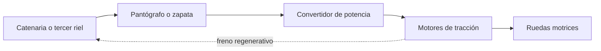
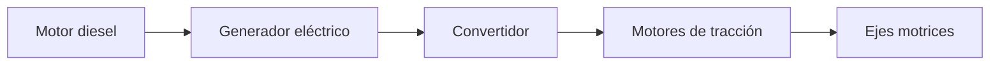

# 🔧 Sistemas mecánicos del tren de pasajeros

[🏠 Inicio](../../../README.md) · [🚆 Curso: Tren de pasajeros](../README.md) · 🔧 Sistemas mecánicos

Este módulo abre el tren por dentro. Explica cada sistema, como funciona y como
se conecta con los demás, con foco en la tracción, la guía sobre rieles, la
adherencia y el frenado de gran masa. Es la base técnica para entender los mandos
(Módulo 4) y la operación con pasajeros (Módulo 5).

---

## 1. ⚡ Tracción eléctrica

En la tracción eléctrica el tren toma energía de una fuente externa y no lleva
combustible. Es la propulsión típica de metros, suburbanos y EMU.

- **Pantógrafo y catenaria**: el pantógrafo es un brazo articulado sobre el techo
  que roza la catenaria, un cable aéreo bajo tensión, y capta la corriente.
- **Tercer riel**: alternativa usada en algunos metros; una zapata toma la
  corriente de un riel adicional a nivel de la vía.
- **Convertidores**: adaptan la tensión y la frecuencia para regular los motores.
- **Motores de tracción**: transforman la electricidad en giro de los ejes.

| Toma de corriente | Como funciona | Uso típico |
| --- | --- | --- |
| Pantógrafo y catenaria | Contacto aéreo con cable bajo tensión | Metro, suburbano, larga distancia. |
| Tercer riel | Zapata sobre un riel lateral energizado | Metros urbanos. |

---

## 2. ⛽ Tracción diesel-electrica

Cuando no hay catenaria, el tren genera su propia electricidad a bordo. El motor
diesel no mueve las ruedas de forma directa: mueve un generador.

- **Motor diesel**: quema combustible y entrega par a un generador.
- **Generador**: convierte ese giro en energía eléctrica.
- **Motores de tracción**: la misma familia de motores de la tracción eléctrica
  mueve los ejes, pero alimentados por el generador de a bordo.
- **Ventaja**: no necesita catenaria; sirve en vías sin electrificar.

| Elemento | Función | Nota |
| --- | --- | --- |
| Motor diesel | Genera par mecánico | No mueve las ruedas de forma directa. |
| Generador | Produce electricidad | Alimenta los motores de tracción. |
| Motores de tracción | Mueven los ejes | Iguales a los de tracción eléctrica. |

---

## 3. 🛞 Bogies y ruedas de pestaña

El bogie es el carro de ejes bajo cada vehículo. Soporta la caja, aloja los ejes
y sigue el trazado de la vía.

- **Bogie**: bastidor con dos ejes que gira respecto a la caja para tomar curvas.
- **Perfil cónico**: la rueda no es cilíndrica; su banda de rodadura es cónica, y
  eso centra el eje en la vía y ayuda en curva.
- **Pestaña**: un reborde en el lado interior de la rueda que impide el
  descarrilamiento y guía al eje sobre el riel.

| Elemento | Función |
| --- | --- |
| Bastidor del bogie | Une los ejes y transmite el peso a la vía. |
| Eje montado | Dos ruedas unidas por un eje rígido. |
| Perfil cónico | Centra el eje y reparte el rodado en curva. |
| Pestaña | Guía el eje y evita que se salga del riel. |
| Suspensión del bogie | Absorbe el camino y da confort al pasajero. |

---

## 4. 🧲 Adherencia rueda-riel

Toda la tracción y el frenado pasan por el contacto acero-acero entre la rueda y
el riel. Ese contacto es muy pequeño y el coeficiente de adherencia es **bajo**,
mucho menor que el de un neumático sobre asfalto.

- **Baja adherencia**: limita cuanta fuerza de tracción o de freno se puede
  aplicar antes de que la rueda patine o se bloquee.
- **Arenado**: los trenes llevan areneros que dejan caer arena sobre el riel para
  aumentar el agarre en arrancadas y frenadas difíciles.
- **Contaminación**: hojas, humedad o grasa reducen aún más la adherencia.

| Factor | Efecto en la adherencia |
| --- | --- |
| Contacto acero-acero | Muy eficiente pero de bajo agarre. |
| Humedad y hojas | Reducen el agarre; riesgo de patinaje. |
| Arenado | Aumenta el agarre de forma puntual. |
| Peso por eje | Más carga sobre el eje, más adherencia disponible. |

---

## 5. 🛑 Frenado de gran masa

Frenar un tren es el reto central: mucha masa y baja adherencia obligan a combinar
varios sistemas y a frenar con mucha anticipación.

- **Freno neumático**: usa aire comprimido en una tubería de freno a lo largo de
  todo el tren; al bajar la presión, cada vehículo aplica sus zapatas. Es a
  prueba de fallos: si se corta la tubería, el tren frena solo.
- **Freno dinámico**: los motores de tracción trabajan como generadores y frenan
  el tren transformando el movimiento en electricidad.
- **Freno regenerativo**: variante del dinámico que **devuelve** esa energía a la
  catenaria para que la usen otros trenes, en vez de disiparla en calor.

| Sistema | Como frena | Ventaja |
| --- | --- | --- |
| Freno neumático | Aire que aplica zapatas o discos | Fiable, a prueba de fallos. |
| Freno dinámico | Motores en modo generador | Ahorra desgaste de zapatas. |
| Freno regenerativo | Devuelve energía a la línea | Recupera energía, más eficiente. |

---

## 6. 🚦 Señalización y control

El tren no elige su ruta ni se detiene a la vista como un auto: obedece un sistema
de señales que ordena la circulación y protege las distancias entre trenes.

- **Señales de vía**: luces y carteles junto a la vía que autorizan o detienen la
  marcha, similares a semaforos ferroviarios.
- **ATP/ATC en cabina**: sistemas que repiten la señal dentro de la cabina y
  supervisan la velocidad; pueden frenar el tren si el maquinista no responde.

| Elemento | Función |
| --- | --- |
| Señal de vía | Autoriza o detiene la marcha en cada tramo. |
| ATP | Protege la velocidad y frena si se excede el límite. |
| ATC | Control automático que asiste o conduce el tren. |
| Bloqueo por tramos | Impide que dos trenes ocupen el mismo tramo. |

---

## 7. 📏 Ancho de vía y toma de corriente

El ancho de vía o trocha es la distancia entre las caras internas de los dos
rieles. Define que trenes pueden circular por una red.

- **Trocha ancha**: separación mayor que la internacional, usada en varias redes.
- **Trocha internacional**: el ancho más difundido en el mundo.
- En Chile el ancho de vía de la red varia según la zona; el valor exacto queda
  **por confirmar** en la fuente oficial.

| Concepto | Descripción |
| --- | --- |
| Trocha ancha | Mayor separación entre rieles. |
| Trocha internacional | Ancho más común a nivel mundial. |
| Pantógrafo vs tercer riel | Dos formas de tomar corriente en tracción eléctrica. |
| Ancho en Chile | Por confirmar en la fuente oficial. |

---

## 🔁 Cómo se conecta todo

1. La **energía** llega por catenaria y pantógrafo, o se genera con el grupo
   **diesel-generador** a bordo.
2. Los **convertidores** regulan y alimentan los **motores de tracción**.
3. Los motores mueven los **ejes** montados en los **bogies**.
4. La **rueda de pestaña** con perfil cónico guía el eje sobre el **riel**.
5. La **adherencia** rueda-riel limita tracción y frenado; el arenado ayuda.
6. Para detener la gran masa se combinan **freno neumático**, **dinámico** y
   **regenerativo**.
7. La **señalización** y el **ATP** ordenan la circulación y protegen distancias.

Con esto entendido, el [Módulo 4: Mandos](../mandos/manual-mandos-tren-pasajeros.md)
muestra como el maquinista opera cada uno de estos sistemas.

---

[⬅️ Anterior: Características](caracteristicas-tren-pasajeros.md) · [➡️ Siguiente: Mandos e instrumentos](../mandos/manual-mandos-tren-pasajeros.md)
