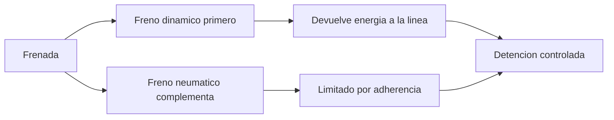

# 🧰 Recursos del tren de pasajeros

[🏠 Inicio](../../../README.md) · [🚆 Curso: Tren de pasajeros](../README.md) · 🧰 Recursos

Glosario especifico, enlaces y diagramas de apoyo del curso de tren de pasajeros.
Amplia el [glosario general](../../../docs/05-glosario-general.md).

---

## 📖 Glosario especifico

| Termino | Definicion |
| --- | --- |
| Pantografo | Brazo articulado sobre el techo que capta corriente de la catenaria. |
| Catenaria | Cable aereo bajo tension que alimenta el tren electrico. |
| Bogie | Carro de ejes bajo el vehiculo que gira para tomar las curvas. |
| Pestana | Reborde de la rueda que la guia sobre el riel y evita el descarrilamiento. |
| Adherencia rueda-riel | Agarre disponible del contacto acero-acero antes de patinar. |
| Freno dinamico | Frenado que usa los motores de traccion como generadores. |
| Freno regenerativo | Freno dinamico que devuelve energia a la catenaria. |
| ATP | Sistema que protege la velocidad y frena si se excede el limite. |
| Trocha | Distancia entre las caras internas de los dos rieles. |

---

## 🗺️ Diagrama de reparto de frenado

---

## 🔗 Enlaces y fuentes

- Marco legal: [⚖️ docs/07-marco-legal-chile.md](../../../docs/07-marco-legal-chile.md)
- Registro de fuentes: [📚 manuales/fuentes.md](../../../manuales/fuentes.md)
- Fuente institucional del operador estatal (EFE): ver el registro de fuentes.

Registrar cada recurso nuevo con su origen y licencia, siguiendo
[`recursos/README.md`](../../../recursos/README.md).

---

[🎓 Portada del curso](../README.md) · [⬅️ Anterior: Diseno de simulacion](../simulacion/diseno-simulador-tren-pasajeros.md)
